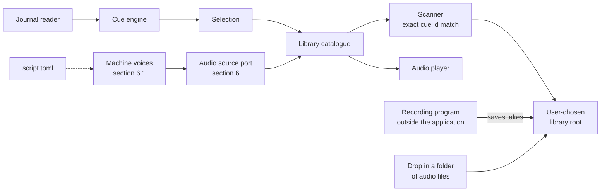

# Bridge Talk: Requirements Specification

Section 11 records open questions; it holds one at present.

---

## 1. Introduction

### 1.1 Purpose

Bridge Talk is a desktop application that watches Elite Dangerous as it is
played and plays a short piece of recorded audio when something happens in the
game. The audio is supplied by the person using it: recordings they made
themselves; recordings made for them by people they know.

It listens to the game. It does not control the game.

### 1.2 Intended audience

Oliver Ernster as author and decision owner; contributors to the open source
project.

### 1.3 Scope

**In scope:**

- A cue engine that turns Elite Dangerous journal events and status flags into
  named cues.
- An audio library held in a directory the user chooses, organised by the person
  who recorded it.
- Discovery of that library by scanning, with no configuration step.
- A checklist of the moments a voice has no recording for, each opening the folder
  its recording belongs in.
- Auditioning, casting a voice, settings and a tray presence.
- Chatter: a switch for each moment the game raises, kept between runs and shared by every voice
  (section 7.2).
- A setup program that installs, updates, repairs and removes the application for one user.
- Machine voices: the 28 English voices of the Kokoro model, cast apart from recorded voices,
  speaking one shared script and made on the user's own machine (section 6.1).
- An audio source port through which another kind of voice is supplied (section 6); recorded voices
  and machine voices both reach the catalogue through it.
- Windows and Linux, decided by Oliver on 2026-09-13. Linux work comes after
  everything else.

**Out of scope:**

| Item | Why |
|---|---|
| Controlling the game in any way | The application has no input path to the game and will not acquire one |
| Speech recognition or spoken commands | Not what this is for |
| Speaking a line as its event fires | Making a line takes 204 to 348 ms, over the 150 ms of NFR-P-202; each line is made once, at a cast or the first time its cue fires, then kept (FR-511, FR-514, FR-527) |
| Shipping recordings with the application | The application ships the files machine voices are made from, never recordings |
| Machine voices in any language but English | The 28 voices in scope are the British and American English ones |
| Editing the script from the user interface | `script.toml` is edited as a file, as `cues.toml` is |
| Changing a machine voice's speed or pitch | Every line is made at the model's own speed |
| Processing a made line's audio | The model's samples are written as made, apart from the pause FR-553 inserts (Oliver, 2026-09-14) and the fade FR-556 applies (Oliver, 2026-09-15), each at a spot measured before the build |
| Working out pronunciation while the application runs | Every line's speech sounds are made before the build by the sounds tool (FR-532); a misread word is put right in the script (FR-529) |
| Distributing recordings between users | No transport, no store, no upload |
| Editing the cue vocabulary from the user interface | `cues.toml` is edited as a file |
| Fuzzy, partial or normalising name matching | Section 3.1 rule 4; matching is exact by design |
| macOS | Not asked for; Windows and Linux are the platforms in scope |
| Capturing audio | Recorded in a dedicated program; section 4 |
| Reading a comms message's words aloud | The words are generated afresh for each message, so a line would have to be made as the event fires (Oliver, 2026-09-15) |
| A message a player typed, on any channel | It carries no key (measured on 203 of 203 `starsystem` messages); it is another person's words |
| Comms moments beyond the pirate key stems and station traffic | FR-620 and FR-637 name the set; any other key stem waits for a decision of its own (Oliver, 2026-09-15) |
| Switching a moment for one voice alone | Which moments are spoken for is a question about the game rather than about who speaks (OQ-15, Oliver, 2026-09-15) |
| A switch for `Cast.Confirmed` | It answers the player's own cast rather than the game (FR-621) |
| Searching or filtering the list on Chatter | Not asked for; the categories of FR-635 break the 262 moments up |
| Changing a moment's priority, cooldown or words from Chatter | `cues.toml` and `script.toml` are edited as files |
| Switching moments on or off by time or by what the game is doing | Not asked for; a switch changes only when it is pressed |

### 1.4 Definitions

| Term | Meaning, fixed for this document |
|---|---|
| **Cue** | One thing the application can play, plus the game condition that triggers it. Identified by a stable id spelled in the game's own words, such as `StartJump.JumpType.Hyperspace`. Defined in `cues.toml`. |
| **Cue vocabulary** | The complete set of cue ids in `cues.toml`. Currently 263. |
| **Voice** | A recorded voice or a machine voice, selectable as a whole. |
| **Recorded voice** | One person's recordings: a directory under the library root that yields at least one take. Sections 3 and 4 say voice for a recorded voice. |
| **Machine voice** | One of the 28 English voices of the Kokoro model shipped with the application, identified by the model's own id, such as `bf_emma`. Its takes are made lines (section 6.1). |
| **Script** | `script.toml`: the words each cue is spoken with, shared by every machine voice. |
| **Line** | One entry in the script for a cue. A cue in the script has three. |
| **Made line** | An audio file the application made from one line for one machine voice. |
| **Pause** | 40 ms of silence the application inserts in a made line before a final commander, at the sample the pauses tool found for that voice and line (FR-551, FR-553). |
| **Fade** | The end of a made line whose last speech sound is a nasal, falling linearly to zero over the 30 ms before the hiss the model adds after that nasal starts, then silent to the line's end, from the sample the pauses tool found for that voice and line (FR-555, FR-556). |
| **Library root** | One directory the user chooses, holding one subdirectory per voice. |
| **Manifest** | `voice.toml` in a voice directory. Optional; it may carry the name a voice is shown by, a credit and takes the convention cannot find (FR-210). |
| **Take** | One audio file answering one cue. A cue may have several takes. |
| **Cast** | The act of selecting the voice that speaks. |
| **Audition** | Playing a take on demand from the user interface, outside game events. |
| **Message key** | The `Message` value of a `ReceiveText` journal event, exactly as the game writes it. |
| **Key stem** | A message key with its leading `$`, the digits ending its name, any values from the first `:#` onwards and its closing `;` removed. `$Pirate_ThreatenSpecific01:#units=20:#CommodityName=$aluminium_Name;;` has the key stem `Pirate_ThreatenSpecific`. |
| **Comms moment** | A cue that names a key stem (section 7.1) or the beginnings of key stems (FR-638). |
| **Moment** | The word the window uses for a cue. |
| **Chatter** | The pane on which the player chooses which moments the application speaks for; also the band button opening it (section 7.2). |
| **Switched off** | Said of a cue the player has chosen the application will not speak for (FR-622). Every other cue is switched on. |
| **Category** | One of the named sets of FR-635 that Chatter lists moments under, written beside each cue in `cues.toml`. Not an Audition group (FR-216). |
| **Station traffic** | A `ReceiveText` message on the `npc` channel whose key stem begins `STATION_`, `DockingChatter_` or `DockingFailed_` (section 7.2). |

### 1.5 References

- `ARCHITECTURE.md`: the layering invariants and the tests that enforce them.
- `internal/infrastructure/config/cues.toml`: the cue vocabulary.
- ISO/IEC/IEEE 29148 for requirement quality; EARS for requirement syntax.

---

## 2. Overall description

### 2.1 Product perspective



The cue engine asks the catalogue for a take for a cue id and gets a path or
nothing back. Everything about how audio is stored sits below that line.

### 2.2 User classes

| Class | Description | May do | May not do |
|---|---|---|---|
| **Commander** | Plays Elite Dangerous, wants spoken feedback | Choose a library root, cast a voice, audition, adjust settings, record | Modify the cue vocabulary from the interface |
| **Contributor** | Someone recording a voice for a commander | Record takes in a program of their choice and save them into a voice directory | Anything else |

A single person is usually both.

### 2.3 Operating environment

Windows. Go with Wails hosting a React and TypeScript front end. No CGO: `build.ps1`
sets `CGO_ENABLED` to `0`. Elite Dangerous journal files in their standard location
unless another directory is chosen in Settings or passed with `-journal`. No network
dependency at runtime: the application makes no outbound request. Machine voices run on the
processor alone through one native library loaded with cgo disabled, ONNX Runtime (CON-8).

**Linux is in scope alongside Windows,** decided by Oliver on 2026-09-13. It is not
built yet and comes after all other work. The library
schema in section 3 is already portable, so nothing there changes either way.

### 2.4 Constraints

| ID | Constraint |
|---|---|
| CON-1 | The layering invariant `UI to Application to Domain from Infrastructure` holds and is enforced by `tests/structural`. |
| CON-2 | Every Go source file, every TypeScript and CSS file under `frontend/src` and every HTML, CSS and script file of the setup program's page stays at or below 400 lines; one landing between 381 and 400 lines is reduced to 350 or fewer. A line is counted as an editor numbers it, so the newline ending a file adds none. Build and packaging scripts are not counted. |
| CON-3 | The coverage floor over `internal/domain` and `internal/application` stays at 100 percent. |
| CON-4 | `VERSION` is the single source of truth for the version. No version literal elsewhere. |
| CON-5 | No recording ships inside the application or its setup program. The files a machine voice is made from do (FR-524); amended on 2026-09-14. |
| CON-6 | Everything written at install time stays per user, under `%LOCALAPPDATA%`, `HKCU`, the user's Start Menu under `%APPDATA%` and the user's Desktop, so Windows never asks for administrator rights. |
| CON-7 | The application never writes to the library root except where section 3 permits it. |
| CON-8 | A machine voice is made with the Kokoro-82M v1.0 model in ONNX form, run through ONNX Runtime from Go with cgo disabled. The application runs no Python, uses no network and works out no pronunciation: every line's speech sounds are made before the build by the sounds tool (FR-532) and ship with the script. Chosen by Oliver on 2026-09-14 over a bundled Python helper of about 1 GB, after the measurements in section 6.1; amended the same day to make speech sounds before the build rather than while the application runs. |

### 2.5 Assumptions

| ID | Assumption | Owner | Confirm by |
|---|---|---|---|
| ASM-1 | The 263 cue ids in `cues.toml` are the right vocabulary. | Oliver | Before recordings are made in earnest |
| ASM-2 | Recordings are made with ordinary consumer microphones in untreated rooms, so their quality is not controllable by the application. | Oliver | Before recordings are made in earnest |
| ASM-3 | A voice is expected to be complete: every cue recorded, every file present used. See FR-215. | Oliver | Confirmed 2026-09-09 |
| ASM-4 | The development machine, 12 logical processors with no graphics card used, is close enough to a player's machine to set NFR-P-203. | Oliver | Before the first release with machine voices |
| ASM-5 | The Apache-2.0 licence the Kokoro-82M model repository declares covers its voice style files, which it does not license separately. Confirmed by Oliver: the model cards of hexgrad/Kokoro-82M and of onnx-community/Kokoro-82M-v1.0-ONNX, the pinned source, each declare apache-2.0 and give the voice files no separate terms; their LICENSE files and VOICES.md were not read. | Oliver | Confirmed 2026-09-15 |

---

## 3. The audio library

### 3.1 The schema

```
<library root>/
├── Alice/
│   ├── StartJump/
│   │   ├── best-one.wav
│   │   └── second-try.wav
│   ├── DockingGranted/
│   │   └── docking.mp3
│   └── voice.toml              optional: display name, credit, overrides
└── Bob/
    ├── StartJump.wav
    └── DockingGranted.wav
```

**Rule 1, the voice.** Each immediate subdirectory of the library root is a
candidate voice. It becomes a voice when at least one take resolves inside it.

**Rule 2, the folder form.** A subdirectory whose name is exactly a cue id with every
dot written as an underscore holds takes, so `Cast_Confirmed` is the folder for
`Cast.Confirmed`. A subdirectory named with dots is no cue's folder. Every recognised
audio file directly inside it that plays is one take (FR-204). File names carry no meaning.

**Rule 3, the flat form.** An audio file whose name, with its extension removed,
is exactly a cue id is a take for that cue. A trailing dot plus digits before the
extension distinguishes takes, so `StartJump.2.wav` is a second take of
`StartJump`.

**Rule 4, exact literal matching.** A name matches a cue id only when the two
strings are equal, compared case insensitively and in no other way. For a folder the
string compared is the cue id with every dot written as an underscore (FR-229); that is
the one derivation, it runs from id to name only and it is never applied to a name.
No normalisation, no punctuation folding, no fuzzy or nearest match, ever.

**Rule 5, the optional manifest.** `voice.toml` is not required and most voices will not have
one. Where present it may set the name the voice is shown by, a credit line and explicit cue to
file mappings for takes that follow no convention. It adds to what the convention found and takes
nothing away. The directory name stays the voice's identity whatever the manifest says.

**Why rule 4 is a requirement and not a detail.** A name either is a cue id or it
is not. Exact matching means the scan report can state, of every file it found,
whether it was used and if not why not, with no third answer. It also means a
directory of audio organised for some other purpose contributes nothing by
accident, which is what makes it safe to point the application at a directory and
simply see what happens.

### 3.2 Naming on disk

A file in the flat form is named with the cue id unchanged. A cue folder is named with
the cue id with every dot written as an underscore; nothing else is changed (FR-229). No
cue id holds an underscore (FR-230), so each folder name belongs to exactly one id.

Checked against all 262 cue ids: every id uses only letters, digits, `.` and a
space inside a segment, which five ids carry; none begins with a dot, which would
hide it on Linux and macOS; none ends in a dot or space, which Windows silently
strips; no space sits beside a dot; none has a first segment that is a Windows
reserved device name (`con`, `prn`, `aux`, `nul`, `com1` to `com9`, `lpt1` to
`lpt9`); none collides with another when case folded; the longest is 49
characters.

Verified on the Windows filesystem directly: directories named
`CommitCrime_CrimeType_collidedAtSpeedInNoFireZone` (the folder for the longest id),
`Synthesis_Name_Repair Basic` and `DockingGranted`, plus files named
`DockingGranted.wav`, `DockingGranted.2.wav` and `Synthesis.Name.Repair Basic.wav`,
were created and read back byte for byte with nothing stripped and nothing renamed. On Linux and macOS every byte
except `/` and NUL is legal in a name; the only special case is a leading dot,
which no id has.

**Case is the only genuine cross platform difference.** Windows and macOS refuse
two names differing only in case; Linux allows both. FR-218 says what happens
then. Voice directory names are user chosen and are never matched against
anything, so they may hold any characters the platform allows, including non
ASCII; they are display strings only.

### 3.3 The manifest format

TOML, matching `cues.toml`. Every key is optional; a key not shown here makes the file malformed
(FR-211).

```toml
name = "Alice Hart"
credit = "Recorded by Alice, 2026"

# Optional. Only needed for files the convention cannot find.
[takes]
"IsInDanger.Set" = ["oddly-named-file.wav", "alternates/another.wav"]
```

A `[takes]` key is a cue id, matched as rule 4 matches a file name. Each path is relative to the
voice directory, with `/` between its segments on every platform.

The reasoning, since this is an open source project and the file is meant to be
edited by hand: TOML takes comments, which JSON does not; it is not whitespace
significant, so no user can break it by indenting, which a YAML user can; it is
already a direct dependency, so it costs nothing; and it is what `cues.toml`
already is. Two configuration formats in one application is worse than either
format alone.

### 3.4 Requirements

**FR-201 Choose a library root**
Priority: Must.
When the user selects a library root, the application shall scan it. If it holds a voice, then the
application shall take it at once in place of the last one and persist that path in settings,
persisting nothing else with it. If it holds no voice or cannot be read, then the application shall
refuse with the reason naming it and change nothing. A cancelled Browse shall change nothing. If the
choice cannot be kept, then the application shall say so.
Acceptance: Given no root is set, when the user chooses one holding a voice and the application is
restarted, then the same root is in use.
Verified by: `TestChoosingOneDirectoryKeepsThatDirectoryAlone` and
`TestAChoiceThatCannotBeRememberedIsReported` in `remember_test.go` at the repository root;
`TestChoosingALibraryRootTakesItAtOnce`, `TestCancellingTheChooserChangesNothing`,
`TestADirectoryHoldingNoVoicesIsRefusedInWordsTheReaderCanActOn` and
`TestADirectoryThatCannotBeReadIsReported` in `settings_test.go`. Not verified by a test: the restart;
nothing being persisted on a refusal.

**FR-202 If the library root is missing or unreadable, then say so**
Priority: Must.
If the configured library root does not exist or cannot be read, then the Missing
takes pane shall show a refusal naming the path it tried, on the same pane as the Browse
control that chooses another root, rather than presenting an empty voice list. At startup
the same refusal is printed to standard error.
Note: the Cast pane does not tell these cases apart; it says nothing under the path is
named for a cue.
Rationale: an empty list and a broken path look identical; the guess a user makes
is usually the parent of the right place.
Verified by: `TestARootThatCannotBeReadIsAnError` in
`internal/infrastructure/library/voice_test.go`; `frontend/src/missingTakes.test.tsx` for the
refusal on the pane.

**FR-203 Recognised audio formats**
Priority: Must.
The scanner shall recognise files with the extensions `.wav`, `.mp3`, `.flac` and
`.ogg`, matched case insensitively; it shall ignore every other file.
Rationale: these are exactly the formats the player can decode.
Verified by: `TestTheFormatsThePlayerDecodesAreRecognisedInAnyCase` in
`internal/infrastructure/audio/formats_test.go`.

**FR-204 If a file has a recognised extension but cannot be decoded, then report it**
Priority: Must.
If a take cannot be decoded, then the application shall exclude it from the
catalogue, shall record it in the scan report with the reason and shall not fail
the scan.
Note: only the start of each take is decoded, so a file whose start plays and whose middle is
damaged is still offered. The scan report reaches standard error alone (FR-208).
Verified by: `TestATakeThatWillNotPlayIsLeftOutAndReported` and
`TestAVoiceScannedAloneLeavesOutWhatWillNotPlay` in
`internal/infrastructure/library/playable_test.go`;
`TestARecordingThatWillNotPlaySaysWhyWithoutNamingItself` and `TestARecordingThatPlaysIsPlayable`
in `internal/infrastructure/audio/formats_test.go`; `TestEverythingAScanPassedOverIsNamed` in
`voices_test.go` at the repository root.

**FR-205 Drop-in discovery, folder form**
Priority: Must.
When scanning a voice directory, the application shall treat each subdirectory
whose name equals a cue id's folder form (FR-229) as that cue's takes; every recognised
audio file directly inside it is one take.
Acceptance: Given `Alice/StartJump/` holding two WAV files, when a scan runs,
then Alice has two takes for `StartJump` and no manifest was needed.
Verified by: `TestAFolderNamedForACueHoldsThatCuesTakes` in
`internal/infrastructure/library/voice_test.go`.

**FR-206 Drop-in discovery, flat form**
Priority: Should.
When scanning a voice directory, the application shall treat a recognised audio
file whose base name equals a cue id, optionally followed by a dot and digits, as
a take for that cue.
Acceptance: Given `Bob/DockingGranted.wav` and `Bob/DockingGranted.2.wav`, when
a scan runs, then Bob has two takes for `DockingGranted`.
Verified by: `TestAFileNamedForACueIsATakeWithDigitsTellingTakesApart`;
`TestOnlyASegmentOfDigitsMarksAnotherTake`.

**FR-207 Matching is exact and literal**
Priority: Must.
The application shall compare a directory or file name to a cue id by case
insensitive string equality alone, a directory name against the id's folder form
(FR-229). It shall not normalise punctuation, whitespace or word separators; nor shall
it perform any fuzzy, partial or nearest match.
Verified by: `TestMatchingIsExactApartFromCase`.

**FR-208 If a name does not match a cue id, then skip it and report it**
Priority: Must.
If a subdirectory or audio file inside a voice directory matches no cue id, then
the application shall ignore it and shall record it in the scan report as
unmatched, naming what it found.
Rationale: a typo is the most likely user error and it is otherwise silent.
Note: the scan report reaches only standard error, printed at startup. Choosing a library
root and a rescan both discard it.
Verified by: `TestNamesMatchingNoCueAreReportedWhereTheyWereFound`.

**FR-209 If a directory yields no takes, then it is not a voice**
Priority: Must.
If an immediate subdirectory of the library root yields no resolved take, then the
application shall omit it from the voice list and shall record it in the scan
report with the reason.
Verified by: `TestADirectoryResolvingNothingIsReportedRatherThanOffered`.

**FR-210 Optional manifest**
Priority: Should.
Where a voice directory holds a `voice.toml` that FR-211 does not refuse, the application shall
show its `name` in place of the directory name wherever the voice is shown: its row on the Cast
pane, the Moments spoken for dialog, the Cast card on the Status pane, the Auditioning chooser, the
tray's Voice menu and the tray icon's hover text. It shall show the `credit` beneath the figures on
the voice's Cast pane row; it shall add every take the `[takes]` table declares to the takes found
by convention.
The directory name stays the voice's identity: Settings stores it, `-voice` matches it and `-list`
and `-unbound` print it. The Missing takes pane lists folders rather than voices, so it names
directories too. A blank or missing `name` leaves the voice shown by its directory name. Voices are
listed in order of the name they are shown by, ignoring case.
If a `[takes]` key names no cue, then the application shall pass over that entry and shall record it
in the scan report. If a declared path is absolute, leaves the voice directory or has no recognised
extension, then the application shall pass over that path alone and shall record it in the scan
report. A declared take that will not play, one that is not there included, is left out as FR-204
says. A file declared for a cue the convention already found it for is one take. Neither a file the
manifest reaches nor a folder holding one is reported as matching no cue (FR-208).
Acceptance: Given `Alice/StartJump.wav`, `Alice/odd.wav` and `Alice/voice.toml` holding
`name = "Alice Hart"`, `credit = "Recorded by Alice, 2026"` and `"IsInDanger.Set" = ["odd.wav"]`,
when a scan runs, then Alice has takes for `StartJump` and `IsInDanger.Set`, her Cast pane row reads
"Cast Alice Hart" with the credit beneath its figures and casting her stores `Alice`.
Verified by: `TestAManifestNamesAndCreditsItsVoice`, `TestAManifestAddsTheTakesItDeclares`,
`TestAManifestEntryThatCannotBeUsedIsPassedOverAlone` and `TestVoicesAreListedByTheNameTheyAreShownBy`
in `internal/infrastructure/library/manifest_test.go`;
`TestAManifestNameIsShownWhileTheDirectoryStaysTheIdentity` in `cast_test.go`;
`TestTheTrayShowsAVoiceFoundLaterByItsManifestName` in `session_test.go`;
`TestTheMenuShowsEachVoiceByTheNameItIsShownBy` in
`internal/infrastructure/taskbar/tray_windows_test.go`; "shows the name and credit a manifest gives"
in `frontend/src/cast.test.tsx`; "offers each voice under the name it is shown by" in
`frontend/src/audition.test.tsx`; "names the cast voice on the Status pane as it is shown" in
`frontend/src/shell.test.tsx`. Not verified by a test: the tray menu as drawn.

**FR-211 If a manifest is malformed, then fall back to the convention**
Priority: Must.
If `voice.toml` cannot be read, is not valid TOML, holds a key section 3.3 does not show or holds a
value of the wrong type, then the application shall scan the directory by convention as though the
file were absent; it shall record the reason in the scan report.
Rationale: a broken optional file must never cost a voice their voice.
Acceptance: Given `Alice/StartJump.wav` beside a `voice.toml` holding `nmae = "Alice Hart"`, when a
scan runs, then Alice is shown as `Alice` with her `StartJump` take and the scan report names
`Alice/voice.toml` with the key it did not know.
Note: the scan report reaches standard error alone (FR-208).
Verified by: `TestAManifestThatCannotBeUsedFallsBackToTheConvention` in
`internal/infrastructure/library/manifest_test.go`; `TestAKeyTheShapeDoesNotHoldIsRefused` in
`internal/infrastructure/tomlfile/strict_test.go`; `TestEverythingAScanPassedOverIsNamed` in
`voices_test.go`.

**FR-212 Assign unmatched files to cues**
Priority: Should.
Not built today: no pane lists unmatched files and nothing writes a `voice.toml`.
When the user selects a voice with unmatched files, the application shall list
those files, shall let the user assign each to a cue and shall write the
assignments to that voice's `voice.toml`.
Rationale: the escape hatch for audio that arrived under someone else's naming; it
is also how a user fixes a typo without leaving the application.

**FR-213 A directory organised under another convention resolves nothing**
Priority: Must.
Given a directory tree whose names follow a space separated prose convention, when
a scan runs, then no take shall resolve and no voice shall be offered.
Verified by: `TestATreeNamedInProseResolvesNothing` in
`internal/infrastructure/library/voice_test.go`.

**FR-214 Rescan on demand**
Priority: Must.
When the user requests a rescan, the application shall re-read the library root
and update the voice list, the completeness figures and the cast voice's catalogue
without a restart.
Note: a rescan that finds no voice leaves the voices already known in place. The
tray's voice menu is built at startup and is not refreshed by a rescan.
Verified by: `TestLookingAgainFindsAVoiceFilledSinceTheStart`;
`TestLookingAgainWithNothingToFindChangesNothing`.

**FR-215 Report both completeness figures**
Priority: Must.
The application shall show, for each voice, the number of cues that voice has at
least one take for out of the size of the cue vocabulary, plus the number of audio
files it uses out of the number of recognised audio files present in that voice's
directory.
Rationale: a voice is expected to be complete and every file present is expected
to be used, so both figures should read `n of n`. Two figures rather than one
because they fail differently: a shortfall in the first means lines were never
recorded; a shortfall in the second means files are present that nothing can
reach, which is a naming mistake.
Acceptance: Given a voice with takes for every cue and no unmatched files, when
the voice list is shown, then both figures read `n of n`.
Note: a recording present is any file with a recognised extension anywhere under the voice's
directory, whether it plays or not; a recording used is a distinct file that answers a cue. The Cast
pane words the pair as moments recorded and recordings used.
Verified by: `TestPresentCountsEveryRecognisedRecordingUnderTheVoice` and
`TestFilesCountDistinctFilesUsedAgainstRecordingsPresent` in
`internal/infrastructure/library/present_test.go`; `TestTheCastPaneListsEveryVoiceTheScanFound` in
`cast_test.go`; "reads both completeness figures for each voice" in `frontend/src/cast.test.tsx`.

**FR-216 Audition a take**
Priority: Must.
When the user chooses a voice on the Audition pane and presses a group's button, the
application shall play one take drawn at random from the distinct takes of that group,
where a group is every cue sharing the first segment of its id. Any voice found may be
auditioned whether cast or not; an audition plays while muted.
Note: a machine voice is auditioned from its made lines, the line drawn being made on the press
where it is not yet made (FR-545 to FR-548).
Verified by: `TestTheAuditionPaneListsWhatAVoiceCanBeHeardOn` and
`TestAnAuditionPlaysEvenWhileMuted` in `audition_test.go`; `TestAnAuditionDrawsFromTheNamedGroup`
in `internal/infrastructure/library/catalogue_test.go`; `TestTheEndOfAClipWithNoVoiceCastIsAnnounced`
in `app_test.go` for an audition ending while no voice is cast, which ended the run until
2026-09-15.

**FR-217 The library is read only, with named exceptions**
Priority: Must.
The application shall never write to, move, rename or delete a file under the
library root, except FR-223 making a voice's directory with its empty folders plus
FR-314 making a missing moment's folder. Both are confined to the voice directory being
targeted. FR-212 would add a third, writing a `voice.toml`; it is not built today.
Verified by: in part, `TestMakingFoldersAgainAddsOnlyWhatIsMissing` in
`internal/infrastructure/library/folders_test.go` for FR-223 leaving a recording and a file already in
the voice directory unchanged; `TestAMomentFolderIsMadeWhereMissingAndKeptWhereNot` in
`internal/infrastructure/library/checklist_test.go` for FR-314 leaving a take already there unchanged;
`TestMakingAVoicesFoldersMakesOneForEveryCue` in the same `folders_test.go` and
`TestAMomentFolderIsMadeWhereMissingAndKeptWhereNot` for each landing inside the voice directory named;
`TestANameThatCannotBeAFolderIsRefused` in `folders_test.go` for a refused name making nothing under
the root; `TestMadeLinesLiveInTheProductsDataFolder` in
`internal/infrastructure/madelines/madelines_test.go` for made lines going to the product's own data
folder. Not verified by a test: that a scan, a rescan, an audition or playback writes nothing under the
library root. By inspection on 2026-09-15 the only write calls in `internal/infrastructure/library`
are the folder making of FR-223 and FR-314 plus the default recordings directory of FR-227.

**FR-218 If two directories differ only in case, then merge their takes**
Priority: Must.
If a voice directory holds more than one subdirectory whose name equals the same cue
folder name under case insensitive comparison, then the application shall treat their takes as
one set and shall record the duplication in the scan report.
Rationale: Linux permits `DockingGranted/` beside `dockinggranted/`; Windows and
macOS do not. Merging is deterministic and loses nothing. Silently choosing one
would make a library behave differently on two machines holding identical files.
Verified by: `TestDirectoriesDifferingOnlyInCaseMergeTheirTakes`.

**FR-219 No cue id may end in a digit only segment**
Priority: Must.
The cue vocabulary shall contain no id whose final dot separated segment consists
only of digits.
Rationale: the flat form in rule 3 distinguishes takes by a trailing dot and
digits, so such an id would make `x.2.wav` ambiguous between a second take of `x`
and a first take of `x.2`. No id has this shape today, which is a property of the
vocabulary rather than a law, so it is made a test.
A cue table holding such an id shall fail to load with the reason. That holds for the
shipped table and for an override file handed to the loader; no flag or setting supplies
an override today.
Verified by: `TestNoCueIdEndsInDigits` in `tests/structural/vocabulary_test.go`, proved by
planting a violating id; `TestAnIdEndingInASegmentOfDigitsIsRefused` in
`internal/domain/cue/id_test.go` for `cue.New`, which every table is built through;
`TestAnOverrideHoldingAnIdEndingInDigitsFailsToLoad` in
`internal/infrastructure/config/loader_test.go`.

**FR-222 No cue id may end in a dot or a space**
Priority: Must.
The cue vocabulary shall contain no id whose final character is a dot or a space.
Rationale: a recording is found by a name equal to its cue id; Windows silently
strips a trailing dot or space from a name as it is created, so a folder made for
such an id would arrive under a different name and never be found.
A cue table holding such an id shall fail to load with the reason. That holds for the
shipped table and for an override file handed to the loader; no flag or setting supplies
an override today.
Verified by: `TestNoCueIdEndsInADotOrASpace` in `tests/structural/vocabulary_test.go`, proved
by planting a violating id; `TestAnIdEndingInADotOrASpaceIsRefused` in
`internal/domain/cue/id_test.go`; `TestAnOverrideHoldingAnIdEndingInASpaceFailsToLoad` in
`internal/infrastructure/config/loader_test.go`.

**FR-229 A cue folder writes each dot as an underscore**
Priority: Must.
The application shall name every cue folder it makes, lists or opens with the cue id
with every dot written as an underscore. The scanner shall take a subdirectory of a voice
as a cue's folder only when its name equals that form, compared case insensitively.
Rationale: there are no dotted folder names (Oliver, 2026-09-13). The flat form keeps
the dots, since a trailing dot and digits number its takes (rule 3).
Acceptance: Given the cue `Cast.Confirmed`, when the folders for `Oliver` are made, then
`Oliver/Cast_Confirmed/` exists and `Oliver/Cast.Confirmed/` does not; a take in
`Oliver/Cast_Confirmed/` resolves for `Cast.Confirmed`; a take in `Oliver/Cast.Confirmed/`
resolves for nothing.
Verified by: `TestMakingAVoicesFoldersMakesOneForEveryCue` in
`internal/infrastructure/library/folders_test.go`, which also resolves a take in the
underscore folder and none in a dotted one; `TestAMomentFolderWritesEachDotAsAnUnderscore` in
`internal/infrastructure/library/checklist_test.go`; `TestAFolderNameWritesEachDotAsAnUnderscore`
in `internal/domain/cue/id_test.go`.

**FR-230 No cue id may contain an underscore**
Priority: Must.
The cue vocabulary shall contain no id holding an underscore. A cue table holding such an
id shall fail to load with the reason, whether it is the shipped table or an override file
handed to the loader.
Rationale: FR-229 writes dots as underscores. An id already holding one could share a
folder name with another id, so a folder could no longer be read back as exactly one cue.
Verified by: `TestNoCueIdHoldsAnUnderscore` in `tests/structural/vocabulary_test.go`, proved
by planting a violating id; `TestAnIdHoldingAnUnderscoreIsRefused` in
`internal/domain/cue/id_test.go` for `cue.New`, which every table is built through.

**FR-231 Every cue carries a written purpose**
Priority: Must.
Every cue in the cue table shall carry a purpose: one sentence, written by hand, saying when
the cue is heard. If a table holds a cue whose purpose is missing, empty or only spaces,
then the application shall refuse the table, naming the cue.
Rationale: a title is read from the cue id, so it can only restate the id. Someone recording a
take needs to know when it will be heard, which the id cannot say (Oliver, 2026-09-13). Titles
stay generated; the purpose is the one piece of reader facing text the table writes.
Acceptance: Given a table whose `Docked` entry has no `purpose`, when it is loaded, then loading
fails with an error naming `Docked`. Given the shipped table, when it is loaded, then every one
of its 263 cues has a purpose.
Verified by: `TestACueWithNoPurposeIsRefusedByName` and `TestEveryShippedCueHasAPurpose` in
`internal/infrastructure/config/loader_test.go`; `TestAPurposeIsCarriedAsWritten` in
`internal/domain/cue/cue_test.go`.

**FR-223 Make a voice's folders**
Priority: Must.
When the user asks for the folders of a named voice, the application shall create
`<library root>/<name>/` holding one empty subdirectory for each cue id in the
vocabulary, named with that id's folder form (FR-229).
Rationale: a folder named for its cue is the folder form of rule 2, so a person
filling a voice by hand puts each recording in the folder for its moment and never
types a cue id. The Missing takes pane opens the same folders under FR-314.
Acceptance: Given an empty library root and a vocabulary of 256 cues, when the user
makes the folders for `Oliver`, then `Oliver/` holds 256 empty subdirectories, one
per cue id; a take then placed in `Oliver/DockingGranted/` under any file name
resolves for `DockingGranted` on the next scan.
Verified by: `TestMakingAVoicesFoldersMakesOneForEveryCue` in
`internal/infrastructure/library/folders_test.go`;
`TestFoldersAreMadeUnderTheChosenRecordingsDirectory` in `folders_test.go` at the
repository root.

**FR-224 Making a voice's folders never replaces anything**
Priority: Must.
When the user asks for a voice's folders, the application shall leave every entry
already under that voice directory unchanged.
Acceptance: Given `Oliver/Docked/a.wav` and a file named `Oliver/Undocked`, when the
folders are made, then both are unchanged and only the missing folders are created;
a second run creates none.
Verified by: `TestMakingFoldersAgainAddsOnlyWhatIsMissing`.

**FR-225 If a voice name cannot be a folder name, then refuse it**
Priority: Must.
If the name given for a voice breaks one of the rules below, then the application
shall refuse it with the rule it broke, creating nothing.

- It is empty or only spaces.
- It begins or ends with a space.
- It ends with a dot.
- It holds one of `< > : " / \ | ? *` or a control character.
- Before its first dot it is a device name Windows keeps: `con`, `prn`, `aux`,
  `nul`, `com1` to `com9`, `lpt1` to `lpt9`.

Rationale: a library is expected to move between Windows and Linux, so the rules of
the stricter platform hold on both. The name is checked before anything is made, so a
refused name creates nothing, not even the default recordings directory of FR-228.
Verified by: `TestANameThatCannotBeAFolderIsRefused` in
`internal/infrastructure/library/folders_test.go`; `TestABadNameIsRefusedBeforeAnythingIsMade`
in `folders_test.go` at the repository root.

**FR-226 withdrawn on 2026-09-13.** It had Make folders ask where the folders go while no
library root was chosen. Pressed, the button opened a folder picker instead of making folders;
the picker refused the voice's name typed into it because that folder did not exist yet.
FR-228 replaces it. FR-226 is retired and is not reused.

**FR-228 While no library root is chosen, make the folders in the default recordings directory**
Priority: Must.
While no library root is chosen, when the user asks for a voice's folders, the application
shall make them in the default recordings directory of FR-227 without asking anything and shall
take that directory as the library root. If the default recordings directory cannot be worked
out or made, then the application shall report the reason and make nothing.
Rationale: a button called Make folders makes folders (Oliver, 2026-09-13). FR-201's chooser
refuses a directory holding no voices, which is all a new user has, so without this a new user
has no way to name a library root.
Acceptance: Given no library root on Windows, when the user makes the folders for `Oliver`, then
`%LOCALAPPDATA%\BridgeTalk\Recordings\Oliver\` holds one folder per cue, no dialog opens and
`%LOCALAPPDATA%\BridgeTalk\Recordings` is the stored library root, with nothing else stored beside it.
Verified by: `TestWithNoRecordingsDirectoryTheFoldersGoInTheDefaultOne`;
`TestADefaultThatCannotBeMadeIsReported` in `folders_test.go` at the repository root.

**FR-227 The recordings question opens in the product's own folder**
Priority: Must.
While no library root is chosen, when the application asks where the recordings are, the
application shall open that question in the default recordings directory, creating the
directory where it is missing. If the default recordings directory cannot be worked out or made,
then the application shall still ask, leaving the folder it opens in to the system.
The default recordings directory is `%LOCALAPPDATA%\BridgeTalk\Recordings` on
Windows. Elsewhere it is `BridgeTalk/Recordings` under `$XDG_DATA_HOME`, which falls
back to `~/.local/share` where it is unset.
Rationale: given no folder, the system dialog chose for itself and opened in the
game's folder, where a user's recordings do not belong. Of the folders the product
owns this is the one setup never removes: uninstall deletes the install directory, the made lines
(FR-525) and `Log.txt` (FR-715); forgetting settings deletes the window state and the settings file. It is local
rather than roaming, because hours of audio do not belong in a roaming profile.
Acceptance: Given no library root on Windows, when the user presses Browse for the
recordings, then the folder question opens in `%LOCALAPPDATA%\BridgeTalk\Recordings`,
which exists. Given a library root, when the user presses Browse for the recordings, then
the question opens in that root.
Verified by: `TestTheDefaultRecordingsDirectoryIsMadeWhereMissing` in
`internal/infrastructure/library/root_test.go`;
`TestTheRecordingsQuestionOpensInTheProductsOwnFolder`,
`TestTheRecordingsQuestionOpensWhereTheRecordingsAre` and `TestADefaultThatCannotBeMadeStillAsks` in
`folders_test.go` at the repository root.

**FR-220 If a voice has no take for a cue, then the cue is silent and the gap is reported**
Priority: Must.
If the cast voice has no take for a fired cue, then the application shall play
nothing, shall not substitute a take from another cue or another voice; it shall
list that cue among the voice's missing cues.
Note: a complete voice is the expectation, so silence here covers a state the
design does not intend rather than a normal operating mode. It stays a Must
because a half recorded voice must not crash or substitute.
Verified by: `TestACueTheActiveVoiceCannotServeIsRecordedAsUnbound` in
`internal/application/services/reaction_test.go`, for the silence; the list is held by the tests
FR-311 names.

**FR-221 One cue plays one file**
Priority: Must.
The application shall play exactly one audio file per fired cue and shall not
assemble a sequence of files into one utterance.
Rationale: a long line is one long file. The person recording decides where a line
ends.
Verified by: `TestEveryCuePlaysExactlyOneFile` in `internal/application/services/scheduler_test.go`;
`TestACueWithSeveralTakesSpeaksOnce` in `internal/application/services/reaction_test.go`.

**FR-232 Casting a voice plays its confirmation**
Priority: Must.
When the user casts a voice, the application shall play one take of `Cast.Confirmed` from that
voice, chosen at random among its takes. If the voice has no take for `Cast.Confirmed`, the
output is muted or no audio device is open, then the cast shall succeed with nothing played.
Acceptance: Given `Ivy/` with two takes for `Cast.Confirmed`, when Ivy is cast, then one of the
two plays. Given `Ivy/` with none, when Ivy is cast, then the cast succeeds and nothing plays.
Verified by: `TestCastingAVoiceIsConfirmedInThatVoice` and `TestCastingAVoiceWhileMutedSaysNothing`
in `cast_test.go`; `TestTheAcknowledgementIsFoundByItsSource` and
`TestAnAcknowledgementNobodyRecordedIsSilence` in `internal/infrastructure/library/catalogue_test.go`.

**FR-233 Each listed cue is named once**
Priority: Must.
Wherever the application lists cues, on the Missing takes pane and in the Moments spoken for dialog behind
a cast row, it shall show each cue under its full title alone, with no group heading above it.
Rationale: a heading is read from the first segment of the id and a title from the whole id, so a
heading repeats the start of every title beneath it; for 112 of the 262 cues the two are the same
words (Oliver, 2026-09-13).
Acceptance: Given `CarrierDepositFuel` and `StartJump.JumpType.Hyperspace` listed, then "Carrier
deposit fuel" is shown once and "Start jump: jump type hyperspace" is shown with no "Start jump"
standing on its own above it.
Verified by: `frontend/src/missingTakes.test.tsx` and `frontend/src/cast.test.tsx`, each failing
when a heading is drawn above a title; `TestTheBreakdownAnswersForAVoiceThatIsNotCast` in
`cast_test.go` for the full title reaching the page.

**FR-234 Nothing is shown twice in a row**
Priority: Must.
The application shall never show the same text twice in succession: no line, label, message or
tooltip shall repeat, word for word, text standing directly before it or beside it.
Rationale: a repeat tells the reader nothing new and makes the window look broken (Oliver,
2026-09-13).
Acceptance: A decision in the reaction log that played nothing names its cue once, with no event
name repeating the start of the id. With every voice complete, the voice chooser says "Every voice
is complete" and the note beneath it does not say it again. After Browse, the new path is shown
once, in its row; the message beneath does not repeat it. A cast row carries no tooltip
repeating its own words. The setup program's header carries no title line beneath the window's
own title bar, which already names the program.
Verified by: `frontend/src/log.test.tsx` for the reaction log; `frontend/src/missingTakes.test.tsx`
for the complete note and the recordings message; `frontend/src/panes.test.tsx` for the journal
message; `frontend/src/cast.test.tsx` for the cast rows; `TestTheSetupHeaderRepeatsNoTitle` in
`tests/structural/setupheader_test.go` for the setup header. Each failed with its repeat put back.

**FR-235 Setup applies the boxes it shows**
Priority: Must.
Whenever setup writes the application, it shall apply the Start Menu, Desktop and sign-in boxes as
they stand on screen; no action shall substitute choices of its own. If a box that saves at once
fails to save, then setup shall put the box back as it was and show the reason.
Rationale: Reinstall applied sign-in off beneath a ticked box, so the application opened with its
own box unticked (Oliver, 2026-09-13).
Acceptance: Given the Installed screen with "Start it when I sign in" ticked, when Reinstall is
pressed, then the sign-in entry exists and the application's Settings box reads ticked.
Verified by: `TestSetupAppliesTheBoxesItShows` in `tests/structural/setupchoices_test.go`. The
entry and the Settings box after a real Reinstall are checked by hand, since no test runs setup.

**FR-236 A press never cuts a clip short**
Priority: Must.
While a clip is playing, the application shall ignore every audition press whichever group it
names; it shall show each audition button as unavailable until the clip ends or Stop is pressed.
Rationale: hammering Play cut off the clip already sounding, since starting a clip stopped whatever
was playing first (Oliver, 2026-09-13). A clip the ship is saying in reaction to the game counts
as playing, so an audition press never cuts a reaction short either.
Note: three acts still end a clip on purpose. Stop ends it. Casting a voice ends it and plays the
new voice's confirmation (FR-232). An alert ends a reaction of lower priority.
Acceptance: Given a clip playing, when any audition button is pressed, then the clip plays on and
nothing else starts. Given a clip playing, then every audition button is disabled; when the clip
ends, they are enabled again.
Verified by: `TestAPressWhileAClipPlaysLeavesThatClipPlaying` in `audition_test.go`;
`TestPlayingIfIdleLeavesACurrentSequenceAlone` in `internal/infrastructure/audio/sequence_test.go`;
`frontend/src/audition.test.tsx` for the held buttons. Each failed with its guard taken out. That
the clip is heard to its end is checked by hand, since no test hears the device.

**FR-237 A refusal names each path once**
Priority: Must.
Wherever the application or its setup program refuses an action over a file or folder, the refusal
shall name that file or folder once, written as the reader would type it, followed by the reason in
plain words. It shall not name the system call that failed.
Rationale: a folder with no journal in it was named twice, the second time with every separator
doubled; a folder that did not exist was named three times, with GetFileAttributesEx between them
(Oliver, 2026-09-13).
Acceptance: Given Browse on the Journal directory row answered with a folder holding no journal,
then the refusal names that folder once with single separators. Given a recordings directory that
does not exist, when Refresh is pressed, then the refusal names it once and says it cannot be found.
Verified by: `TestAJournalDirectoryRefusalNamesItsFolderOnce`, `TestARecordingsRefusalNamesItsFolderOnce`
and `TestAFolderTheFileManagerWillNotOpenIsNamedOnce` in `refusals_test.go`;
`TestSetupRefusalsNameTheirPathOnce` in `internal/infrastructure/setup/refusals_test.go`;
`TestConfigRefusalsNameTheirPathOnce` in `internal/infrastructure/config/refusals_test.go`. Every one
holds its refusals to `refusal.Check` in `internal/refusal`, the one statement of the rule, which
`TestCheckFindsEachWayARefusalGoesWrong` holds in turn. Each failed with its site's fix taken out.

**FR-238 The window opens whatever the journal directory holds**
Priority: Must.
When the application starts with a journal directory that cannot be found, cannot be read, holds no
journal file or holds no status file, it shall open its window as it otherwise would. The Status
pane and the Journal directory row on the Settings pane shall each show why that directory cannot
be watched, naming it once (FR-237). When Browse on that row takes a directory that can be watched,
neither shall show it any longer. The same holds when no directory was chosen and the game's usual
one does not exist, which is a machine where the game has never run.
Rationale: an unreadable journal directory ended the application before any window appeared, so it
read as a program that does not start rather than one pointed at the wrong place, with the one
control that could put it right out of reach (Oliver, 2026-09-13).
Acceptance: Given a journal directory that does not exist, when the application starts, then the
window opens, the Status pane says that directory cannot be found and so does the Journal directory
row. Given that window, when Browse on the row takes a directory holding a journal and a status
file, then neither place shows the refusal.
Verified by: `journaldir_test.go` for what startup watches and what the facade reports, including
a Browse that clears it; `frontend/src/shell.test.tsx` for the Status pane and
`frontend/src/panes.test.tsx` for the Settings row. Each failed with its fix taken out. That the
window itself appears is checked by hand, since no test opens it.

### 3.5 Non-functional

**NFR-P-201 Scan time**
Priority: Should.
Not measured today: no benchmark exists in the scanner package and section 2.3 names no
reference machine.
When scanning a library root holding up to 10 voices and up to 5,000 audio files
in total, the application shall complete the scan within 3 seconds on the
reference machine in section 2.3, measured by a benchmark in `internal/infrastructure/library`.
Verified by: nothing yet. Not verified by a test: the scan time, since no benchmark exists anywhere in
the repository and section 2.3 names no reference machine to run one on.

**NFR-P-202 Playback latency**
Priority: Must.
When a cue fires, the application shall begin audio output within 150 milliseconds at the 95th
percentile, measured over 100 firings in the player benchmark on a machine with an audio device.
Output is counted from the call that plays the take to its first samples being taken, plus the audio
queued ahead of them in the player at that moment, plus the Windows audio buffer at its full size,
since how full that buffer is cannot be read. The journal poll before a cue fires (FR-615) is not
counted (Oliver, 2026-09-13).
Note: Stop and a take that interrupts another both drop the audio still queued, so the cut is heard at
once; a take stopped or replaced while its clip is still being read never reaches the speaker. A take that starts after silence drops the queued silence. A take that follows another closely
waits for the end of the one before it rather than cutting it off. A cue whose line is made when it
fires (FR-514) is counted from when that line is handed over, not from the firing.
Verified by: `TestPlaybackBeginsWithinTheLatencyBudget` in
`internal/infrastructure/audio/latency_test.go`, which fires each take from a stopped player and
read 100 milliseconds at the 95th percentile on 2026-09-15, almost all of it the Windows buffer
counted at its full 100 milliseconds; it skips on a machine with no audio device. The note is held
by `TestStopDropsWhatIsQueued`, `TestATakeThatInterruptsAnotherDropsWhatIsQueued`,
`TestATakeThatStartsAfterSilenceDropsTheQueuedSilence` and
`TestATakeThatFollowsAnotherCloselyWaitsForItsEnd` in
`internal/infrastructure/audio/speaker_test.go`, over a fake of the device's queue, with
`TestATakeStoppedWhileItsClipIsReadNeverReachesTheSpeaker` and
`TestATakeReplacedWhileItsClipIsReadNeverReachesTheSpeaker` in
`internal/infrastructure/audio/loading_test.go` for a take cancelled while its clip is read. Not
verified by
a test: a game launch with the Windows buffer at 100 milliseconds, read off the stall count on the
Status pane (FR-616).

---

## 4. Recording

Recording happens outside the application, in whatever program the person recording
prefers. The application's part is to say what a voice is still missing and to open the
folder each take belongs in.

**Withdrawn on 2026-09-13.** A built-in recorder was specified here as FR-301 to FR-310
with NFR-C-301 to NFR-C-304. Oliver withdrew it in favour of recording in a dedicated
program, which already records WAV and can trim a take or even out its level, where a
bare recorder here would do neither. Those identifiers are retired and are not reused.

**FR-312 withdrawn on 2026-09-13.** It offered every voice folder, recorded or not. Oliver ruled
the same day that the chooser is for what still needs recording, so a complete voice has no place in
it; FR-316 and FR-317 replace it. FR-312 is retired and is not reused.

**FR-311 List what a voice is missing**
Priority: Must.
When the user chooses a voice folder on the Missing takes pane, the application shall list
every cue that voice has no take for, each under its full title alone (FR-233), with the full
path of the folder an audio file for it belongs in.
Rationale: what a voice is missing is audio files in particular folders, so the list says
where each one goes rather than leaving the reader to work out a path from a cue id.
Acceptance: Given `Oliver/` holding a take for `Docked` alone and a vocabulary of 256
cues, when Oliver is chosen, then 255 cues are listed and `Docked` is not; `Undocked` is
shown with `<library root>\Oliver\Undocked` as its folder.
Verified by: `TestMissingListsWhatAVoiceHasNoTakeFor` in
`internal/infrastructure/library/checklist_test.go`; `TestTheChecklistCountsWhatIsRecorded`
in `checklist_test.go` at the repository root; `frontend/src/missingTakes.test.tsx`.

**FR-318 Show when each missing take will be heard**
Priority: Must.
When the Missing takes pane lists a cue, it shall show the cue's purpose (FR-231) on the line
beneath its title and above its folder path, in the theme's secondary text colour, so the
purpose reads apart from both. That colour shall measure a contrast of at least 7 to 1 against
the page and panel backgrounds in both the light theme and the dark one.
Rationale: the list is useful to someone recording only if it says when each take will be heard
(Oliver, 2026-09-13).
Acceptance: Given `Oliver/` with no take for `Cast.Confirmed`, when Oliver is chosen, then the
row reads "Cast: confirmed", then the purpose of `Cast.Confirmed`, then
`<library root>\Oliver\Cast_Confirmed`, the purpose drawn in the secondary colour.
Verified by: `frontend/src/missingTakes.test.tsx` for the line and its place in the row;
`TestTheChecklistCountsWhatIsRecorded` for the purpose reaching the page;
`TestTheSecondaryLinesContrastInBothThemes` in `tests/structural/contrast_test.go` for the colour.

**FR-316 Offer only the voices still missing takes**
Priority: Must.
The Missing takes pane shall offer in its voice chooser every immediate subdirectory of the
library root that has no take for at least one cue, including one that holds no take at all,
each named with how many cues it is missing. A voice folder with a take for every cue shall not
be offered.
Rationale: the chooser is for what still needs recording (Oliver, 2026-09-13). A voice made
under FR-223 holds no take until the first is saved, so under FR-209 it is not yet a voice; it
is exactly the one that needs the list.
Acceptance: Given `Grace/` with a take for every cue, `Oliver/` with a take for `Docked` alone
and an empty `Hugo/`, when the pane opens, then the chooser offers Hugo and Oliver, each with
its count of missing cues; it does not offer Grace.
Verified by: `frontend/src/missingTakes.test.tsx`; `TestVoiceDirsListsEveryFolderRecordedOrNot`
and `TestEveryVoiceFolderIsOfferedRecordedOrNot` for the folders the pane chooses among.

**FR-317 The voice chooser is always shown**
Priority: Must.
The Missing takes pane shall always show its voice chooser. While the library root holds no
voice folder, the chooser shall hold one entry saying there are no voices yet and the pane shall
say how to make one. While every voice folder has a take for every cue, the chooser shall hold
one entry saying every voice is complete and the pane shall add that each one has a recording for
every moment, without saying again what the chooser says (FR-234).
Rationale: a control that is there in some states and gone in others makes the pane a different
window each time it is opened (Oliver, 2026-09-13).
Acceptance: Given no voice folder, the chooser shows "No voices yet" and cannot be changed.
Given only complete voices, the chooser shows "Every voice is complete" and the pane beneath it
says "Each one has a recording for every moment."
Verified by: `frontend/src/missingTakes.test.tsx`.

**FR-313 Show progress**
Priority: Should.
While a voice folder is chosen, the Missing takes pane shall show how many cues of the
vocabulary it has at least one take for.
Verified by: `TestTheChecklistCountsWhatIsRecorded`.

**FR-314 Open a moment's folder**
Priority: Must.
When the user presses Open folder beside a cue, the application shall open that cue's
folder inside the chosen voice folder in the system file manager, creating the folder
where it is missing.
Acceptance: Given `Oliver/` with no `Docked` folder, when Open folder is pressed beside
Docked, then `Oliver/Docked/` exists and File Explorer shows it.
Verified by: `TestAMomentFolderIsMadeWhereMissingAndKeptWhereNot`;
`TestOpeningAMomentsFolderMakesItAndShowsIt`. File Explorer appearing is not verified by
a test, since a test opens no window.

**FR-315 If a moment's folder cannot be opened, then say why**
Priority: Must.
If the cue is not in the vocabulary, the voice folder does not exist or the folder
cannot be made or shown, then the application shall report the reason on the Missing
takes pane without opening anything.
Verified by: `TestAMomentFolderThatCannotBeMadeIsReported`;
`TestAMomentFolderThatCannotBeOpenedIsReported`.

---

## 5. Cross cutting non-functional requirements

| ID | Requirement | Method |
|---|---|---|
| NFR-M-1 | Coverage over `internal/domain` and `internal/application` stays at 100 percent | `test.ps1` fails below the floor and names every function short of it |
| NFR-M-2 | No source file exceeds 400 lines; none sits between 381 and 400, each counted as an editor numbers its lines | `TestNoFileExceedsLineLimit` and `TestNoFileInDangerBand` in `tests/structural/boundary_test.go`, over the Go source and both front ends, with the count itself held by `TestLineCountCountsTheLinesAnEditorShows` in `tests/structural/linecount_test.go`; each guard was seen to fail on a planted file on 2026-09-15; build scripts are not counted |
| NFR-M-3 | The layering invariant holds | `tests/structural/boundary_test.go` |
| NFR-M-4 | `gofmt`, `go vet` and `staticcheck` all exit zero | `test.ps1` runs `gofmt` and `go vet`; `build.ps1` runs `test.ps1` ahead of any build. Not enforced today for `staticcheck`: no script runs it; it is run by hand |
| NFR-S-1 | The application makes no network request; there is no update check | Inspection: the only Go source naming a network package is the model files download in `internal/infrastructure/modelfiles` and `tools/models`, which the application does not import; `net/http` reaches the application through Wails alone (`go list -deps .`, 2026-09-15). The front end makes no request. No test asserts the outbound surface today; `TestDomainIsPure` forbids `net` and `net/http` in the domain alone |
| NFR-S-2 | The application never writes outside the library root and its own per user data directories, apart from the per user sign-in entry under `HKCU` | No test today. By inspection (2026-09-15) the application writes the settings file under the user configuration directory; under `%LOCALAPPDATA%\BridgeTalk` the default recordings directory, the made lines of FR-523 (writing and deleting them) and the log of FR-715; the folders of FR-223 and FR-314 under the library root; the sign-in entry. WebView2 keeps the window's state under `%APPDATA%\BridgeTalk.exe`, which no Go code in the application writes. Setup's removals are the installer's, not the application's |
| NFR-O-1 | Every scan produces a report naming every candidate voice directory that resolved no take, every subdirectory or audio file matching no cue, every cue folder differing from another only in case and every take that will not play, each with a reason | `TestADirectoryResolvingNothingIsReportedRatherThanOffered`, `TestNamesMatchingNoCueAreReportedWhereTheyWereFound` and `TestDirectoriesDifferingOnlyInCaseMergeTheirTakes` in `internal/infrastructure/library/voice_test.go`; `TestATakeThatWillNotPlayIsLeftOutAndReported` in `internal/infrastructure/library/playable_test.go` |

**Non claims, stated deliberately:**

- The application does not encrypt recordings at rest.
- The application does not verify who a recording is of or who owns it.
- The application does not record, process, clean up or improve audio.
- The application cannot control the game.
- A word's part of speech is misaki's guess, made with spaCy's tagger when the sounds tool runs, so a
  word whose sound depends on it can be misread; the script is where such a line is put right.

---

## 6. The audio source port

**FR-501 The audio source is a port**
Priority: Must. Raised from Should on 2026-09-14: machine voices are its first implementation.
The application layer shall declare an audio source interface that answers, for a
cue id, the takes available; the catalogue shall depend on that interface rather
than on any concrete scanner.
Rationale: an additional source of audio can then be supplied without the
catalogue knowing anything about where it came from. Declaring the seam now costs
nothing; retrofitting it later is a rewrite of the catalogue.
Note: `ports.AudioSource` is the interface and a scanned `library.Voice` is its first
implementation. The name a voice is shown by is handed to the catalogue beside it.
Verified by: `TestTheCatalogueAnswersFromAnyAudioSource` in
`internal/infrastructure/library/catalogue_test.go`.

**FR-502 An extension supplies audio, never behaviour**
Priority: Must.
An implementation of the port shall supply takes for cue ids and nothing else. It
shall not add cues, alter the cue table or change playback behaviour.
Verified by: in part, `ports.AudioSource` declares one method, `Lookup`, which answers takes for a cue id.
A scanned `library.Voice` and the made voice `MakingService.Cast` answers with both implement it.

### 6.1 Machine voices

**Amended on 2026-09-14.** Text to speech synthesis stood out of scope until Oliver brought it in
on 2026-09-14. His rulings that day: a machine voice is cast apart from a recorded voice; the voices
live inside the application rather than in a separate program; every machine voice speaks one shared
script holding three lines a cue; the setup program carries the files they are made from. This
answers OQ-6: the additional source is built in behind the section 6 port rather than supplied by an
extension, so FR-501 is raised to Must. Later the same day Oliver accepted Claude's recommendations
on naming a machine voice, on putting a misread word right and on a complete script. He chose
lossless FLAC for made lines, kept for the cast machine voice alone; once it was measured that FLAC
cannot hold the model's floating-point samples, he chose 16-bit samples within it. He then accepted the form a
line uses to give a word's speech sounds, with a second spelling for American voices, checked when
the tests run. Last, he chose to make every line's speech sounds before the build with misaki itself,
run by a tool with its own venv in the repository, so that neither misaki nor eSpeak NG ships (CON-8).
Once casting came to be wired, he accepted Claude's recommendations on where the application reads the
model files, on keeping a cast machine voice apart from a recorded one and on starting when that voice
cannot be cast (FR-539 to FR-542). Last, he ruled that casting a voice takes no more than 5 seconds
and accepted Option B: the confirmation is made first, a cue that fires before its line exists has
that line made on the spot and the rest are made after the cast (FR-511, FR-514, FR-521, NFR-P-205).
Later the same day he replaced the making of every line after the cast: a cast makes its confirmation
alone, every other line is made the first time its cue fires and every machine voice keeps its made
lines (FR-511, FR-527). Later still he asked to hear every machine voice on the Audition pane; he
accepted Claude's recommendation that a press makes the line it plays where that line is not yet made,
keeping it (FR-545 to FR-548). Last of all he ruled how commander is spoken after a comma. The comma
goes and commander is joined to the word before it; British voices use the short vowel he picked by
ear; 40 ms of silence goes in before commander. He accepted Claude's recommendations that the spot is
found for every voice before the build rather than while the application runs, that a line whose spot
is doubtful gets no pause and that a line whose samples differ from those measured is written without
one and logged (FR-549 to FR-554). Inserting that silence was then the one change made to a made
line's samples; the pitch itself is not processed. On 2026-09-15 he heard British female voices end
"You'll be hearing from me from here on." as "on't" and ruled a second change: the hiss the model adds
after a final nasal is faded out. He accepted Claude's recommendation that the hiss is found for every
voice before the build, as the pause is, then chose a fade of 10 ms by ear. The same day he still heard
"on't" in the application built with it; he then chose by ear a fade of 30 ms ending where the hiss
starts (FR-555 to FR-557).

Measured before any of this was written, on the development machine, processor only:

- Making one short line through the Kokoro-82M model took 204 to 348 ms from Go through ONNX Runtime,
  against 228 to 341 ms from Python through PyTorch. Loading the model took 539 ms. The 8-bit model
  took 946 to 1,528 ms a line, so it is not used.
- Over the purposes of all 256 cues, speech sounds taken from misaki's English dictionaries, with
  eSpeak NG for a word they lack, matched misaki's own on 99.4 percent of words in each accent;
  without eSpeak NG, 97.7 percent. Seven distinct words in each accent reached eSpeak NG. eSpeak NG
  alone matched 81.0 percent British and 77.1 percent American.
- misaki 0.9.4 itself, called the way Kokoro calls it, reproduced all 512 reference lines exactly:
  loading took 2.9 s and making all 512 took 0.76 s, in Python 3.11.9.
- In the sounds tool's own venv, holding only the packages pinned in `tools/sounds/requirements.txt`
  (71 packages, 292.9 MB, no torch), misaki reproduced all 512 lines again: loading took 1.6 s and
  making took 0.71 s. spaCy imports click, which nothing else installed, so it is pinned by hand.
- The files a machine voice is made from sum to about 354 MB: the model 325.5 MB, the 28 voice style
  files 14.6 MB and ONNX Runtime 14.2 MB. misaki's dictionaries and eSpeak NG do not ship.

Measured for the pause before commander on 2026-09-14, on the development machine:

- `model.onnx` declares the inputs `input_ids`, `style` and `speed` with one output, `waveform`: it
  gives samples with no word timings.
- After a comma, commander's voice began 1.6 to 3.1 semitones above the end of the word before it
  over three lines each for `bf_emma` and `am_michael`. Joined to the word before, the same six takes
  ranged from 1.0 below to 1.5 above. Every other way of writing the pause that was tried kept the
  jump in most takes.
- Of 40, 60, 80, 100 and 150 ms of silence before commander, Oliver chose 40 ms by ear, then heard it
  right on "Breathable atmosphere", "Jumping now" and "I'm your ship's voice now" for both voices.
- Over 960 joined takes, the 240 lines of FR-550 for `bf_emma`, `bm_george`, `am_michael` and
  `af_heart`, the break found by FR-551's rule and by a plain autocorrelation check agreed on 953,
  counting 4 cuts within 5 ms of each other as agreeing. All 7 left were `bm_george`; in the 4 judged
  by eye, FR-551's rule was right. A rule reading loudness alone, scored against an earlier Praat
  rule that demanded a break of 60 ms, agreed on 873 of 958.
- With that rule, 69 of the 960 takes had a final voiced stretch more than a quarter away from their
  voice's median (FR-552).
- Eight lines made again in a second process matched the first byte for byte. Whether another machine
  makes the same samples is not measured; FR-553 is written so that it does not matter.

Measured for the hiss after a final nasal on 2026-09-15, on the development machine, over lines made
with the real model for `bf_alice`, `bf_emma`, `bf_isabella`, `bf_lily` and `bm_daniel`, each written
as the application writes it:

- Stressing the final on of "You'll be hearing from me from here on." did not cure the "on't": after
  it, `bf_alice`, `bf_emma` and `bf_lily` still ended on a burst in every form of the line tried
  (stressed, unstressed, with no full stop, with the American vowel). For `bf_alice` and `bf_lily` the
  probe's line held its bursts at the same places as the made line installed on the machine.
- After the murmur of the nasal the model adds 40 to 120 ms of noise with nearly all its energy above
  3 kHz, starting within 10 to 20 ms of the murmur's end. For `bf_alice` it peaks at -24 dB, as loud
  as the nasal. A clean ending fades with at most a fifth of its energy above 3 kHz.
- Over 40 takes of 8 lines, with a share of 0.4 above 3 kHz on 10 ms frames, every burst ended 0 to
  50 ms before the end of sound; every clean ending was 200 ms or more away. With a share of 0.5,
  `bf_isabella`'s "You'll be hearing from me from here on." read as clean at 630 ms. With a share of 0.3
  or frames stepped by 5 ms, clean endings came within 105 and 50 ms. The share was chosen over the same
  takes it was scored on.
- Final stressed or short syllables burst ("here on", "Move along.", "Back at the helm."); unstressed
  endings such as -ing and "spectrum" did not. `bm_daniel` never burst.
- 91 of the 768 lines end on a nasal in each accent (n 65, ŋ 22, m 4); none is a line FR-550 joins.
- Of fades over 5, 10 and 20 ms from the start of the burst, Oliver chose 10 ms by ear over "You'll be
  hearing from me from here on." for the four British female voices, `bf_alice`'s "Back at the helm."
  and `bf_emma`'s "Move along.".
- `endings.py`, handed the settings FR-555 gives, found a burst in exactly those 12 of the 40 takes and in
  no other, starting at the samples the listening files were faded from: 49,200 for `bf_alice`'s "You'll
  be hearing from me from here on." and 44,400 for `bf_isabella`'s.
- In the application built with that 10 ms fade, the installed "You'll be hearing from me from here on."
  of `bf_alice`, `bf_emma` and `bf_isabella` still said "on't". Read in 0.5 ms frames, each still held
  the hiss inside its fade at up to -32.7 dB with up to 99 percent of its energy above 3 kHz. Burst
  frames start on a 10 ms step, so a fade could begin after the hiss had: `bf_isabella`'s hiss started
  at sample 44,184 and its fade at 44,400, 9 ms later.
- Taking the hiss to start at the first 0.5 ms frame, over the 10 ms before the burst, louder than
  -50 dB with 0.4 of its energy above 3 kHz, it started at 49,164 for `bf_alice` and 44,184 for
  `bf_isabella`; `bf_emma` had no such frame, so its burst's own start of 44,640 stood. Of a fade of
  10 ms ending there, one of 30 ms ending there and a hard cut there, each made from the installed line,
  Oliver heard the fade of 30 ms end the line on "on" for all three.

The script, `script.toml`, sits beside `cues.toml`:

```toml
# The words each moment is spoken with, shared by every machine voice.
[lines]
"Docked" = ["Docking complete.", "We're down safely.", "Docked and secure, commander."]
```

**FR-503 The script**
Priority: Must.
The application shall make every machine voice's lines from `script.toml`: a `[lines]` table
whose keys are cue ids, each holding a list of lines; a `[words]` table giving a word's speech sounds
once (FR-549); a `[joins]` table naming each word joined to the word before it after a final comma
(FR-550).
Rationale: one set of words for every machine voice, edited as a file (Oliver, 2026-09-14). TOML for
the reasons section 3.3 gives.
Acceptance: Given `script.toml` holding three lines for `Docked`, when a machine voice is cast, then
that voice's takes for `Docked` are made from exactly those three lines.
Verified by: in part, `TestAScriptHoldsTheLinesItIsGiven` in `internal/domain/script/script_test.go`
and `TestTheShippedScriptLoadsAgainstTheShippedTable` in `internal/infrastructure/config/script_test.go`
for reading the script; `TestCastingMakesOnlyTheConfirmationsUnmadeLines` in
`internal/application/services/making_test.go` for making a voice's takes from it.

**FR-504 If the script names something that is not a cue, then the build fails**
Priority: Must.
If `script.toml` holds a key that is not a cue id in `cues.toml`, then a structural test shall fail
naming that key.
Acceptance: Given `script.toml` holding `"Dockd"`, when the structural tests run, then one fails
naming `Dockd`.
Verified by: `TestTheShippedScriptHoldsNoProblem` in `tests/structural/script_test.go`, proved by
planting `"Dockd"`; the rule is `TestAKeyThatIsNotACueIsRefusedNamingIt` in
`internal/domain/script/script_test.go`.

**FR-505 A cue in the script holds three lines**
Priority: Must.
For each cue it names, `script.toml` shall hold exactly three distinct lines, none of them empty.
Rationale: three so an event heard often does not sound the same each time (Oliver, 2026-09-14);
FR-610 already keeps the same take from playing twice running.
Acceptance: Given `"Docked"` holding two lines, when the structural tests run, then one fails naming
`Docked`.
Verified by: `TestTheShippedScriptHoldsNoProblem` in `tests/structural/script_test.go`, proved by
planting a cue with two lines; the rules are `TestACueWithoutThreeLinesIsRefused`,
`TestAnEmptyLineIsRefused` and `TestARepeatedLineIsRefused` in `internal/domain/script/script_test.go`.

**FR-506 A line fits the model**
Priority: Must.
Each line in `script.toml` shall come to no more than 510 speech-sound symbols in either accent.
Rationale: the model reads at most 510 symbols; Kokoro cuts a longer string short.
Verified by: `TestTheShippedScriptHoldsNoProblem` in `tests/structural/script_test.go` over every
line's saved speech sounds, proved by planting a symbol the model does not read in `sounds.toml`; the
limit is `TestALineOfAtMostFiveHundredAndTenSymbolsIsAccepted` in `internal/domain/speech/speech_test.go`
and `TestSoundsTheModelCannotTakeAreRefused` in `internal/domain/script/voice_test.go`.

**FR-507 Every cue has lines**
Priority: Must. Oliver ruled on 2026-09-14 that the script is complete before machine voices ship.
`script.toml` shall hold lines for every cue id in `cues.toml`.
Note: were a cue to lose its lines, a machine voice would be silent for it, as FR-220 says of a
recorded voice.
Verified by: `TestTheScriptHoldsLinesForEveryCue` in `tests/structural/script_test.go`, enforced since
the last group of lines landed on 2026-09-14 with `scriptComplete` switched on. Proved before then by
planting it on while the script was incomplete; proved again once complete by removing the lines for
`FireGroup.Changed`, when the test failed naming that cue, then passed with the script restored.

**FR-508 The machine voices offered**
Priority: Must.
The Cast pane shall offer 28 machine voices, listed apart from the recorded voices. British female:
`bf_alice`, `bf_emma`, `bf_isabella`, `bf_lily`. British male: `bm_daniel`, `bm_fable`, `bm_george`,
`bm_lewis`. American female: `af_alloy`, `af_aoede`, `af_bella`, `af_heart`, `af_jessica`, `af_kore`,
`af_nicole`, `af_nova`, `af_river`, `af_sarah`, `af_sky`. American male: `am_adam`, `am_echo`,
`am_eric`, `am_fenrir`, `am_liam`, `am_michael`, `am_onyx`, `am_puck`, `am_santa`.
Rationale: machine voices and recorded voices are cast separately (Oliver, 2026-09-14). FR-528 says
how each is named.
Acceptance: Given a library root holding `Alice/`, when the Cast pane opens, then Alice is listed
among the recorded voices and the 28 machine voices are listed apart from her.
Verified by: in part, `TestTheVoicesOfferedAreTheTwentyEightOfFR508` in
`internal/domain/machinevoice/voice_test.go` for the voices offered;
`TestTheCastPaneOffersEveryMachineVoiceByItsName` in `machinepane_test.go`; "offers a panel for each
accent and sex, its voices sorted by name" in `frontend/src/machineVoices.test.tsx`.

**FR-509 The tray offers the machine voices**
Priority: Should.
The tray icon's Voice menu (FR-710) shall list the machine voices after the recorded voices.
Verified by: `TestTheMenuListsMachineVoicesAfterTheRecordedVoices` in
`internal/infrastructure/taskbar/tray_windows_test.go`; `TestTheTrayOffersTheMachineVoicesAfterTheRecordedVoices`
in `machine_test.go`; "selecting a machine voice casts it" in `facade_test.go`. Not verified by a test:
the menu as drawn, with its separator.

**FR-510 A machine voice speaks with its own accent**
Priority: Must.
The application shall make a British machine voice's lines with British English pronunciation and
an American machine voice's lines with American English pronunciation.
Acceptance: Given the line "Fuel reserves are running low, commander.", when it is made for
`bf_emma`, then its last word reads `kəmˈɑːndə`; when made for `am_michael`, `kəmˈændəɹ`. Both
were measured on 2026-09-14.
Verified by: in part, `TestAVoiceSpeaksWithTheAccentItsIdNames` in
`internal/domain/machinevoice/voice_test.go` for the accent read from the id;
`TestWithNothingMadeEveryLineIsToMakeInTheVoicesAccent` in `internal/domain/making/making_test.go` for
making each line from that accent's saved speech sounds.

**FR-511 Casting a machine voice makes its confirmation**
Priority: Must.
When a machine voice is cast, the application shall make the lines of the cue played on a cast
(FR-521) that the voice has no current made line for (FR-513). It shall make no other line until a
cue fires (FR-514).
Rationale: Oliver ruled on 2026-09-14 that casting a voice takes no more than 5 seconds (NFR-P-205).
Making the whole script took 3 m 18 s for `bf_alice` and ran beside the game. NarrateX makes speech
when it is needed and keeps it (read in its source on 2026-09-14); a game moment cannot be known
before it fires, so each line is made the first time it is needed and kept (FR-527). This replaces
Option B's making of every line after the cast (recommended by Claude; accepted by Oliver on
2026-09-14).
Acceptance: Given `bf_emma` with no made lines, when she is cast, then her confirmation's three lines
are made and no other line is.
Verified by: `TestCastingMakesOnlyTheConfirmationsUnmadeLines` in
`internal/application/services/making_test.go` over fakes, with
`TestTheConfirmationIsTheCueWithTheApplicationAsItsSource` in `internal/domain/cue/confirmation_test.go`
for the cue played on a cast, proved on 2026-09-14 by planting a cast that queues no confirmation and a
confirmation taken from the first cue whatever its source; each failed its test. In part,
`TestWithNothingMadeEveryLineIsToMakeInTheVoicesAccent` and
`TestLinesWithAKeyOnDiskAreCurrentAndTheRestAreToMake` in `internal/domain/making/making_test.go` for
the lines still to make, with
`TestAShippedLineIsMadeByTheRealModel` in `internal/infrastructure/speechmodel/maker_windows_test.go`
for the real model making a shipped line, with `TestLinesSurviveTheirStackMovingWhileTheModelIsCalled`
in `internal/infrastructure/speechmodel/stress_windows_test.go` for lines made while goroutine stacks
move (6 of 150 lines broke before the fix on 2026-09-14, none after) and
`TestAddressesAreConvertedOnlyWhereTheCallIsMade` in `tests/structural/syscall_test.go` (it named 17
addresses and the wrapper that carried them before the fix), with
`TestCastingAMachineVoiceSpeaksWithItAndTellsThePage`
in `machine_test.go` for casting from the facade over fakes. Not verified by a test: `newMaking` in
`main.go` wiring the model and the store, since it runs only inside the window's start.

**FR-512 Starting with a machine voice kept casts it**
Priority: Must.
When the application starts with a machine voice kept (FR-540) and no `-voice` flag, the application
shall cast that voice as FR-511 does, making only those of its confirmation's lines that are not current.
Verified by: `TestAKeptMachineVoiceIsCastAtStart` and `TestAVoiceGivenForTheRunOutranksAKeptMachineVoice`
in `machine_test.go`, with the tests FR-511 names for making the lines on cast. Not verified by a test:
`run` in `main.go` handing the kept voice to the session.

**FR-513 A made line is current only while what it was made from is unchanged**
Priority: Must.
The application shall treat a made line as current only while its line's saved speech sounds, its
pause with the silence inserted at it (FR-553), its fade with the length it fades over (FR-556), its
voice's style file and the model file are the ones it was made from.
Rationale: an edited line, new speech sounds, a changed pause, a changed fade, a new voice file or a
new model arriving in an update must be heard, rather than an old rendering of it. A silence or a fade
changed in length alone changes the samples written as surely as a moved sample does.
Acceptance: Given current made lines for `bf_emma`, when the line "Docking complete." is changed to
"Docked." and the application starts, then that line is made again and no other line is.
Verified by: in part, `TestALineWhoseSoundsChangedIsTheOnlyOneMadeAgain`,
`TestANewStyleFileMakesEveryLineAgain` and `TestAKeyChangesWithTheSoundsTheStyleFileOrTheModel` in
`internal/domain/making/making_test.go` for the key with `TestAVoicesMaterialIsReadFromItsFiles` in
`internal/infrastructure/voicefiles/voicefiles_test.go` for the digests;
`TestALineCarriesItsVoicesPauseAndNoOther`, `TestALineWithNoPauseOrADoubtfulOneKeepsItsKeyFromBeforePauses`
(against a key computed as it was before pauses), `TestAPausedLinesKeyChangesWithItsSampleOrItsDigest` and
`TestALineWhosePauseChangedIsTheOnlyOneMadeAgain` in `internal/domain/making/pause_test.go` for the pause
in the key, with `TestAChangedSilenceMakesOnlyThePausedLineAgain` beside them for its silence and
`TestAChangedFadeLengthMakesOnlyTheFadedLineAgain` in `ending_test.go` for the fade's length. Proved on
2026-09-14 by planting the sample left out of a paused key, a doubtful pause added to the key, a pause
looked up for one voice whatever the voice, a paused line keeping its unpaused key and a doubtful line
counted as paused; each failed its test. Proved on 2026-09-15 by planting the silence left out of a
paused key and the fade's length left out of a faded key; each failed its test, each file restored by
SHA-256. The made lines on disk are kept by
`internal/infrastructure/madelines`, whose keys `TestKeysListAVoicesMadeLinesAlone` holds.

**FR-514 A cue with nothing made is made when it fires**
Priority: Must.
The application shall play the cast machine voice's current made lines for the cues that fire. When a
cue fires while the cast machine voice has no current made line
for it, the application shall record `making`, make that cue's first line next after any line already
being made, then hand the cue over to be spoken (FR-612) as though it fired when the line was written.
The cue's other lines shall be made straight after it. If the line is not written within 2 seconds of
the cue firing, then the application shall let the cue go and record `dropped`. While a cue waits for
its line, a further firing of it shall be recorded as `duplicate`. While playback is muted, such a cue
shall be recorded as `dropped` (FR-611); its line shall still be made next.
Rationale: FR-511 makes only the confirmation at a cast, so a cue's lines are made the first time it
fires. A line took
204 to 348 ms, the model 539 ms to load and a line under way cannot be interrupted, so the measured
worst case comes to about 1.25 s; 2 s bounds how late a line may be heard. Making the cue's first line
rather than one at random, recording `making` and the 2 s limit were recommended by Claude and
accepted by Oliver on 2026-09-14.
Acceptance: Given `bf_emma` cast with no made line for `Docked`, when `Docked` fires, then `making` is
recorded and `Docked`'s first line is the next made; once it is written, the line is played. Given the
line still unwritten 2 seconds after `Docked` fired, then `dropped` is recorded and nothing is played.
Verified by: `TestUnmadeGivesACuesLinesStillToMakeInLineOrder` in `internal/domain/making/making_test.go`;
`TestMakeNextPutsACuesUnmadeLinesAheadOfTheRest`, `TestMakeNextStartsMakingWhenNothingIsUnderWay` and
`TestMakeNextAnswersWhetherALineIsOnItsWay` in `internal/application/services/making_next_test.go`;
`TestACueWithNothingMadeWaitsForItsLineThenSpeaks`,
`TestALineStillUnwrittenAfterTheLimitLetsTheCueGo`, `TestAFurtherFiringWhileACueWaitsIsADuplicate`,
`TestAMutedCueIsDroppedWhileItsLineIsStillMade` and `TestACueNoLineIsOnItsWayForIsUnbound` in
`internal/application/services/reaction_made_test.go`; `TestACueFiredBeforeItsLineIsMadeWaitsThroughTheFacade`
in `made_on_call_test.go`. After M11, proved on 2026-09-14 by planting a cue's unmade lines taken
whatever their cue, a line on its way for a cast that is over, for a stopped cast or after a failed
write, no run started when none is going and a run that leaves making set when its queue empties,
when it is stopped or when a write fails; each failed its test, those that keep a run from starting
within 2 seconds rather than by blocking. Before M11, proved on 2026-09-14 by planting fourteen faults, each of
which failed its test: a cue's made lines counted as unmade, a line on its way for a cast that is over or a making that
has ended, the cue's lines put at the back, a made line made again, a further firing not taken for a
duplicate, a cue let go at the limit rather than past it, a cue handed over as though it fired when it
first did, a muted cue left waiting, a cue with no line on its way left waiting, a missing cue maker
asked all the same, no cue maker handed over on a machine cast, a tick that hands nothing over and a
poll loop that never ticks. With the real model, `TestAMachineVoiceIsCastWithinFiveSeconds` measured a
line asked for on call written 590 ms later. Before Option B, in part, `TestWhileMakingTheVoiceSpeaksOnlyWhatIsMade` in
`internal/application/services/making_test.go` over fakes, with `TestACuesTakesAreTheDistinctKeysOfItsCurrentLines`
in `internal/domain/making/making_test.go`; playing them through the catalogue is held by
`session.speakWith` in `main.go`, which builds the catalogue over a made voice.

**FR-515 Show how many lines are made**
Priority: Must.
The Cast pane shall show, for the cast machine voice, how many of its lines are current out of how
many lines the script holds, rising as lines are made.
Acceptance: Given a script of 768 lines, when `bf_emma` is cast with 100 current, then the pane
reads 100 of 768 and the figure rises as lines are made.
Verified by: in part, `TestLinesWithAKeyOnDiskAreCurrentAndTheRestAreToMake` in
`internal/domain/making/making_test.go` for the count; `TestMakingReportsHowFarItHasGot` and
`TestAPollAnnouncesMakingOnlyWhenItHasMoved` in `machinepane_test.go`, the second proved on 2026-09-14 by
planting an announcement on every tick; "reads how far making has got for the cast voice and follows
it" in `frontend/src/machineVoices.test.tsx`, proved the same day by planting a pane that ignores the
announcement.

**FR-516 Casting another voice stops making**
Priority: Must.
When another voice is cast while a machine voice's lines are being made, the application shall stop
making them, keeping every made line written so far.
Note: every machine voice keeps its made lines (FR-527).
Verified by: in part, `TestCastingAnotherVoiceStopsMakingKeepingWhatWasWritten` and
`TestCastingARecordedVoiceStopsMakingKeepingEveryLine` in `internal/application/services/making_test.go`
over fakes, with `TestCastingARecordedVoiceKeepsEveryMadeLine` in `machine_test.go` for the facade;
"casts a machine voice by its id" in `frontend/src/machineVoices.test.tsx` for the Cast pane casting
through it.

**FR-517 A made line is written whole or not at all**
Priority: Must.
If making a line is interrupted, by the application closing or the machine stopping, then the
application shall leave either the whole made line or no file for it.
Verified by: `TestALineIsWrittenWholeOrNotAtAll` and `TestKeysListAVoicesMadeLinesAlone` in
`internal/infrastructure/madelines/madelines_test.go`: a line is written to a part then renamed into
place; a part left behind is never taken for a made line.

**FR-518 If a line cannot be made, then say why and carry on**
Priority: Must.
If a line cannot be made, then the application shall report the cue and the reason on the Cast pane
and go on to the next line.
Verified by: in part, `TestALineThatCannotBeMadeIsReportedAndMakingGoesOn` in
`internal/application/services/making_test.go` for the report, with
`TestAModelThatCannotBeLoadedIsTriedAgain` and `TestALineTheModelRefusesLeavesItLoaded` in
`internal/infrastructure/speechmodel/maker_test.go` and the refusals naming a missing runtime, a library
that is not ONNX Runtime, a missing or damaged model and an impossible path once in
`internal/infrastructure/speechmodel`; `TestMakingReportsWhatWentWrong` in `machinepane_test.go` and
"says which lines could not be made, why making stopped and what could not be deleted" in
`frontend/src/machineVoices.test.tsx` for the Cast pane.

**FR-519 If a machine voice's files are missing, then refuse the cast**
Priority: Must.
If a file a machine voice is made from is missing or cannot be read, then the application shall
refuse to cast that voice, changing nothing, with a reason that names the file once (FR-237).
Rationale: a damaged install is put right by Repair (FR-804); saying which file is gone says so.
Verified by: in part, `TestAVoiceWhoseFilesCannotBeReadIsRefusedChangingNothing` in
`internal/application/services/making_test.go` over a fake, with
`TestAMissingOrUnreadableFileIsRefusedNamingItOnce` and `TestAnotherVoicesStyleFileIsNoStandIn` in
`internal/infrastructure/voicefiles/voicefiles_test.go` for reading the files and
`TestAMachineVoiceThatCannotBeCastChangesNothing` in `machine_test.go` for the facade; "says why a
machine voice could not be cast" in `frontend/src/machineVoices.test.tsx` for the Cast pane.

**FR-520 If a made line cannot be written, then stop and say why**
Priority: Must.
If a made line cannot be written, whether for want of space or permission, then the application
shall stop making that voice's lines and show the reason on the Cast pane.
Verified by: in part, `TestAWriteFailureStopsMakingAndSaysWhy` in
`internal/application/services/making_test.go` for stopping with the reason, with the Cast pane tests
FR-518 names.

**FR-521 Casting a machine voice plays its confirmation**
Priority: Must.
When a machine voice is cast, the application shall play one current made line of `Cast.Confirmed`
from that voice, as FR-232 does for a recorded voice, as soon as one is current: at once where one
already is, otherwise when the first is written. If none can be made, the output is muted or no audio
device is open, then the cast shall succeed with nothing played. A voice cast before the confirmation
is written shall leave it unplayed.
Rationale: FR-511 makes the confirmation first, so on a first cast it is heard a moment after the cast
(NFR-P-205) rather than not at all (Option B, accepted by Oliver on 2026-09-14).
Verified by: `TestAConfirmationWrittenAfterTheCastIsPlayedOnTheNextTick` and
`TestAConfirmationIsForgottenWhenAnotherVoiceIsCastFirst` in `made_on_call_test.go`, proved on
2026-09-14 by planting a cast that waits for no confirmation, a wait that stops at once and a cast of
another voice that leaves the confirmation waiting; each failed its test. Also `TestCastingAMachineVoiceIsConfirmedInAMadeLine` and
`TestAMachineVoiceWithNothingMadeYetIsCastInSilence` in `machine_test.go`, the second proved on
2026-09-14 by planting an acknowledgement that answers with nothing recorded. Not verified by a test
for a machine voice: muted and no audio device, which pass through the same `acknowledge` as FR-232.

**FR-522 A machine voice's completeness**
Priority: Should.
The Cast pane shall show, for a machine voice, the number of cues with at least one current made
line out of the size of the cue vocabulary.
Verified by: in part, `TestLinesWithAKeyOnDiskAreCurrentAndTheRestAreToMake` in
`internal/domain/making/making_test.go` for the cues with a current made line, with the Cast pane tests
FR-515 names.

**FR-523 Made lines live apart from recordings**
Priority: Must.
The application shall write made lines under its own per user data directory, never under the
library root. If that directory cannot be found, then the application shall refuse to cast a machine
voice with the reason, writing nothing.
Rationale: CON-7. A made line is the application's to remake; a recording is the user's. A store with
no directory would write each voice's lines into whatever folder the application was started from.
Verified by: in part, `TestMadeLinesLiveInTheProductsDataFolder` in
`internal/infrastructure/madelines/madelines_test.go` for the folder and
`TestWithNowhereToKeepMadeLinesNoMachineVoiceIsCast` in `machine_test.go` for the refusal. Not verified
by a test: `newMaking` in `main.go` handing the folder to the store.

**FR-524 Setup installs everything a machine voice is made from**
Priority: Must.
When setup writes the application's files (FR-802), it shall write every file a machine voice is
made from: the model, the 28 voice style files and ONNX Runtime. Nothing shall be downloaded.
Rationale: the setup program carries the model files (Oliver, 2026-09-14), so NFR-S-1 holds.
Note: the payload is embedded in the setup program as a string rather than a byte slice (Oliver,
2026-09-14). Measured the same day with a stand-in program that embeds the full payload and extracts it
the way `setup.ExtractZip` does: as a byte slice the payload is charged to the process as 323.6 MB of
private memory from the moment it starts, peaking at 329.1 MB; as a string, 12.8 MB at start and
17.6 MB at peak. Extracting took about 1.9 s either way.
Verified by: `TestPackedModelFilesAreExtractedIntoTheFolderBesideTheApplication` in
`internal/infrastructure/setup/pack_test.go` for where the files land and
`TestSetupInstallsEveryListedFileButTheTokenizerFile` in `internal/infrastructure/modelfiles/installed_test.go`
for which files, proved by planting the model files packed at the archive's root and the tokenizer file
kept. On 2026-09-14 `tools/payload` packed `models/` into a 326.3 MB archive holding the application and
the 30 installed files in `models`. Not verified: a built setup program installing them, nor its memory;
neither has been built or run.

**FR-525 Uninstall removes the made lines**
Priority: Must.
When Uninstall is confirmed, setup shall delete the folder the made lines are kept in (FR-523) whether
or not "Also forget my settings" is ticked, leaving the product's data folder around it as it is. The
uninstall screen shall say that the made lines are removed.
Rationale: made lines are the application's own and can be made again. FR-805's rule that setup
never touches the recordings still holds, since a made line is not one. The default recordings folder
sits beside the made lines in the product's data folder, so only the made lines' own folder is deleted.
Saying so on the uninstall screen was recommended by Claude on 2026-09-14, since the screen otherwise
names only the application and its shortcuts.
Acceptance: Given the product's data folder holding `Made lines` and `Recordings`, when Uninstall is
confirmed with "Also forget my settings" unticked, then `Made lines` is gone and `Recordings` is as it
was.
Verified by: `TestTheMadeLinesGoWhateverIsTickedWhileTheRecordingsBesideThemStay`,
`TestLeftoversThatCouldNotBeFoundAreSkipped` and `TestAFolderThatCannotGoDoesNotStopTheOther` in
`internal/infrastructure/setup/leftovers_test.go`, with the leftovers case in
`TestSetupRefusalsNameTheirPathOnce`. Proved by planting the made lines deleted only when forgetting, the
folder around them deleted and a refusal over them stopping the rest; each planted fault failed its test.
The uninstall screen's words were seen on 2026-09-14 in a browser at the setup window's size, not in the
setup program. Not verified by a test: the facade finding the folders through `madelines.Dir` and
`setup.StateDir`; a real uninstall.

**FR-526 Made lines are stored as 16-bit FLAC**
Priority: Must.
The application shall store each made line as a mono 16-bit FLAC file at the model's sample rate,
each sample clamped to between -1 and 1, then scaled to 16 bits and rounded; decoding the file shall
give exactly those 16-bit samples.
Rationale: FLAC took 56.7 percent of the space of 16-bit WAV over ten made lines, giving back every
16-bit sample, through the FLAC library the application already uses (Oliver, 2026-09-14). The model
makes 32-bit floating-point samples, which FLAC cannot hold. The output device is opened for 16-bit
samples, so nothing finer than 16 bits reaches it either way; Oliver chose 16 bits on 2026-09-14.
Note: measured on 2026-09-14, that library logs a line for every frame whose header names 24 kHz;
playing a made line must not fill the output with them. A frame header that leaves the rate to the
stream info is read without one, so made lines are written that way.
Acceptance: Given the model's samples -1.5, -0.5, 0, 0.5 and 1.5, when they are stored and the file is
decoded, then it gives -32767, -16384, 0, 16384 and 32767.
Verified by: `TestAMadeLineDecodesToItsSamplesRoundedToSixteenBits` and
`TestALongLineComesBackSampleForSample` in `internal/infrastructure/madelines/madelines_test.go`,
decoding through the FLAC library the player uses. The note is held by
`TestAMadeLinePlaysWithoutTheFlacLibraryLogging` in `internal/infrastructure/audio/madeline_test.go`,
proved by putting the rate back in every frame header.

**FR-527 Every machine voice keeps its made lines**
Priority: Must.
When a voice of either kind is cast, the application shall keep every machine voice's made lines.
When a machine voice is cast, the application shall delete that voice's made lines that are no longer
current (FR-513).
Rationale: casting a voice again finds its lines made. A complete voice measured 50.4 MB for
`bf_alice` and 51.7 MB for `bf_emma`; only voices used take space and Uninstall removes it all
(FR-525). A line no longer current is never played again, so it is deleted rather than left behind
after a model update. This replaces the 50 MB bound Oliver set earlier (recommended by Claude;
accepted by Oliver on 2026-09-14).
Acceptance: Given `bf_emma`'s lines made, when `am_michael` is cast then `bf_emma` again, then every
line of hers is still current and none is made again. Given a made line of hers whose key no line
holds, when she is cast, then that file is gone.
Verified by: `TestCastingDeletesOnlyTheVoicesStaleLinesSayingWhereItCannot` and
`TestCastingARecordedVoiceStopsMakingKeepingEveryLine` in `internal/application/services/making_test.go`
over a fake store, with `TestStaleGivesTheKeysOnDiskNoLineHolds` in
`internal/domain/making/making_test.go` for the lines no longer current,
`TestDeletingRemovesOnlyTheKeysGiven` in `internal/infrastructure/madelines/madelines_test.go` for
deleting the files and `TestCastingARecordedVoiceKeepsEveryMadeLine` in `machine_test.go` for the
facade. Proved on 2026-09-14 by planting a cast that deletes no stale line, one that deletes them from
the voice cast before, a recorded cast that deletes lines, stale keys that are the ones a line holds
and a delete that fails on a line never made; each failed its test. Not verified by a test:
`newMaking` in `main.go` wiring the store.

**FR-528 A machine voice's name on screen**
Priority: Must.
The application shall name a machine voice by the name in its id, capitalised, followed by its accent
and sex in brackets, such as "Emma (British, female)" for `bf_emma`. In a panel headed by its accent
and sex, the voice's pill shall show the name alone (FR-720).
Rationale: recommended by Claude; accepted by Oliver on 2026-09-14.
Verified by: in part, `TestAVoiceIsNamedByItsNameThenItsAccentAndSex` in
`internal/domain/machinevoice/voice_test.go` for the name, with the Cast pane tests FR-508 names.

**FR-529 A line may give a word's speech sounds**
Priority: Should.
Where a line writes a word as `[word](/sounds/)`, the application shall make that word with those
speech sounds, speaking the word alone and never the brackets or the sounds. Where the round brackets
hold two spellings, `[word](/British/American/)`, a British machine voice shall use the first and an
American machine voice the second; one spelling serves both accents.
Rationale: a word whose sound depends on its part of speech is put right by rewording its line first;
where no rewording serves, the line says how the word sounds (Oliver, 2026-09-14). The form is
misaki's own, read in its source on 2026-09-14. The second spelling is added because one script
serves both accents (FR-510).
Acceptance: Given the line "Flight [record](/ˈɹɛkɔːd/ˈɹɛkɚd/) saved.", when it is made for `bf_emma`,
then the word record is made from `ˈɹɛkɔːd`; when made for `am_michael`, from `ˈɹɛkɚd`.
Verified by: in part, `TestOneSpellingServesBothAccents` and `TestTwoSpellingsGiveBritishThenAmerican`
in `internal/domain/speech/speech_test.go` for reading the spellings and `TestEveryLineIsMadeInEachAccentFromItsSpelling` in
`tools/sounds/make_test.go` for handing each accent its spelling;
`TestCastingMakesOnlyTheConfirmationsUnmadeLines` in `internal/application/services/making_test.go` for
making a line from its saved sounds.

**FR-530 If a made line no longer current cannot be deleted, then say so**
Priority: Must.
If a made line that is no longer current cannot be deleted (FR-527), then the application shall say so
on the Cast pane and complete the cast.
Verified by: in part, the tests FR-527 names for the reason being kept, with
`TestLinesThatCannotBeDeletedAreRefusedNamingThemOnce` in
`internal/infrastructure/madelines/madelines_test.go` for the reason itself, proved on 2026-09-14 by
planting a delete that stops at the first line it cannot delete, with the Cast pane tests FR-518 names.

**FR-531 If a line's given speech sounds cannot be read, then the build fails**
Priority: Should.
If a line in `script.toml` opens a `[word](` it does not close, gives speech sounds for no word or
for more than one word, gives a spelling not held between slashes, gives an empty spelling, gives
more than two spellings or gives a symbol the model does not read, then a structural test shall fail
naming the cue and the line.
Rationale: a mistake in a spelling is caught when the tests run rather than heard in play (Oliver,
2026-09-14). The model reads 114 speech sound symbols plus a marker at each end of a line, counted
from its tokenizer file on 2026-09-14; square brackets and slashes are not among them. Kokoro's own
code drops a symbol the model does not hold without complaint, so nothing later would catch one.
Acceptance: Given `"Docked"` holding a line with `[record](/ˈɹɛkɔːd)`, when the structural tests run,
then one fails naming `Docked` and that line.
Verified by: `TestTheShippedScriptHoldsNoProblem` in `tests/structural/script_test.go`, proved by
planting a broken spelling; every broken form is `TestABrokenSpellingIsRefusedSayingWhy` in
`internal/domain/speech/speech_test.go`. The symbols the model reads are held to its tokenizer file by
`TestTheSymbolTableIsTheModelsOwn` in `tests/structural/tokenizer_test.go`, proved by planting a
symbol's number changed, a symbol removed and a symbol the file does not give; on 2026-09-14 the
table matched the file exactly.

**FR-532 Every line's speech sounds are saved with the script**
Priority: Must.
The sounds tool shall save, beside `script.toml`, the speech sounds of every line in each accent,
made by misaki 0.9.4 the way Kokoro calls it. The application shall make each line from its saved
speech sounds.
Rationale: the script is embedded, so every word the application speaks is known when it is built;
working out pronunciation while it runs has nothing to do that making the sounds beforehand does not
do better (Oliver, 2026-09-14). misaki's own output is exact where a Go port reached 99.4 percent;
the setup program also carries about 30 MB less.
Acceptance: Given the line "Fuel no longer low, commander.", when the sounds tool runs, then every word
but the last is saved with misaki's own sounds in each accent; the last is saved as FR-549 and FR-550
say, ending `lˈQkəmˈɑndə.` for British voices and `lˈOkəmˈændəɹ.` for American ones.
Verified by: in part, `TestTheShippedScriptIsVoiced` and `TestTheShippedScriptJoinsAFinalCommanderAndNoOther`
in `internal/infrastructure/config/sounds_test.go`; `TestEveryLineIsMadeInEachAccentFromItsSpelling` in
`tools/sounds/make_test.go`; `TestCastingMakesOnlyTheConfirmationsUnmadeLines` in
`internal/application/services/making_test.go` for making a line from its saved sounds. Measured on 2026-09-14: `sounds.py` gave `kəmˈɑːndə` and `kəmˈændəɹ`
for commander.

**FR-533 If a line's saved speech sounds are missing or stale, then the build fails**
Priority: Must.
If a line in `script.toml` has no saved speech sounds in either accent, its saved sounds were made
from different text or saved sounds remain for a line the script no longer holds, then a structural
test shall fail naming the cue and the line.
Rationale: an edited line whose sounds were not made again would be spoken with its old words.
Acceptance: Given "Docking complete." changed to "Docked." in `script.toml` without running the sounds
tool, when the structural tests run, then one fails naming `Docked` and that line.
Verified by: `TestTheShippedScriptHoldsNoProblem` in `tests/structural/script_test.go`, proved by
planting an edited line, sounds saved for a cue that is gone and a symbol the model does not read; the
rules are tested in `internal/domain/script/voice_test.go`.

**FR-534 The sounds tool**
Priority: Must.
The repository shall hold the sounds tool under `tools/sounds` with its own Python venv, its packages
pinned to the versions section 6.1 measured with. The tool shall rewrite the saved speech sounds of
the whole script in one run.
Rationale: the tool keeps its own venv in the repository rather than borrowing another project's
(Oliver, 2026-09-14). One run over the whole script leaves no saved sounds behind for a line that is
gone.
Note: the venv is not committed; `.gitignore` already ignores `venv/`.
Verified by: inspection. `tools/sounds/requirements.txt` pins every package; the tool's run on
2026-09-14 wrote `sounds.toml` whole.

**FR-535 The model files are listed with where they come from**
Priority: Must.
The repository shall hold one list of every file a machine voice is made from, with the model's
tokenizer file, each given the name it is kept under, the address it is downloaded from, its size and
its SHA-256. A file taken from inside a downloaded archive shall also give its path in that archive.
Rationale: the code is written against one exact model. A different or damaged copy still runs
while the speech comes out wrong with no error; the list turns that into a refusal naming the file. Where
the files are kept on the build machine is found by Go rather than set by an environment variable
(Oliver, 2026-09-14).
Acceptance: Given the list, when the tests run, then it names `model.onnx`, `onnxruntime.dll`,
`tokenizer.json` and one style file for each of the 28 voices; it names nothing else.
Verified by: `TestTheListNamesEveryFileAVoiceIsMadeFrom` and `TestAListThatCannotBeTrustedIsRefused` in
`internal/infrastructure/modelfiles/list_test.go`, proved by planting a name no voice reads and a source
reached over plain HTTP. On 2026-09-14 `go run ./tools/models -check` over the model, ONNX Runtime, the
tokenizer file and two style files, copied in from files checked against their published digests,
found none of them different.

**FR-536 The model files tool**
Priority: Must.
When `go run ./tools/models` runs, the tool shall leave `models/` at the repository root holding every
listed file at its listed size and SHA-256. A file already there that matches shall be left alone;
any other shall be downloaded, checked, then put in place.
Rationale: a machine that builds the setup program fills its own folder from the list, so nothing is
copied by hand. `models/` is not committed; `.gitignore` ignores it.
Acceptance: Given `models/` holding a `model.onnx` that matches the list and no `bf_alice.bin`, when
the tool runs, then `model.onnx` is not downloaded and `bf_alice.bin` is.
Verified by: `TestOnlyWhatDoesNotMatchIsDownloaded` and `TestTheFolderIsMadeWhereItIsMissing` in
`internal/infrastructure/modelfiles/fetch_test.go` over a local server, with
`TestTheToolFillsTheFolderThenChecksIt` in `tools/models/main_test.go`, proved by planting a matching
file being downloaded again. On 2026-09-14 the tool run over `models/` holding five matching files
left those alone, downloaded the other 26 from the listed addresses, then `-check` passed.

**FR-537 If a downloaded model file does not match the list, then refuse it**
Priority: Must.
If a downloaded file's size or SHA-256 differs from the list, its download fails or its archive does
not hold the listed path, then the tool shall leave nothing under that file's name, go on to the
rest, then exit with a failure naming each refused file with what was wrong.
Rationale: as FR-517 for a made line, a file is put in place whole and checked or not at all.
Acceptance: Given an address that answers with bytes whose SHA-256 differs from the list for
`bf_alice.bin`, when the tool runs, then no `bf_alice.bin` is left in `models/` and the failure names
`bf_alice.bin` and both digests.
Verified by: `TestADownloadThatDoesNotMatchLeavesNothingInItsPlace` and
`TestAFileIsTakenFromInsideItsArchive` in `internal/infrastructure/modelfiles/fetch_test.go`, with
`TestADownloadThatNeverArrivesWholeIsRefused` and
`TestAFileThatCannotBeWrittenOrPutInPlaceIsRefusedNamingItOnce` in `refusals_test.go` beside it, proved
by planting a download put in place unchecked, a refused part left behind and the archive's listed
path ignored.

**FR-538 Checking the model files downloads nothing**
Priority: Must.
When the tool runs with `-check`, it shall download nothing and exit with a failure naming each listed
file that is missing from `models/` or differs from the list. A test that needs the model files shall
skip where one is missing and fail where one differs.
`test.ps1` shall run the check before anything else and stop where it fails, saying how to fill the
folder (Oliver, 2026-09-14).
Rationale: the build checks the files before packing them without reaching the network. A file that
is present but wrong is a fault to be told about, never a reason to skip. A gate that let the
tests needing the model skip would pass having proved nothing about the model.
Acceptance: Given `models/` with `bf_alice.bin` missing and `am_adam.bin` altered, when the tool runs
with `-check`, then nothing is requested from any address and the failure names both files.
Verified by: `TestCheckNamesWhatIsMissingAndWhatDiffersAskingForNothing` and
`TestAFolderWhereAFileShouldBeIsRefusedNamingItOnce` in `internal/infrastructure/modelfiles/check_test.go`,
with `TestTheToolFillsTheFolderThenChecksIt` and `TestTheCheckFailsOnAFileThatDiffers` in
`tools/models/main_test.go`, proved by planting a different digest matching and the check reporting
nothing missing. `modelfilestest.Require` decides for every test that needs the files: on 2026-09-14,
with `am_santa.bin` set aside, the three tests in `internal/infrastructure/speechmodel` that need them
skipped; with `bf_emma.bin`'s listed digest altered, they failed.

**FR-539 A machine voice's files are read from beside the application**
Priority: Must.
The application shall read the files a machine voice is made from out of the folder `models` beside
its own executable.
Rationale: setup writes the application into the install folder (FR-802, FR-809) with
those files beside it (FR-524). The repository's `models/` is found through `go.mod`, which an install
does not have; one place to read from means no build quietly uses the repository's copy (recommended
by Claude; accepted by Oliver on 2026-09-14).
Acceptance: Given the application at `C:\Apps\BridgeTalk\BridgeTalk.exe`, when `bf_emma` is cast, then
her files are read from `C:\Apps\BridgeTalk\models`; where that folder lacks `bf_emma.bin`, the cast is
refused naming it (FR-519).
Verified by: `TestTheFilesAreReadFromTheFolderBesideTheApplication` in
`internal/infrastructure/voicefiles/beside_test.go` for the folder. Not verified by a test: `newMaking`
in `main.go` reading the executable's path; setup filling the folder is held by
`TestPackedModelFilesAreExtractedIntoTheFolderBesideTheApplication` (FR-524).

**FR-540 The cast machine voice is kept for the next run**
Priority: Must.
When a machine voice is cast, the application shall keep its id for the next run apart from a recorded
voice's name. Casting a voice of one kind shall forget the voice kept of the other kind. A voice given
by `-voice` outranks a kept machine voice for the run (FR-701).
Rationale: a recordings folder may be named as a machine voice's id is, so one kept name could not say
which kind was cast. A build older than this one ignores the kept machine voice and casts a recorded
voice (recommended by Claude; accepted by Oliver on 2026-09-14).
Acceptance: Given `Alpha` cast, when `bf_emma` is cast and the application starts again, then
`bf_emma` is cast; when `Alpha` is cast and the application starts again, then Alpha is.
Verified by: `TestTheCastMachineVoiceIsKeptApartFromARecordedOne` and
`TestAVoiceGivenForTheRunOutranksAKeptMachineVoice` in `machine_test.go`; `TestChoicesSurviveASave` in
`internal/infrastructure/config/settings_test.go` for the file.

**FR-541 If the kept machine voice cannot be cast at start, then cast a recorded voice and say why**
Priority: Must.
If the application starts with a kept machine voice that is not offered or whose files cannot be read,
then it shall print the reason as a warning, then cast the recorded voice FR-701 chooses; with no
recorded voice found, no voice shall be cast.
Rationale: FR-701 falls back in the same way when a kept recorded voice is no longer installed, so no
start is refused over a voice (recommended by Claude; accepted by Oliver on 2026-09-14).
Verified by: `TestAKeptMachineVoiceThatCannotBeCastFallsBackToARecordedVoice` in `machine_test.go`.

**FR-542 Looking again keeps a cast machine voice**
Priority: Must.
When a rescan (FR-214) or a newly chosen library root finds voices while a machine voice is cast, the
application shall keep that machine voice cast.
Rationale: looking again reads the recordings. A machine voice is not among them, so casting a
recorded voice in its place would change a choice nobody changed.
Verified by: `TestLookingAgainKeepsACastMachineVoice` in `machine_test.go`, over a rescan; a newly
chosen library root takes the same path.

**FR-543 The payload is packed from the list**
Priority: Must.
When `go run ./tools/payload` runs with `-app` naming the built application's folder and `-out` naming
the archive, the tool shall check `models/` as FR-538 does, then write the archive holding every file
under the application's folder at its root and every listed file but the tokenizer file in `models`.
If a listed file is missing or differs from the list, then the tool shall exit with a failure naming
each such file and leave the archive as it was. If the application's folder holds no `BridgeTalk.exe`,
then the tool shall refuse naming the folder and leave the archive as it was.
Rationale: FR-524 has setup carry exactly the files the application reads beside itself (FR-539). The
list is the one place those files are named, so the packing reads it rather than `build.ps1` keeping a
second list; a glob over `models/` would carry the tokenizer file, which only a test reads. `build.ps1`
runs the tool where it once zipped the application alone (recommended by Claude, 2026-09-14).
Acceptance: Given the application's folder holding `BridgeTalk.exe` and `models/` holding every listed
file, when the tool runs, then the archive holds `BridgeTalk.exe` and `models/bf_alice.bin` and holds no
`models/tokenizer.json`. Given `bf_alice.bin` altered and `model.onnx` missing, when the tool runs, then
the failure names both and the archive is as it was.
Verified by: `TestThePayloadHoldsTheApplicationThenEveryModelFileSetupInstalls`,
`TestAModelsFolderThatDoesNotMatchLeavesTheArchiveAsItWas`,
`TestAnApplicationFolderWithoutTheApplicationLeavesTheArchiveAsItWas` and `TestTheToolIsToldBothFolders` in
`tools/payload/main_test.go`, with `TestVerifyNamesEveryFileMissingOrDifferent` in
`internal/infrastructure/modelfiles/check_test.go` and the two packing refusals in
`TestSetupRefusalsNameTheirPathOnce`. Proved by planting the tokenizer file kept, the check skipped, the
application left unlooked for and the archive packed in place; each planted fault failed its test. On
2026-09-14 the tool took 5.5 s over the repository's `models/` with an application built earlier, writing
326,264,502 bytes: `BridgeTalk.exe` at the root, 30 files in `models`, no `tokenizer.json`. `build.ps1`
was checked by the PowerShell parser only; it has not been run.

**FR-544 Casting a machine voice loads the model at once**
Priority: Should.
When a machine voice is cast, at start (FR-512) or later, the application shall begin loading the model
at once rather than when its first line is made, completing the cast without waiting for the load. If
the model cannot be loaded, then the application shall say nothing of it until a line is made, which
reports why (FR-518). While only recorded voices are cast, the application shall not load the model
until a machine voice is auditioned (FR-546).
Rationale: loading the model took 539 ms (section 6.1). A cast whose confirmation is already made makes
no line, so the first cue to fire with nothing made paid for the load inside FR-514's 2 seconds; loaded
at the cast, that cue waits for its line alone. Loading the model and making one line peaked at 408.5
MB working set and 452.8 MB private bytes, against 4.0 to 7.6 MB and 33.5 to 46.5 MB without it,
measured on 2026-09-14 over three runs each by sampling the test process; Oliver saw the figures and
accepted loading the model when a run starts with a machine voice the same day. A later cast is
included so its first cue is spared the load too (recommended by Claude; accepted by Oliver on 2026-09-14).
Acceptance: Given `bf_emma` kept with her confirmation's three lines made, when the application starts,
then the model is loaded with no line made and the cast completes while the load is under way. Given
only recorded voices cast in a run with no machine voice auditioned, then the model is never loaded.
Verified by: `TestCastingLoadsTheModelAtOnceWithoutWaitingForIt` and
`TestCastingARecordedVoiceLoadsNothing` in `internal/application/services/making_test.go` over fakes,
with `TestLoadingAheadLoadsTheModelOnceForTheLinesAfter` and
`TestALoadStoppedFailingOrClosedLoadsNothingMore` in `internal/infrastructure/speechmodel/maker_test.go`.
Proved on 2026-09-14 by planting a cast that loads nothing, a cast that waits for the load, a recorded
cast that loads the model, a load that ignores a stopped making, a closed maker that loads and a loaded
model loaded again; each failed its test. Not verified by a test: the load over the real model files.
An audition loads the model through the line it makes, `Make` loading the model where it is not loaded
(read in `internal/infrastructure/speechmodel/speechmodel.go`); no test of its own holds that.

**FR-545 The Audition pane offers the machine voices**
Priority: Must.
The Auditioning chooser on the Audition pane shall list the 28 machine voices of FR-508 after the
recorded voices, each named as FR-528 says.
Rationale: the chooser listed recorded voices alone, filled from the voices the scan found (read in
`frontend/src/audition.tsx` on 2026-09-14), so a machine voice could be heard only by casting it.
Oliver asked for every machine voice there on 2026-09-14.
Acceptance: Given a library root holding `Alice/`, when the Audition pane opens, then the Auditioning
chooser lists Alice, then the 28 machine voices with `bf_emma` among them as "Emma (British, female)".
Verified by: "offers the machine voices after the recorded voices", "offers the machine voices with no
recorded voice at all" and "opens on a cast machine voice and marks it rather than a folder of the same
name" in `frontend/src/audition.machine.test.tsx`. Proved on 2026-09-14 by planting a chooser that
offers no machine voice, one that shows None beside them and one that marks the folder in place of the
cast machine voice; each failed its test. Not verified by a test: the chooser as drawn in the window.

**FR-546 Auditioning a machine voice plays a line of the group pressed**
Priority: Must.
When a machine voice is chosen on the Audition pane and a group's button is pressed, the application
shall play one line drawn at random from the lines the script holds for that group's cues, first
making that line next after any line already being made where the voice has no current made line for
it (FR-513).
Note: a line made for an audition is kept as every made line is (FR-527), so casting the voice later
does not make it again. A group's button counts its samples as the lines the script holds for the
group. As FR-216 says of a recorded voice, a machine voice need not be cast to be auditioned; an
audition plays while muted.
Rationale: a machine voice's lines are made the first time they are needed (FR-511, FR-514), so a
voice never cast has none to play. Loading the model took 539 ms (section 6.1) and a line asked for
on call was written 595 ms later (NFR-P-205). Making the line on the press and keeping it were
recommended by Claude; accepted by Oliver on 2026-09-14.
Acceptance: Given `bf_emma` not cast with no made lines, when she is chosen on the Audition pane and
the `CarrierCrewServices` group's button is pressed, then one of the 12 lines of that group's four
cues is made, kept and played; none of her other lines is made. Given that line already made, when it
is drawn again, then it is played without being made again.
Verified by: `TestTheGroupsAuditionedAreTheScriptsCountingTheirLines`,
`TestAnAuditionMakesTheLineDrawnKeepsItAndAnswersWhereItPlays`, `TestAnAuditionOfALineAlreadyMadeMakesNothing`,
`TestALineAuditionedForTheCastVoiceCountsAsMade`, `TestAnAuditionIsMadeNextAfterTheLineUnderWay` and
`TestAnAuditionOfAGroupTheScriptLacksIsRefused` in `internal/application/services/making_audition_test.go`
over fakes, with `TestGroupsGatherCuesByTheirFirstSegmentCountingTheirLines` in
`internal/domain/script/groups_test.go` and `TestAGroupGivesItsCuesLinesInOrderMadeOrNot` in
`internal/domain/making/group_test.go`; `TestAMachineVoiceIsAuditionedOnTheScriptsGroups`,
`TestAMachineVoiceAuditionMakesTheLineDrawnKeepsItAndPlaysIt`,
`TestAMachineVoiceAuditionOfALineAlreadyMadeMakesNothing` and
`TestAMachineVoiceAuditionOfAGroupTheScriptLacksIsRefusedByName` in `audition_machine_test.go` for the
facade; "auditions a machine voice through the machine voice calls" in
`frontend/src/audition.machine.test.tsx`. Proved on 2026-09-14 by planting an audition that waits behind
the run's next line, a line auditioned for the cast voice left uncounted, a made line made again, groups
counting cues rather than lines, a group taking the other cues and a machine voice played through the
recorded voice's call; each failed its test. Not verified by a test: a line made by the real model on a
press and heard.

**FR-547 While an audition's line is being made, the audition buttons are held**
Priority: Must.
While a line is being made for an audition, the Audition pane shall show each audition button as
unavailable until that line has played to its end, Stop is pressed or the making fails.
When Stop is pressed while an audition's line is being made, the application shall keep the line once
it is written and play nothing.
Rationale: FR-236 holds the buttons while a clip plays. A line still being made is a press already
answered, so a second press must not set a second line making. A line under way cannot be
interrupted (FR-514), so Stop keeps it rather than wasting it.
Acceptance: Given `bf_emma` chosen with nothing made, when a group's button is pressed, then every
audition button is disabled until the line made has played. Given a line being made, when Stop is
pressed, then nothing plays, the buttons are enabled again and the line is current once written.
Verified by: `TestAPressWhileAnAuditionsLineIsBeingMadeIsIgnored` and
`TestStopWhileAnAuditionsLineIsBeingMadePlaysNothingAndKeepsIt` in `audition_machine_test.go`; "holds the
buttons while a line is made and says why one cannot be" in `frontend/src/audition.machine.test.tsx`.
Proved on 2026-09-14 by planting a Playing that ignores a line being made, a press while one is made
that is not ignored, a Stop that does not let the line go and a Stop that tells the page nothing; each
failed its test. Not verified by a test: the buttons as drawn in the window.

**FR-548 If an audition's line cannot be made, then say why**
Priority: Must.
If a line cannot be made for an audition, whether a file the voice is made from is missing or
unreadable, the model refuses the line or the made line cannot be written, then the Audition pane
shall show the reason with any file named once (FR-237), playing nothing.
Rationale: FR-518 and FR-519 report the same failures on the Cast pane; an audition is asked for on
the Audition pane, so its answer belongs there.
Acceptance: Given `bf_emma`'s style file missing, when she is chosen on the Audition pane and a
group's button is pressed, then the pane shows a reason naming that file once, nothing plays and the
buttons are enabled again.
Verified by: `TestAnAuditionThatCannotBeMadeAnswersWhyKeepingNothing` in
`internal/application/services/making_audition_test.go` for files refused, a line the model refuses and a
failed write; `TestAMachineVoiceAuditionThatCannotBeMadeSaysWhy` in `audition_machine_test.go`; "holds the
buttons while a line is made and says why one cannot be" in `frontend/src/audition.machine.test.tsx`.
Proved on 2026-09-14 by planting a failure that leaves the buttons held; it failed its test.

**FR-549 A word's speech sounds may be given once for the whole script**
Priority: Should.
Where `script.toml` gives a word a British and an American spelling of its speech sounds in its table
of words, the sounds tool shall save that word with those sounds in every line holding it, as though
each line gave them (FR-529).
Note: the table reads `[words]` then `commander = ["kəmˈɑndə", "kəmˈændəɹ"]`.
Rationale: commander was in 246 of the 768 lines the script held on 2026-09-14; giving its sounds in
each line would write one spelling that many times. Oliver chose the British `kəmˈɑndə` over misaki's `kəmˈɑːndə` by ear on
2026-09-14.
Acceptance: Given the table giving commander `kəmˈɑndə` and `kəmˈændəɹ`, when the sounds tool runs,
then "Sold, commander. Credits are in." is saved with `kəmˈɑndə` for British voices and `kəmˈændəɹ`
for American ones; so is every other line holding commander.
Verified by: `TestAWordsTwoSpellingsGiveBritishThenAmerican`, `TestOneSpellingOfAWordServesBothAccents`,
`TestABrokenWordIsRefusedNamingItAndSayingWhy`, `TestATableWordIsSpelledWhereverItStandsWhole`,
`TestATableWordIsSpelledOnlyWholeAndInItsExactCase`, `TestAWordTheLineSpellsKeepsTheLinesOwnSpelling` and
`TestTheLongerOfTwoTableWordsIsSpelledFirst` in `internal/domain/speech/words_test.go`;
`TestAScriptGivesItsTableOfWords` and `TestABrokenTableOfWordsIsRefusedNamingTheWord` in
`internal/domain/script/join_test.go`; `TestATableWordIsHandedToTheMakerSpelledForEachAccent` in
`tools/sounds/make_test.go`; `TestTheShippedScriptGivesCommandersSounds` and
`TestAScriptsBrokenLinesWordsAndJoinsAreRefusedTogether` in `internal/infrastructure/config/script_test.go`;
`TestTheShippedScriptHoldsNoProblem` in `tests/structural/script_test.go` for a table the model cannot
read. Proved on 2026-09-14 by planting a table entry holding a slash accepted, a letter before a word
ignored, a letter after a word ignored, the shorter of two table words spelled first, a line's own
spelling overridden by the table, a sounds tool that ignores the table, a loader that drops the table's
problem and a commander spelling the model does not read in `script.toml`; each failed its test.
Measured on 2026-09-14 after the tool ran: the British saved sounds of the 246 lines holding commander
changed, each only in commander's spelling, while no other line changed; "Sold, commander. Credits are
in." saves `sˈQld, kəmˈɑndə. kɹˈɛdɪts ɑː ˈɪn.` and `sˈOld, kəmˈændəɹ. kɹˈɛdəts ɑɹ ˈɪn.`.

**FR-550 A final commander after a comma is joined to the word before it**
Priority: Should.
Where a line ends with a comma followed by a word the `[joins]` table names (today commander alone),
the sounds tool shall save its speech sounds in each accent with the comma and the space before that
word left out, joining it to the word before it.
Rationale: after a comma the model restarts its pitch on commander, which Oliver heard as the start of
a new sentence; joined, the jump fell in every take measured (section 6.1). Oliver ruled that the pitch
itself is not processed (2026-09-14). The four lines where commander follows a comma without ending
the line were not measured, so they keep their comma.
Acceptance: Given "Breathable atmosphere, commander.", when the sounds tool runs, then its British
saved sounds read `bɹˈiːðəbᵊl ˈatməsfɪəkəmˈɑndə.` and its American `bɹˈiðəbᵊl ˈætməsfˌɪɹkəmˈændəɹ.`;
"Sold, commander. Credits are in." keeps its comma.
Verified by: `TestAWordJoinedWithoutSoundsInTheTableIsRefusedNamingIt`,
`TestAFinalWordAfterACommaIsJoinedToTheWordBefore`,
`TestALineThatDoesNotEndWithACommaAndAJoinedWordKeepsItsSounds`,
`TestSoundsThatDoNotEndAsTheTableSpellsThemCannotBeJoined`, `TestJoinedListsEveryJoiningLineInCueThenLineOrder`
and `TestAScriptWithoutATableOfWordsJoinsNothing` in `internal/domain/script/join_test.go`;
`TestAJoiningLineIsSavedWithItsCommaLeftOut` and
`TestAnAnswerThatCannotBeJoinedStopsTheRunNamingTheCueTheLineAndTheAccent` in `tools/sounds/make_test.go`;
`TestTheShippedScriptJoinsAFinalCommanderAndNoOther` in `internal/infrastructure/config/sounds_test.go` for
the acceptance over the shipped files; `TestTheShippedScriptHoldsNoProblem` in
`tests/structural/script_test.go` for a joined word the table lacks. Proved on 2026-09-14 by planting a
join that finds the word anywhere in the line rather than at its end, unjoinable sounds returned in
silence (failing both the domain test and the tool test), a joined word missing from the table accepted,
a joined line listed at the wrong place, a sounds tool that saves joining lines unjoined and `pilot`
joined in `script.toml` without sounds; each failed its test. Measured on 2026-09-14 after the tool ran:
240 lines join in each accent; the American saved sounds of exactly those 240 changed; misaki's answer
ended with the comma and the given spelling in every one.

**FR-551 The pauses tool**
Priority: Should.
The repository shall hold the pauses tool under `tools/pauses` with its own Python venv, its packages
pinned to those section 6.1 measured with: Python 3.13.11, praat-parselmouth 0.4.7, numpy 2.5.3 and
soundfile 0.14.0. In one run the tool shall make every line FR-550 joins for each of the 28 machine
voices with the model files of FR-535, find the break before commander in each and write
`pauses.toml` whole beside `sounds.toml`. For each voice and line the file shall give the saved speech
sounds the line was made from, a digest of the samples the break was found in and the sample the pause
goes at; where the break is doubtful (FR-552), it shall give no sample. It shall also give the digests of
the model file and of each voice's style file the lines were made with.
The break is the last unvoiced stretch before the final voiced stretch of at least 200 ms, reading
voicing with Praat in 10 ms frames and counting an unvoiced gap of up to 20 ms as voiced. The pause
goes at the middle of the quietest 10 ms within the break.
Note: Praat reads voicing between 120 and 350 Hz for a female voice and between 65 and 200 Hz for a
male one, the ranges of the measurements in section 6.1; they were not tuned for the other 24 voices.
Making 6,720 lines at the 0.28 s a line measured takes about 31 minutes. The venv is not committed;
`.gitignore` already ignores `venv/`.
Rationale: the model gives samples with no word timings, so the break is found in the sound. Finding it
before the build means every pause is known before it ships, where a check run while the application
runs could not be verified for the 24 voices never measured (Oliver, 2026-09-14). The rule did best
of those measured over 960 takes (section 6.1). The tool keeps its own venv as the sounds tool does
(FR-534).
Acceptance: Given `models/` filled as the list says, when the tool runs, then `pauses.toml` gives each
of the 28 voices an entry for each of the 240 lines FR-550 joins and the tool prints how many of each
voice's lines are doubtful.
Verified by: in part, `TestADigestIsTheSha256OfEachSamplesLittleEndianBitsCutShort` and
`TestSamplesWrittenWithOtherBitsHaveAnotherDigest` in `internal/domain/pause/digest_test.go` for the digest;
`TestABookGivesWhatItWasMadeWith`, `TestABookIsTheCallersOwnCopy`, `TestTheEmptyBookIsValid`,
`TestALineWithNoSoundsOrNoDigestIsRefusedNamingIt`, `TestANegativeIndexIsRefusedNamingTheCue`,
`TestAPauseAtTheStartOfALineIsRefused` and `TestTheSameLineTwiceInOneVoiceIsRefused` in
`internal/domain/pause/book_test.go` for what a book may hold; `TestTheShippedPausesLoad`,
`TestTheEmptyBookIsWrittenAsItsHeaderAlone`, `TestPausesAreWrittenAsAFileThatReadsBackTheSame`,
`TestADoubtfulLineIsWrittenWithoutASampleAndAPausedLineWithoutDoubtful`,
`TestPausesWithAKeyOutsideTheirShapeAreRefused`, `TestPausesThatAreNotTomlAreRefused` and
`TestPausesTheBooksRulesRefuseAreRefused` in `internal/infrastructure/config/pauses_test.go` for
`pauses.toml`. Proved on 2026-09-14 by planting a digest read big-endian, negative zero folded into
zero, empty sounds accepted, an empty digest accepted, a negative index accepted, a pause at sample 0
accepted, a doubtful line held to a sample, the same line twice accepted, a book keeping the caller's
entries, a book handing out its own, a doubtful line written with its sample, a zero silence written,
a false doubtful written, a decode error dropped, a book's refusal dropped and a header naming the
sounds tool; each failed its test. The pauses tool itself, over a hand-written maker and finder:
`TestEachVoicesEntriesFollowTheLinesTheScriptJoinsInOrder`,
`TestTheDigestRecordedIsTheSamplesOwnAndTheFinderReadsThemAtSixteenBits` and
`TestTheLinesWrittenForTheFinderAreRemovedOnceItAnswers` in `tools/pauses/find_test.go`;
`TestAFinderAnsweringTheWrongNumberOfLinesIsRefused`, `TestACutOutsideItsLineIsRefused`,
`TestAMakerThatFailsStopsTheRunNamingTheVoiceAndTheLine`, `TestAFinderThatFailsStopsTheRunNamingTheVoice`,
`TestAVoiceWhoseFilesCannotBeOpenedStopsTheRun` and `TestAModelFileThatChangesDuringTheRunIsRefused` in
`refusals_test.go` beside it; `TestTheSilenceIsFortyMillisecondsOfSamples`,
`TestTheFinderIsAskedWithEverySettingAndTheVoicesPitchRange`,
`TestALineIsWrittenAsSixteenBitMonoWAVAtTheModelsRate` and `TestALineThatCannotBeWrittenIsRefusedNamingItsPath`
in `settings_test.go`; `TestWithoutFlagsEveryVoiceIsFoundForTheShippedFile`,
`TestOnlyTakesVoicesRepeatedOrCommaSeparatedInTheOrderTheyAreOffered`, `TestOnlyRefusesToWriteTheShippedFile`,
`TestAnUnknownVoiceIsRefused` and `TestAFlagTheToolDoesNotHaveIsRefused` in `options_test.go`. Proved on
2026-09-14 by planting a digest of other samples, an answer count unchecked, a maker failure naming no
line, a cut at a line's last sample accepted, a model change unchecked, the lines left behind, every voice
made in British, cuts matched to lines backwards, a run with `-only` writing the shipped file, the shipped
file compared unresolved, a silence of 50 ms, a male voice read in the female band, one frame too many
bridged and a WAV header claiming 24 bits; each failed its test. `pauses.py` was held to the rule over
the 480 joined takes of `bf_emma` and `bm_george` an earlier probe of the rule had measured: it found the
same break and the same pause sample in all 480; planting a bridged gap one frame short left 341 breaks
the same. Measured on 2026-09-14 with `-only bf_emma,bm_george`: the run took 152 s; each of the 412
samples it gave fell inside the probe's break; a second run over `bf_emma` gave the same digest, sample
and verdict for all 240 lines. The venv was made with Python 3.13.11 from `tools/pauses/requirements.txt`.
Measured on 2026-09-14 over all 28 voices: the full run wrote the shipped `pauses.toml` in 32.9 minutes.

**FR-552 If a line's break is doubtful, then it gets no pause**
Priority: Should.
If the final voiced stretch after a line's break is more than a quarter longer or shorter than the
median over that voice's lines, then the pauses tool shall give the line no pause and list it by voice,
cue and line.
Rationale: each wrong break judged by eye on 2026-09-14, whichever check had found it, moved the final
voiced stretch far more than that. A break found inside commander left 0.20 to 0.22 s where
`bf_emma`'s median is 0.48 s; a break found before the word ahead left 0.80 to 1.16 s where
`bm_george`'s median is 0.56 s. A line with no pause is
spoken joined (FR-550), where a pause in the wrong place would split a word or a phrase (recommended by
Claude, accepted by Oliver on 2026-09-14).
Acceptance: Given a voice whose lines' final voiced stretches have a median of 480 ms, when one line's
is 290 ms, then that line is given no pause and is listed; a line at 520 ms is given its pause.
Verified by: in part, `TestALineFarFromItsVoicesMedianIsDoubtful` for the acceptance,
`TestTheMedianOfAnEvenCountIsTheMeanOfTheMiddleTwo`, `TestALineExactlyAQuarterFromTheMedianIsNotDoubtful`,
`TestAFinalThatIsNotPositiveIsDoubtful` and `TestNoLinesAreJudgedAsNone` in
`internal/domain/pause/doubtful_test.go` for the rule. Proved on 2026-09-14 by planting a share of a
half, a line exactly a quarter away judged doubtful, the upper middle taken as an even count's median,
a final of zero judged sure and no guard for no lines; each failed its test. The pauses tool:
`TestALineWithNoCutNoFinalOrADoubtfulFinalGetsNoPause`, `TestALineWithNoBreakIsLeftOutOfItsVoicesMedian` and
`TestEachVoiceIsListedWithItsDoubtfulLinesThenTheTotal` in `tools/pauses/find_test.go`, proved on
2026-09-14 by planting a far final ignored, a line with no cut or no final kept sure, a line with no
break counted in the median as zero and sure lines listed; each failed its test. A line with no break
takes no part in its voice's median. Measured on 2026-09-14 with `-only bf_emma,bm_george`: `bf_emma`
had 68 of 240 lines doubtful around a median final of 0.48 s and `bm_george` none around 0.56 s; the
rule applied to the earlier probe's takes gave the same verdict on all 480 lines. Over all 28 voices
the full run gave 999 of 6,720 lines doubtful: none for `am_michael`, `bm_daniel` and `bm_george`; 117
for `am_santa`.

**FR-553 A made line gets its pause only where its samples are those measured**
Priority: Should.
When a line FR-550 joins is made for a machine voice (for a cue or for an audition) where
`pauses.toml` gives that voice and line a sample, the application shall write the made line with 40 ms
of silence inserted at that sample where the digest of the samples made equals the one saved. Where
the digests differ, it shall write the samples as made and log the voice, the cue and the line.
Rationale: Oliver chose 40 ms by ear on 2026-09-14 (section 6.1). A line whose samples differ from
those measured keeps no pause rather than one at a spot found in other samples. A log line alone is
enough, since the player still hears the whole line (recommended by Claude, accepted by Oliver on
2026-09-14).
Acceptance: Given `pauses.toml` giving `bf_emma` and "Breathable atmosphere, commander." a pause at
sample S found in samples with digest D, when that line is made with samples of digest D, then the
made line holds 960 more samples than the model gave, the 960 at the model's 24 kHz being silence
starting at S. When it is made with samples of another digest, then the made line holds the model's
samples unchanged and the log names `bf_emma`, `BreathableAtmosphere.Set` and the line.
Verified by: in part, `TestSilenceGoesInBeforeTheSampleAskedForLeavingTheSamplesAlone`,
`TestNoSilenceAnswersTheCallersOwnCopy` and `TestSilenceOutsideTheLineIsRefused` in
`internal/domain/pause/insert_test.go` for inserting the silence;
`TestAPauseWithNoSilenceToInsertIsRefusedNamingTheLine` in `internal/domain/pause/book_test.go` with the
digest tests FR-551 names; `TestARunWritesALineWithItsPauseWhereItsSamplesAreThoseMeasured`,
`TestARunWritesSamplesOtherThanThoseMeasuredAsMadeLoggingTheLine`,
`TestADoubtfulLineIsWrittenAsMadeLoggingNothing`, `TestAPauseThatCannotBeInsertedIsALineThatCannotBeMade`,
`TestAnAuditionWritesTheLineWithItsPauseOrAsMadeLoggingWhereItsSamplesDiffer` and
`TestAnAuditionWhosePauseCannotBeInsertedAnswersWhyKeepingNothing` in
`internal/application/services/making_pause_test.go` for a run and an audition over fakes;
`TestEachLineLoggedIsWrittenOnALineOfItsOwn` in `internal/infrastructure/runlog/lines_test.go` for the
log. Proved on 2026-09-14 by planting the end of a line refused, a refusal that does not wrap
`ErrOutOfRange`, no silence answering the samples handed in and zero silence accepted beside a pause;
then the digests left uncompared, differing samples left unlogged, the line's text left out of the log,
an insert error dropped, a made line written without its pause, a doubtful line counted as paused and a
log line left unended; each failed its test. Not verified by a test: `newMaking` in `main.go` loading
`pauses.toml` and logging to the run's error output (the log file only where the run has no console,
FR-715); a line made by the real model with its pause and heard.

**FR-554 If `pauses.toml` is stale, then the build fails**
Priority: Must.
If `pauses.toml` lacks an entry for a machine voice and a line FR-550 joins, holds one for a line it
no longer joins, was made from saved speech sounds other than the line's now or gives a digest of the
model file or a style file other than the list's (FR-535), then a structural test shall fail naming
what is stale.
Rationale: as FR-533 for saved sounds. A stale entry would be skipped on every machine by FR-553's
digest check with nothing said when the application is built.
Acceptance: Given "Breathable atmosphere, commander." changed to "Air is breathable, commander." with
the sounds tool run and the pauses tool not, when the structural tests run, then one fails naming
`BreathableAtmosphere.Set` and that line.
Verified by: `TestPausesFoundForTheScriptWithTheListedFilesAreNotStale`,
`TestAVoiceWithNoPausesIsStaleNamingIt`, `TestAJoinedLineWithNoPauseIsStaleNamingTheVoiceTheCueTheLineAndItsText`,
`TestAPauseForALineThatNoLongerJoinsIsStaleNamingIt`, `TestAPauseFoundInSoundsOtherThanTheLinesNowIsStale`,
`TestPausesFoundWithAnotherModelAreStale`, `TestAVoiceFoundWithAnotherStyleFileIsStale` and
`TestStaleProblemsComeInOneOrder` in `internal/domain/pause/check_test.go` for the rules, over a script
built by `TestAScriptBuiltJoiningJoinsItsFinalWords`'s builder in
`internal/domain/script/scripttest/scripttest_test.go`. Proved on 2026-09-14 by planting the model
digest unchecked, a missing voice unnamed, the style digest unchecked, a missing line unnamed, other
sounds unchecked, a line that no longer joins unnamed, the line's text left out, voices checked last
first and a joining builder that ignores its words; each failed its test.
`TestTheShippedPausesAreNotStale` in `tests/structural/pauses_test.go` reads `pauses.toml` through these
rules against every machine voice, the shipped script and the list's digests, naming every problem;
`TestPausesFoundForTheShippedScriptWithTheListedFilesPass`, `TestAShippedJoinedLineWithNoPauseIsNamed`,
`TestAShippedPauseFoundInOtherSoundsIsNamed` for the acceptance and
`TestShippedPausesFoundWithOtherFilesAreNamed` hold that reading over books built from the shipped
script. Proved on 2026-09-14 by planting the model digest read from the tokenizer's entry and each style
digest read under the voice's id, each failing its test; planting only the first problem named cut the
29 problems named over the empty book shipped before the pauses tool first ran to 1. Measured on
2026-09-14: over the book the full run wrote (FR-551), `TestTheShippedPausesAreNotStale` passes.

**FR-555 The pauses tool finds the hiss after a final nasal**
Priority: Should.
In the same run as the pauses (FR-551) or in a run of its own asked for with `-endings-only`, which
leaves `pauses.toml` untouched, the pauses tool shall make every line whose last speech sound
is n, m or ŋ in its saved sounds for each of the 28 machine voices, find where each ends on a burst
and write `endings.toml` whole beside `pauses.toml`. For each voice and line the file shall give the
saved speech sounds the line was made from, a digest of the samples made and the sample the fade
starts at where the line ends on a burst. It shall also give the digests of the model file and of each
voice's style file the lines were made with. For each voice the tool shall print how many of its lines
were given a sample, naming each by voice, cue and line; then the total over every voice.
A burst is a run of 10 ms frames, counted from the line's first sample, each louder than -50 dB with
at least 0.4 of its energy above 3 kHz read through a Hann window, whose last frame ends no more than 50 ms before the end of the
line's last frame louder than -50 dB. The hiss starts at the first 0.5 ms frame, read the same way
from 10 ms before the run's first frame up to it, louder than -50 dB with at least 0.4 of its energy
above 3 kHz; at the run's first sample where there is no such frame. The fade starts 30 ms before the
hiss starts.
Note: the share was chosen over the 40 takes of five British voices it was scored on (section 6.1).
No American voice was measured, so the tool's first full run is the first measurement of them.
Finding the endings adds 2,548 lines to a full run: about 13 minutes at the 0.29 s a line the full run
of FR-551 took.
Rationale: the model gives samples with no word timings, so the hiss is found in the sound. Finding it
before the build means every change to a made line is known before it ships, as for the pause
(recommended by Claude, accepted by Oliver on 2026-09-15). One run makes the lines, takes their digests
and writes both files, so nothing the pauses tool already does is done twice. `-endings-only` spares the
pauses' share of a full run where only how the endings are found has changed (Oliver, 2026-09-15).
Acceptance: Given `models/` filled as the list says, when the tool runs, then `endings.toml` gives
each of the 28 voices an entry for each of the 91 lines ending on a nasal in its accent. Its entry for
`bf_alice` and "You'll be hearing from me from here on." gives a sample; its entry for `bm_daniel` and
the same line gives none.
Verified by: in part, `TestALineEndsOnANasalWhereItsLastSpeechSoundIsNMOrEng`,
`TestMarksAndPunctuationAfterTheLastSpeechSoundAreReadPast` and `TestOnlyNMAndEngCountAsTheNasalALineEndsOn` in
`internal/domain/speech/nasal_test.go` for the last speech sound;
`TestEndingOnNasalListsEachLineEndingOnANasalInItsAccentInCueThenLineOrder` in `internal/domain/script/nasal_test.go`;
`TestABookGivesWhatItWasMadeWith`, `TestABookIsTheCallersOwnCopy`, `TestTheEmptyBookIsValid` and
`TestAnEndingThatCannotBeShippedIsRefusedNamingItsLine` in `internal/domain/ending/book_test.go`, with the rules every
measured book shares held in `internal/domain/measured/measured_test.go`, for what a book may hold;
`TestTheShippedEndingsLoad`, `TestTheEmptyEndingsAreWrittenAsTheirHeaderAlone`,
`TestEndingsAreWrittenAsAFileThatReadsBackTheSame`, `TestALineWithNoFadeIsWrittenWithoutASample`,
`TestEndingsWithAKeyOutsideTheirShapeAreRefused`, `TestEndingsThatAreNotTomlAreRefused` and
`TestEndingsTheBooksRulesRefuseAreRefused` in `internal/infrastructure/config/endings_test.go` for `endings.toml`. The
tool itself, over a hand-written maker and finder: `TestTheFadeIsThirtyMillisecondsOfSamples`,
`TestTheEndingFinderIsAskedWithEverySetting`, `TestAFadeEndsWhereTheFinderAnswersTheHissStarts`,
`TestEachVoicesEndingsFollowItsLinesEndingOnANasalInOrder`, `TestALineAnsweredWithNoHissHasNoFade`, `TestAnEndingFinderAnswerThatCannotBeMatchedToItsLineIsRefused` and
`TestEachVoiceIsListedWithItsFadedLinesThenTheTotal` in `tools/pauses/endings_test.go`, with
`TestOnlyRefusesToWriteTheShippedFile`, `TestEndingsOnlyAsksForTheEndingsAlone`, `TestEndingsOnlyRefusesAPausesFile`
and `TestEndingsOnlyWithOnlyNeedsOnlyAnEndingsFile` in `options_test.go` beside it, with
`TestAFullRunWritesThePausesAndTheEndings` and `TestARunWithEndingsOnlyWritesTheEndingsAloneAskingNoBreakFinder` in
`measure_test.go`. Each was first seen to fail against stubs.
Proved on 2026-09-15 by planting the stress mark not read past, ɲ counted as a nasal, lines listed by the opposite
rule, a negative sample accepted, a line with sample 0 fading, the first fading line searched for over voices in
reverse, a line with no fade written with a sample, a pause's key accepted in `endings.toml`, a run with `-only`
writing the shipped endings, a start at sample 0 accepted, a burst frame of 5 ms and faded lines left unlisted; each
failed its test, each file restored by SHA-256. Once the fade was set to end where the hiss starts, a fade stored at
the sample the hiss starts and an answer outside its line accepted each failed its test the same way; so did a
run with `-endings-only` finding the pauses, `-out` accepted beside `-endings-only` and a run with `-only` and
`-endings-only` refused for the shipped pauses it would not write. `endings.py` has no unit test, as `pauses.py` has none: handed the
settings above over the 40 probe takes of section 6.1, it found a burst in exactly the 12 takes the share flags, at
the samples the listening files were faded from. Handed the three installed lines of section 6.1 with each run of
burst frames at its measured start, its search for where the hiss starts answered 49,164, 44,640 and 44,184: the
samples the approved 30 ms fades end at.

**FR-556 A made line loses its hiss only where its samples are those measured**
Priority: Should.
When a line whose last speech sound is a nasal is made for a machine voice (for a cue or for an
audition) where `endings.toml` gives that voice and line a sample, the application shall write the made
line faded from that sample where the digest of the samples made equals the one saved: the samples
fall linearly to zero over 30 ms, then stay silent to the line's end, so it keeps its length. Where the
digests differ, it shall write the samples as made and log the voice, the cue and the line. The fade is
applied to the samples as made, before any pause FR-553 inserts.
Rationale: Oliver chose 10 ms by ear on 2026-09-15 over 5 and 20 ms, then heard "on't" still in the
application and chose 30 ms ending where the hiss starts (section 6.1). A line whose
samples differ from those measured keeps its hiss rather than lose samples at a spot found in other
samples; a log line alone is enough, as for FR-553. No line that ends on a nasal is joined today, so no
line gets both a fade and a pause; the order is stated so that a word joined later cannot move the
fade.
Acceptance: Given `endings.toml` giving `bf_alice` and "You'll be hearing from me from here on." a
fade at sample S found in samples with digest D, when that line is made with samples of digest D, then
the made line holds as many samples as the model gave: those before S unchanged, sample S + i
multiplied by (720 - i) / 720 for each i below 720 (30 ms at the model's 24 kHz) and every sample from
S + 720 zero. When it is made with samples of another digest, then the made line holds the model's
samples unchanged and the log names `bf_alice`, `Cast.Confirmed` and the line.
Verified by: in part, `TestAFadeFallsLinearlyToZeroFromItsStartThenStaysSilent`,
`TestAFadeCutShortByTheEndOfTheLineFallsAsFarAsTheLineGoes` and `TestAFadeOutsideTheLineOrOfNoLengthIsRefused` in
`internal/domain/ending/fade_test.go` for the fade, with `TestAFadeWithNoLengthIsRefusedNamingTheLine` in
`book_test.go` beside it; `TestALineCarriesItsVoicesEndingAndNoOther`,
`TestALineWithNoEndingOrNoFadeKeepsItsKeyFromBeforeEndings`, `TestAFadedLinesKeyChangesWithItsSampleOrItsDigest`,
`TestAPauseAndAFadeAreKeyedApart` and `TestALineWhoseFadeChangedIsTheOnlyOneMadeAgain` in
`internal/domain/making/ending_test.go` for the key; `TestARunWritesALineFadedWhereItsSamplesAreThoseMeasured`,
`TestARunWritesSamplesOtherThanThoseMeasuredWithoutTheFadeLoggingTheLine`,
`TestALineWithNoFadeIsWrittenAsMadeLoggingNothing`, `TestAFadeThatCannotBeAppliedIsALineThatCannotBeMade`,
`TestTheFadeGoesOnTheSamplesAsMadeBeforeThePauseIsInserted` and
`TestAnAuditionWritesTheLineFadedOrAsMadeLoggingWhereItsSamplesDiffer` in
`internal/application/services/making_ending_test.go` for a run and an audition over fakes. Each was first seen to
fail against stubs. Proved on 2026-09-15 by planting the ramp one step short, a fade from the end of the line
refused, a fade of no samples accepted, a book accepting a fade of no length, a fade keyed without its mark, a line's
ending left off, a fade applied whatever the digest, the pause inserted in the samples as made so dropping the fade
and a fade's error dropped; each failed its test, each file restored by SHA-256. Not verified by a test: `newMaking`
in `main.go` loading `endings.toml`. Measured on 2026-09-15 after the full run wrote `endings.toml` in 42 minutes,
fading 281 of 2,548 lines and leaving `pauses.toml` unchanged byte for byte: lines made through the making service
with the shipped books and the real model faded "You'll be hearing from me from here on." and "Back at the helm." for
`bf_alice`, `bf_emma`, `bf_isabella` and `bf_lily` from the samples the approved listening files were faded from, the
sound ending at the fade where the burst had run on for up to 120 ms. "Ready when you are." and every line of
`bm_daniel` kept the high-frequency spans the model alone gave. Once the fade was set to end where the hiss
starts, `go run ./tools/pauses -endings-only` rewrote `endings.toml` in 11.5 minutes and left `pauses.toml`
unchanged byte for byte. The same 281 lines fade, each found in samples of the same digest as before, each fade
starting 720 to 960 samples earlier; "You'll be hearing from me from here on." fades from 48,444 for `bf_alice`,
43,920 for `bf_emma` and 43,464 for `bf_isabella`, where the approved listening files' 30 ms fades start. Not yet
heard in the application built with them.

**FR-557 If `endings.toml` is stale, then the build fails**
Priority: Must.
If `endings.toml` lacks an entry for a machine voice and a line whose last speech sound is a nasal,
holds one for a line that no longer ends on one, was made from saved speech sounds other than the
line's now or gives a digest of the model file or a style file other than the list's (FR-535), then a
structural test shall fail naming what is stale.
Rationale: as FR-554 for the pauses. A stale entry would be skipped on every machine by FR-556's digest
check with nothing said when the application is built.
Acceptance: Given "Back at the helm." changed to "Back at the controls." with the sounds tool run and
the pauses tool not, when the structural tests run, then one fails naming `InMainShip.Set` and that
line.
Verified by: `TestEndingsFoundForTheScriptWithTheListedFilesAreNotStale`, `TestAVoiceWithNoEndingsIsStaleNamingIt`,
`TestALineEndingOnANasalWithNoEndingIsStaleNamingItAndItsText`,
`TestAnEndingForALineThatNoLongerEndsOnANasalIsStaleNamingIt`, `TestAnEndingFoundInSoundsOtherThanTheLinesNowIsStale`
and `TestEndingsFoundWithOtherFilesAreStale` in `internal/domain/ending/check_test.go` for the rules. The pauses share
them through `internal/domain/measured`, where `TestStaleEntriesAreNamedInOneOrderInTheKindsWords` holds their words
and their order. Proved on 2026-09-15 by planting a wanted line left unchecked, a line no longer wanted kept and
changed sounds left unchecked; each failed its test. `TestTheShippedEndingsAreNotStale` in
`tests/structural/endings_test.go` reads `endings.toml` through these rules against every machine voice, the shipped
script and the list's digests, naming every problem; `TestEndingsFoundForTheShippedScriptWithTheListedFilesPass`,
`TestAShippedLineEndingOnANasalWithNoEndingIsNamed`, `TestAShippedEndingFoundInOtherSoundsIsNamed` for the
acceptance and `TestShippedEndingsFoundWithOtherFilesAreNamed` hold that reading over books built from the shipped
script.

### 6.2 Machine voices, non-functional

| ID | Requirement | Method |
|---|---|---|
| NFR-P-203 | Withdrawn on 2026-09-14. It held making all 768 lines of a complete script for one machine voice to 10 minutes; the application no longer makes a complete script in one go (FR-511). NFR-P-203 is retired and is not reused. | None |
| NFR-P-204 | While lines are being made, the breaks in speech FR-616 counts do not rise | Checked by hand during a game launch while lines are being made; not automated. Lines are made while the game is played, the first time each cue fires (FR-514), so this matters more than it did |
| NFR-P-205 | From casting a machine voice with none of its lines made, its confirmation reaches the player within 5 seconds on the development machine | `TestAMachineVoiceIsCastWithinFiveSeconds` in `tests/machinevoice/cast_test.go` casts `bf_emma` over an empty store with the real model and measures until the confirmation's first line is current, adding the 250 ms poll (FR-615) through which the facade hands it over; it fails over the limit. It also measures a cue made when it fires, failing over FR-514's 2 seconds. It runs with `./test.ps1 -Benchmarks` and on every build. Measured on 2026-09-14 with the model loaded at the cast (FR-544): `bf_emma`'s confirmation reached the player 1.348 s after the cast, the 250 ms counted in full; a line asked for on call was written 595 ms later. The projection before measuring was about 0.9 s: 539 ms to load plus a line at 204 to 348 ms (Oliver, 2026-09-14) |
| NFR-Q-501 | Withdrawn on 2026-09-14. It held a Go port of misaki's rules to 99 percent agreement with misaki; misaki itself now makes every line's speech sounds (FR-532), so there is no port to hold. NFR-Q-501 is retired and is not reused. | None |
| NFR-C-501 | The files a machine voice is made from add no more than 400 MB to an install | Inspection of the setup payload. Measured parts: about 354 MB |
| NFR-C-502 | The made lines of the cast machine voice for a complete script take no more than 60 MB of disk | `TestMakingACompleteScriptKeepsWithinDisk` in `tests/machinevoice/script_test.go` casts `bf_emma` over an empty store with the real model and asks for every cue's lines, then sums the made lines' files once making ends and fails over the limit; it has no time limit (Oliver, 2026-09-14). It runs with `./test.ps1 -Benchmarks` and on every build. Measured on 2026-09-14 over the complete script: 768 of 768 lines made in 3 m 17 s, taking 51.7 MB. Proved before M11: 3 lines took 0.2 MB and passed, then the test failed naming NFR-C-502 with the limit cut to one byte |

---

## 7. The cue engine

The requirements in sections 7 to 9 were written on 2026-09-13 for behaviour that had shipped
without any. Each states what the application does today; a "Not verified by a test" clause says
where nothing holds it. Where reading the source found behaviour that may not be what is wanted, the
question goes to section 11 rather than being written down here as a rule. Sections 7.1 and 7.2 are
the exceptions: each was specified on 2026-09-15 before it was built.

**FR-601 Read the journal forward only**
Priority: Must.
When the application starts watching a journal directory, it shall begin at the end of the newest
journal file, so nothing written before it started is played. When a newer journal file appears, it
shall read that file from its first byte. The newest file is the last in name order, since the
game's journal names carry a sortable time.
Rationale: launching the application part way through a session must not fire every cue the session
has already had.
Verified by: `TestASourceStartsAtTheEndAndNeverReplaysHistory` and
`TestANewJournalIsFollowedFromItsFirstByte` in `internal/infrastructure/journal/source_test.go`.

**FR-602 A journal line is read whole or not at all**
Priority: Must.
When a poll finds a journal line whose end is not yet written, the application shall hold what it
has until the rest arrives. If a line is not JSON or names no event, then the application shall drop
it without failing the poll. Blank lines are dropped. If the journal file has grown shorter than the
point already read, then the application shall read it again from its start.
Rationale: the game writes the journal while it is being read, so a line caught half written is
ordinary rather than an error.
Verified by: `TestALineCaughtMidWriteIsCarriedAndCompletedNextPass`,
`TestBlankAndWhitespaceLinesAreDropped` and `TestAFileThatShrankIsReadFromTheBeginningAgain` in
`internal/infrastructure/journal/tailreader_test.go`;
`TestAMalformedLineIsDroppedRatherThanFailingThePoll` in
`internal/infrastructure/journal/source_test.go`.

**FR-603 An event carries the game's own time**
Priority: Must.
The application shall date each journal and status event by the timestamp the game wrote beside it.
If that timestamp is missing or cannot be read, then the application shall date the event by the
moment it was read.
Verified by: `TestAppendedLinesArriveAsEvents` and `TestALineWithNoUsableTimestampIsDatedByTheClock`
in `internal/infrastructure/journal/source_test.go`; `TestAnEventIsDatedByTheFilesOwnTimestamp` in
`internal/infrastructure/status/watcher_test.go`.

**FR-604 The status file announces changes, never state**
Priority: Must.
When a status reading sets or clears a watched flag, the application shall raise one event for that
flag, rising when set and falling when cleared. When the focused panel, the fire group or the
capacitor holding the most pips changes, it shall raise one event naming the new value; a focus value
this application does not know is named `NoFocus`. Pips with no single leader read as `Balanced`. A reading equal to the one before raises nothing; neither does a
flag bit outside the watched set.
Verified by: `TestASetFlagRisesAndAClearedFlagFalls`, `TestTheOdysseyFlagWordIsWatchedToo`,
`TestARewriteThatChangesNothingIsNotNews` and `TestAnUnknownFlagBitIsIgnored` in
`internal/infrastructure/status/watcher_test.go`; `TestChangingTheFocusedPanelIsReportedByName`,
`TestAFocusValueThisApplicationDoesNotKnowReadsAsNoFocus`,
`TestChangingTheFireGroupIsReportedAsItsNumber`, `TestPipsAreReportedAsTheLeadingCapacitor`,
`TestTwoCapacitorsTiedAtTheTopReadAsBalanced` and `TestMovingPipsWithoutChangingTheLeaderIsNotNews`
in `internal/infrastructure/status/flags_test.go`.

**FR-605 The first reading of a session is the baseline**
Priority: Must.
When the first status reading of a session arrives, the application shall take it as the baseline
and raise nothing. While both flag words read zero, which is outside the game, it shall raise
nothing and discard the baseline, so the next session starts from its own first reading. If a status
reading cannot be read or parsed, then it shall raise nothing and report no error.
Rationale: the difference between two sessions is not something the ship did.
Verified by: `TestTheFirstPollPrimesTheBaselineAndSaysNothing`,
`TestLeavingTheGameIsNotTheShipDoingAnything`,
`TestReturningToTheGamePrimesAfreshRatherThanAnnouncingTheNewSession` and
`TestAFileCaughtMidWriteIsSilentRatherThanAnError` in
`internal/infrastructure/status/watcher_test.go`.

**FR-606 An event resolves to its most specific cue**
Priority: Must.
When an event arrives, the application shall choose, among the cues listening for its source and
name whose edge and every match field agree with it, the cue with the most match fields. If no cue
agrees, then the event shall play nothing and shall not be recorded.
Note: between cues with equally many match fields the one written first in the table wins; no test
holds that.
Note: a comms moment is narrower than any cue naming no key stem, whatever their match fields
(FR-617), so `ReceiveText.Channel.npc` never answers a message a comms moment names;
`TestACommsMomentAnswersEveryVariantOfItsKey` in `internal/domain/cue/stem_test.go` holds that.
Verified by: `TestResolvePrefersTheMoreSpecificCue`, `TestResolveReportsNoMatch`,
`TestMatchesHonoursEdge` and `TestMatchesComparesPayloadAcrossTypes` in
`internal/domain/cue/cue_test.go`; `TestAnEventNoCueClaimsIsIgnoredEntirely` in
`internal/application/services/reaction_test.go`.

**FR-607 Every cue carries a priority and a cooldown**
Priority: Must.
Every cue shall carry one of four priorities, highest first: `alert`, `notice`, `ambient`,
`flavour`. A cue that names none is `ambient`. A cue's cooldown is a whole number of seconds, zero
where none is given. If a table names another priority or a negative cooldown, then it shall fail to
load with the reason.
Verified by: `TestParsePriorityReadsEverySpellingAndRejectsTheRest` and
`TestNewRejectsBadDefinitions` in `internal/domain/cue/cue_test.go`. Not verified by a test: the
default of `ambient`; that a cooldown is read as seconds.

**FR-608 A repeat inside 900 milliseconds is collapsed**
Priority: Must.
If a cue fires again less than 900 milliseconds after it was last handed over to be spoken, then
the application shall play nothing and shall record the decision as `duplicate`. A firing that
was muted, had no take or was let go (FR-612) opens no window.
Rationale: the journal sometimes states one situation twice in quick succession.
Verified by: `TestDedupeCollapsesRapidRepeats` in `internal/domain/selection/selection_test.go`;
`TestARepeatInsideTheDedupeWindowIsCollapsed` and `TestAFiringNeverHeardHoldsNothingBack` in
`internal/application/services/reaction_test.go`. Not verified by a test: that the application's
window is 900 milliseconds, since the domain test sets a width of its own while the service tests
repeat a firing at the same instant; that a firing let go opens no window.

**FR-609 A cue inside its cooldown is held**
Priority: Must.
If a cue with a cooldown fires again before that cooldown has run since it was last handed over to
be spoken, then the application shall play nothing and shall record the decision as `cooldown`. A
cue with no cooldown is never held; each cue's cooldown is its own. A firing that was muted, had no
take or was let go (FR-612) starts no cooldown.
Verified by: `TestCooldownBlocksASecondFiringInsideTheWindow`, `TestCooldownOfZeroAlwaysAllows` and
`TestCooldownIsPerCue` in `internal/domain/selection/selection_test.go`;
`TestACueInsideItsCooldownIsHeldAndRecorded` and `TestAFiringNeverHeardHoldsNothingBack` in
`internal/application/services/reaction_test.go`; `TestSubmitSaysWhetherItTookTheRequest` in
`internal/application/services/scheduler_test.go`.

**FR-610 A cue never plays the same take twice running**
Priority: Must.
When a cue with more than one take fires, the application shall hand over to be spoken a take chosen
at random from those other than the one it last handed over to be spoken for that cue; a take picked
for a firing that is then let go (FR-612) does not count. If every take is that one, then it plays
that take. A cue with one take plays that take every time.
Verified by: `TestPickerNeverRepeatsTheImmediatelyPreviousClip`, `TestPickerHandlesSmallFolders` and
`TestPickerRepeatsWhenEveryClipIsTheOneItJustPlayed` in
`internal/domain/selection/selection_test.go`; `TestPickingRecordsNothing` in
`internal/domain/selection/record_test.go`; `TestATakeLetGoIsNotTheOneTheCuePlayedLast` in
`internal/application/services/reaction_test.go`.

**FR-611 A muted decision is still recorded**
Priority: Must.
While playback is muted, when a cue would be played, the application shall play nothing and shall
record the decision as `dropped`.
Rationale: the reaction log keeps showing what would have been said.
Verified by: `TestMutingRecordsWhatWouldHaveBeenSaidWithoutSayingIt` in
`internal/application/services/reaction_test.go`.

**FR-612 What is said, what waits and what is let go**
Priority: Must.
When a cue is to be played, the application shall apply its priority:

- an `alert` stops anything of lower priority that is playing and joins the queue ahead of every cue
  of lower priority;
- a `notice` joins the queue;
- an `ambient` cue joins the queue while the queue is empty; otherwise it is recorded as `dropped`;
- a `flavour` cue joins the queue while nothing is queued or playing; otherwise it is recorded as
  `dropped`.

The queue plays from the highest priority down; cues of one priority play in the order they
arrived. The application shall record a cue as `played` when
it starts; as `queued` when it waits behind one that is playing.
Verified by: `TestAlertInterruptsWhatIsSpeaking`, `TestAlertDoesNotInterruptAnotherAlert`,
`TestATakeCutShortLeavesTheAlertThatReplacedItSpeaking`, `TestAmbientQueuesOnlyWhenNothingIsWaiting`, `TestFlavourIsDroppedWhileAnythingIsPending`,
`TestAFlavourLineIsDiscardedWhileSomethingIsSpeaking`,
`TestAFlavourLineIsTakenWhenNothingElseIsPending`, `TestQueueIsOrderedByPriorityThenArrival` and
`TestAlertsWaitingTogetherPlayInArrivalOrder` in
`internal/application/services/scheduler_test.go`. Not verified by a test: the `played` and `queued`
records.

**FR-613 A take that will not start is recorded**
Priority: Must.
If a take fails to start playing, then the application shall record the decision as `unbound` and
shall treat nothing as speaking.
Verified by: `TestAPlaybackFailureIsRecordedAndLeavesNothingSpeaking` in
`internal/application/services/scheduler_test.go`.

**FR-614 The reaction log keeps the newest 200 decisions**
Priority: Must.
The application shall record every decision this section names (`duplicate`, `cooldown`, `unbound`,
`making`, `dropped`, `off`, `queued` and `played`) with its time of day, its cue id and the file name of its take
alone. It shall keep the 200 newest, newest last, adding each to the reaction log on the Status pane
as it is made.
Verified by: `TestADecisionIsRecordedAndAnnounced`, `TestTheHistoryKeepsOnlyTheMostRecentDecisions`
and `TestAClipIsTrimmedToItsFileNameForTheLog` in `facade_test.go`; "adds each new decision as it is
announced" in `frontend/src/log.test.tsx`. Not verified by a test: which 200 are kept, since the
test's decisions are all alike.

**FR-615 Both sources are asked every 250 milliseconds**
Priority: Must.
The application shall ask the journal, then the status file, for new events every 250 milliseconds.
If asking one fails, then it shall print the reason to standard error and ask the other as usual.
While no voice is cast, events are read and let go.
Verified by: `TestAFailingSourceDoesNotStopTheOthers` in `facade_test.go`;
`TestEventsReachTheReactionServiceOnlyOnceAVoiceIsCast` in `session_test.go`. Not verified by a
test: the 250 milliseconds.

**FR-616 Breaks in the speech are counted**
Priority: Should.
When the audio device waits more than 500 milliseconds for its next audio while a take is playing,
the application shall count it and keep the longest such wait; the gap between two takes is not
counted. While the count for the run is above zero, the Status pane shall show it with the longest
wait. At zero it shall say nothing.
Rationale: a break in the speech is otherwise known only to the listener.
Verified by: `TestARefillThatArrivesLateIsCountedAsTheDeviceRunningDry` and
`TestTheGapBetweenClipsIsNotAStall` in `internal/infrastructure/audio/player_test.go`; "says when
the audio device ran dry and for how long" and "says nothing at all when the device was never
starved" in `frontend/src/shell.test.tsx`.

### 7.1 Comms moments

Specified on 2026-09-15 before it was built. Five questions were raised the same day, OQ-7 to OQ-11:
what is heard, which messages become moments, the priorities and purposes proposed, how a comms moment
sits beside the cue the game raises after it and whether recorded voices may fall short again. Oliver
took Claude's recommendation on each; the requirements below record the answers.

**What the journals hold.** Measured on 2026-09-15 over the 101 journal files on Oliver's machine:

- `ReceiveText` arrived on two channels: `npc` 13,205 times and `starsystem` 203 times. Every
  `starsystem` message was text a player typed; none carried a game key.
- An `npc` message carries a message key such as `$Pirate_OnDeclarePiracyAttack07;` in `Message`,
  beside the words the game generated for it in `Message_Localised`. With the variant number and any
  values removed, 69 distinct keys remain.
- Each pirate key arrives in variants: 16 for `$Pirate_OnDeclarePiracyAttack`, 11 for
  `$Pirate_OnStartScanCargo`, 11 for `$Pirate_OnNoCargoFound`, 8 for `$Pirate_NotEnoughCargo`. A few
  carry values after the variant, such as `:#units=` and `:#CommodityName=` on
  `$Pirate_ThreatenSpecific01`.
- 27 of the 101 journals hold at least one pirate message. Leaving aside music, targeting, scans and
  other messages, the next event within 20 seconds of `$Pirate_StartInterdiction` was `Interdicted` in
  7 of 8; after `$Pirate_OnDeclarePiracyAttack` it was `UnderAttack` in 74 of 180.
- The cue table already answers every message with the catch-all cues `ReceiveText`,
  `ReceiveText.Channel.npc` and `ReceiveText.Channel.starsystem`, each `ambient` with a 30 second
  cooldown.

The terms message key, key stem and comms moment are defined in section 1.4; what this section leaves
out is listed in section 1.3.

**FR-617 A comms message is matched by its key stem**
Priority: Should.
When a `ReceiveText` event arrives whose message key has the key stem a comms moment names, the
application shall resolve the event to that comms moment, whatever the variant number, the values or
the words the game generated.
Rationale: one moment reaches the journal in as many as 16 variants (measured above), so a cue for
each variant would be 16 cues saying one thing. The words differ from message to message, so they
cannot name a moment.
Acceptance: Given a comms moment naming `Pirate_OnDeclarePiracyAttack`, when `ReceiveText` arrives
with the message key `$Pirate_OnDeclarePiracyAttack07;` and again with
`$Pirate_OnDeclarePiracyAttack12;`, then both resolve to that comms moment. Given the same comms
moment, when `$Pirate_OnDeclarePiracyAttacker01;` arrives, then it resolves to the channel cue instead.
Note: this compares a value inside an event. Rule 4 in section 3.1, which matches a name on disk to a
cue id exactly, is unchanged.
Note: what is heard is the cast voice's take for the comms moment, chosen and played as for any cue;
the message's own words are never spoken (OQ-7, Oliver, 2026-09-15).
Verified by: `TestAKeyStemIsTheKeyWithoutItsVariantItsValuesOrItsMarks` and
`TestACommsMomentAnswersEveryVariantOfItsKey` in `internal/domain/cue/stem_test.go`, proved by
planting a stem that kept its variant number, a match that took any longer key and a sort that ranked
a comms moment beside the channel cue. Not verified by a test: a comms moment answering a message in a
running session.

**FR-618 A message with no key reaches no comms moment**
Priority: Should.
If a `ReceiveText` event arrives whose `Message` does not begin with `$`, then the application shall
resolve it to no comms moment, leaving the channel cues to answer it as FR-606 does today.
Rationale: a message a player typed has no key (measured above).
Verified by: `TestAMessageWithNoKeyReachesNoCommsMoment` in `internal/domain/cue/stem_test.go`.

**FR-619 A comms moment's id spells its key stem in dots**
Priority: Should.
The cue table shall spell the id of a comms moment naming one key stem as `ReceiveText.` followed by its key stem with every
underscore written as a dot, so `Pirate_OnDeclarePiracyAttack` is
`ReceiveText.Pirate.OnDeclarePiracyAttack`. If such an id is spelled any other way, then the
table shall fail to load, naming the cue.
Rationale: no cue id may hold an underscore (FR-230). Spelled this way the id stays in the game's own
words; its folder is `ReceiveText_Pirate_OnDeclarePiracyAttack` (FR-229). A key stem ends in no digits,
so no id ends in a segment of digits (FR-219).
Verified by: `TestACommsMomentThatIsWrittenWronglyIsRefused` in `internal/domain/cue/stem_test.go`,
proved by planting a check that let any id through; `TestACommsMomentWhoseIdDisagreesWithItsStemFailsToLoad`
in `internal/infrastructure/config/comms_test.go`.

**FR-620 The pirate moments**
Priority: Should.
The cue vocabulary shall hold one comms moment for each key stem below, with the priority and purpose
beside it.

| Key stem | Priority | Purpose |
|---|---|---|
| `Pirate_Arrival` | notice | When a pirate arrives and makes itself known to you. |
| `Pirate_OnStartScanCargo` | notice | When a pirate starts scanning your cargo. |
| `Pirate_NotEnoughCargo` | notice | When a pirate decides your cargo is not worth taking. |
| `Pirate_OnNoCargoFound` | notice | When a pirate's scan finds no cargo in your hold. |
| `Pirate_StartInterdiction` | alert | When a pirate announces it is pulling you out of supercruise. |
| `Pirate_OnDeclarePiracyAttack` | alert | When a pirate declares it is attacking you for your cargo. |

Rationale: a pirate appears once valuable cargo is aboard and says so before it attacks (Oliver,
2026-09-15). Claude proposed the priorities and purposes, reading them from the key names rather than
checking them against what the game says; Oliver accepted them (OQ-9).
Note: only the pirate key stems become comms moments for now; others, such as the police scans, wait
for a decision of their own (OQ-8, Oliver, 2026-09-15).
Note: station traffic became a comms moment on 2026-09-15; it names the beginnings of key stems
rather than one, so its id is given by FR-637 rather than spelled under FR-619 (OQ-19).
Note: a pirate moment and the cue the game raises after it, such as `UnderAttack` or `Interdicted`, both
speak, ordered by FR-612 and their own cooldowns; nothing holds either back (OQ-10, Oliver, 2026-09-15).
Note: every recorded voice lacks the six new moments until they are recorded, which the Missing takes
pane lists (OQ-11, Oliver, 2026-09-15).
Acceptance: Given the shipped table, when it is loaded, then each of the six key stems resolves to
exactly one comms moment carrying the priority above, a purpose (FR-231) and three lines in the script.
Verified by: `TestTheShippedPirateMomentsAnswerTheirMessages` in
`internal/infrastructure/config/comms_test.go`; `TestTheScriptHoldsLinesForEveryCue` and
`TestTheShippedScriptHoldsNoProblem` in `tests/structural/script_test.go` for their lines. Not verified
by a test: what the game's words say for each key, which the purposes were read from.

With the pirate moments the cue vocabulary holds 262 cues. The sounds tool made the speech sounds of
their 18 lines. None of those lines ends by joining a commander or on a nasal, so the pauses and the
endings needed no new entry; `TestTheShippedPausesAreNotStale` and `TestTheShippedEndingsAreNotStale`
pass over them.

### 7.2 Chatter

Specified on 2026-09-15 before it was built. A player asked on Discord the same day to stop Bridge Talk
speaking for chosen moments while it still speaks for the rest; they had heard several lines fired in
quick succession, some of them over station traffic. Oliver proposed a pane listing the moments in
words a player reads, each with a slider switch; he named it Chatter and supplied its artwork. Seven
questions were raised the same day, OQ-12 to OQ-18: whether lines heard back to back and over station
traffic belong to this work, whether station traffic may be switched apart from other messages, a
switch per moment and per category, one choice for every voice, what starts switched on, switching
every moment at once and what a switched off moment does elsewhere. Oliver took Claude's
recommendation on each; the requirements below record the answers. OQ-19 then asked what answers station
traffic while it is switched on; Oliver took Claude's recommendation of a moment of its own (FR-637).
Claude added FR-625, FR-626, FR-632 and FR-733 with searching Chatter's list left out of scope
unasked; Oliver accepted each the same day. OQ-20 remains open in section 11.

**What the journals hold.** Measured on 2026-09-15 over the 101 journal files on Oliver's machine,
beside the figures in section 7.1:

- Of the 13,205 `npc` messages, 7,298 are station traffic: 5,138 carry a key stem beginning
  `STATION_`, 2,147 one beginning `DockingChatter_` and 13 one beginning `DockingFailed_`.
- Their key stems are `STATION_docking_granted` (2,147), `STATION_NoFireZone_entered` (1,577),
  `STATION_NoFireZone_exited` (1,384), `DockingChatter_Neutral` (1,550), `DockingChatter_Cordial`
  (416), `DockingChatter_Allied` (174), `DockingChatter_Friendly` (7), `DockingFailed_Distance` (13),
  `STATION_docking_denied` (13), `STATION_NoFireZone_entered_deployed` (12),
  `STATION_docking_cancelled` (2) plus `STATION_docking_denied_toolarge`,
  `STATION_docking_timeexpired` and `STATION_docking_denied_jumpImminet` once each, the last spelled
  so by the game. The sender most often named beside each is a station, settlement or carrier.
- Every one of them resolves today to `ReceiveText.Channel.npc`, an `ambient` cue with a 30 second
  cooldown (FR-606). Switching that cue off would silence station traffic together with every other
  non player message no comms moment claims.

The terms Chatter, moment, switched off, category and station traffic are defined in section 1.4;
what this section leaves out is listed in section 1.3.

**FR-621 Every moment the game raises has a switch**
Priority: Must.
The application shall hold a switch for every cue whose source is `journal` or `status` and for no
other cue.
Rationale: `Cast.Confirmed`, the one cue whose source is the application, answers the player's own
cast rather than anything in the game (FR-232).
Acceptance: Given the shipped table of 263 cues, when the switches are listed, then 262 are listed
and `Cast.Confirmed` is not among them.
To be verified by: `TestEveryMomentTheGameRaisesHasASwitch`.

**FR-622 A moment switched off is not spoken**
Priority: Must.
When an event resolves to a cue that is switched off (FR-606), the application shall play nothing
and shall record the decision as `off`.
Rationale: the reaction log keeps saying why nothing was said, as it does for mute (FR-611).
Acceptance: Given `Docked` switched off, when `Docked` fires, then nothing plays and the reaction log
gains `off` for `Docked`.
To be verified by: `TestAMomentSwitchedOffPlaysNothingAndIsRecordedOff`.

**FR-623 A moment switched off holds nothing back**
Priority: Must.
If a cue that is switched off fires, then the application shall leave every other decision as though
it had not fired: the firing opens no duplicate window (FR-608), starts no cooldown (FR-609), does not
count as the take played last (FR-610) and makes no line (FR-514).
Acceptance: Given `Docked`, whose cooldown is 30 seconds, switched off, when it fires at 12:00:00, is
switched on at 12:00:05 and fires again at 12:00:10, then the second firing is played. Given `bf_emma`
cast with nothing made for `Docked` and `Docked` switched off, when `Docked` fires, then `making` is
not recorded.
To be verified by: `TestAFiringSwitchedOffStartsNoCooldown`,
`TestAFiringSwitchedOffOpensNoDuplicateWindow` and `TestAFiringSwitchedOffMakesNoLine`.

**FR-624 While muted, a moment switched off is recorded as off**
Priority: Should.
While playback is muted, when a cue that is switched off fires, the application shall record the
decision as `off` rather than `dropped` (FR-611).
Rationale: a switch outlasts the run; a mute does not (FR-705).
Acceptance: Given playback muted with `Docked` switched off, when `Docked` fires, then `off` is
recorded.
To be verified by: `TestAMomentSwitchedOffWhileMutedIsRecordedOff`.

**FR-625 A moment switched off while it waits is let go**
Priority: Should.
If a cue is switched off while it waits in the queue (FR-612) or for its line (FR-514), then the
application shall let it go and shall record the decision as `off`.
Acceptance: Given a take of `HullDamage` playing with `Docked` queued behind it, when `Docked` is
switched off, then `Docked` is never played and `off` is recorded for it.
To be verified by: `TestAMomentSwitchedOffInTheQueueIsLetGo` and
`TestAMomentSwitchedOffWhileItsLineIsMadeIsLetGo`.

**FR-626 A take already playing is not cut short by its switch**
Priority: Should.
When a cue is switched off while one of its takes is playing, the application shall let that take
play to its end.
Rationale: a press never cuts a clip short (FR-236); a switch is a press.
Acceptance: Given a take of `Docked` playing, when `Docked` is switched off, then the take plays to its
end.
To be verified by: `TestSwitchingOffAMomentLeavesItsTakePlaying`.

**FR-627 A switch applies at once**
Priority: Must.
When a switch is changed, the application shall apply it from the next firing of that cue, with no
restart.
Acceptance: Given `Docked` switched on, when it is switched off and then fires, then `off` is
recorded.
To be verified by: `TestASwitchAppliesToTheNextFiring`.

**FR-628 Every moment starts switched on**
Priority: Must.
The application shall treat a cue as switched on unless the kept switches (FR-629) name it as
switched off.
Rationale: nothing changes for a player until they choose (OQ-16). A moment an update adds is named
nowhere, so it starts switched on.
Acceptance: Given no kept switches, when the application starts, then all 262 switches are on. Given
kept switches naming `Docked` alone, when a table adding a cue `NewMoment` is loaded, then `NewMoment`
is on and `Docked` is off.
To be verified by: `TestEveryMomentStartsSwitchedOn` and `TestAMomentNoKeptSwitchNamesIsOn`.

**FR-629 The switches are kept for the next run**
Priority: Must.
The application shall keep, by cue id, which cues are switched off for the next run.
Acceptance: Given `Docked` switched off, when the application is closed and started again, then
`Docked` is still off.
To be verified by: `TestTheSwitchesOutliveTheRun`.

**FR-630 The switches belong to no voice**
Priority: Must.
When a voice is cast, the application shall leave every switch as it stands.
Rationale: which moments are spoken for is a question about the game being played rather than about
who speaks (OQ-15).
Acceptance: Given Grace cast with `Docked` switched off, when `bf_emma` is cast, then `Docked` is still
off.
To be verified by: `TestCastingAVoiceLeavesTheSwitchesAlone`.

**FR-631 A kept switch naming no cue is let go**
Priority: Should.
If the kept switches name a cue id the table does not hold, then the application shall leave that id
out of the switches it applies and keeps.
Acceptance: Given kept switches naming `Gone`, which no cue has, when any switch is next changed, then
`Gone` is no longer kept.
To be verified by: `TestAKeptSwitchForNoCueIsLetGo`.

**FR-632 Switches that cannot be read start every moment on**
Priority: Should.
If the kept switches cannot be read, then the application shall start with every cue switched on.
Note: an unreadable store is treated as no store, as it is for every other setting
(`SettingsStore` in `internal/application/ports/ports.go`), so nothing is said about it.
Acceptance: Given a kept switches file that is not valid, when the application starts, then all 262
switches are on.
To be verified by: `TestUnreadableSwitchesStartEveryMomentOn`.

**FR-633 If a switch cannot be kept, then say why**
Priority: Must.
If a changed switch cannot be written, then the Chatter pane shall show why it was not kept.
Note: the switch still applies until the application closes (FR-627).
Acceptance: Given a store that refuses every write, when `Docked` is switched off, then the Chatter
pane shows the reason and `Docked` stays off until the application closes.
To be verified by: `TestASwitchThatCannotBeKeptSaysWhy`.

**FR-634 Every moment carries a category**
Priority: Must.
Every cue in the cue table whose source is `journal` or `status` shall carry one category named in
FR-635. If a table holds such a cue whose category is missing or not named there, then the
application shall refuse the table, naming the cue.
Rationale: 262 switches with nothing between them make a list nobody reads (OQ-14). A category is
written by hand in the table, as a purpose is (FR-231), since no part of a cue id says which subject it
belongs to.
Acceptance: Given a table whose `Docked` entry has no `category`, when it is loaded, then loading
fails with an error naming `Docked`. Given the shipped table, when it is loaded, then each of its 262
moments has a category.
To be verified by: `TestACueWithNoCategoryIsRefusedByName`, `TestACategoryOutsideTheSetIsRefused`
and `TestEveryShippedMomentHasACategory`.

**FR-635 The categories**
Priority: Should.
The cue table shall name each moment's category from the set below, which Chatter lists in this
order.

| Category | What it holds |
|---|---|
| Combat and danger | Attacks, interdiction, damage, heat, shields, targeting, bounties, crimes, death and rebuy |
| Flight and travel | Jumps, supercruise, routes, approaching and leaving a body, landing gear, touchdown and liftoff |
| Docking and stations | Docking requests with their answers, docking, undocking and station traffic |
| Comms | Messages received and sent, the pirate moments among them |
| Ship systems | The status flags for lights, cargo scoop, silent running, flight assist and night vision; the focused panel, pips and fire groups |
| Exploration | Scans, the full spectrum scanner, surface mapping, the codex, fuel scooping and selling exploration data |
| Trade, missions and outfitting | Markets, modules, the shipyard, missions, repairs, refuelling, restocking, fines, vouchers and promotions |
| Materials and engineering | Materials collected and traded, synthesis and engineering |
| On foot and vehicles | Embarking, disembarking, the SRV, fighters, drones, taxis, oxygen and health on foot |
| Fleet carriers | Every fleet carrier event |
| Wings, squadrons and friends | Wings, squadrons, friends and shared bookmarks |
| Session | Loading the game, changing game mode and shutting down |

Rationale: Claude proposed the set from reading the 261 cue ids. Which cue sits in which category is
written in the table beside its purpose, where Oliver reviews it.
Acceptance: Given the shipped table, when Chatter lists its categories, then all twelve appear in the
order above and none is empty.
To be verified by: `TestTheShippedCategoriesAreTheSetInOrder`; the placement of each cue by Oliver's
inspection of `cues.toml`.

**FR-636 Station traffic can be switched off apart from other messages**
Priority: Should.
The application shall let station traffic be switched off while `ReceiveText.Channel.npc` stays
switched on.
Rationale: 7,298 of the 13,205 `npc` messages are station traffic (measured above) and every one
reaches `ReceiveText.Channel.npc` today, so a player wanting quiet while a station speaks would
otherwise lose every other message too (OQ-13). While it is switched on, station traffic is answered
by a moment of its own (FR-637).
Acceptance: Given station traffic switched off and `ReceiveText.Channel.npc` switched on, when
`ReceiveText` arrives on `npc` with the message key `$STATION_docking_granted;`, then nothing plays
and `off` is recorded; when one arrives whose key stem begins `Military_`, then
`ReceiveText.Channel.npc` answers it.
To be verified by: `TestStationTrafficSwitchedOffLeavesOtherMessagesSpoken`.

**FR-637 The station traffic moment**
Priority: Should.
The cue vocabulary shall hold one comms moment for station traffic, `ReceiveText.StationTraffic`,
carrying the priority `ambient`, a cooldown of 30 seconds, the category Docking and stations and the
purpose "When the station, settlement or carrier you are approaching speaks to you: docking answers,
welcomes and its no fire zone."
Rationale: while it is switched on, station traffic keeps the priority and the cooldown
`ReceiveText.Channel.npc` answers it with today, so the one change a player hears is its own takes
(OQ-19, Oliver, 2026-09-15). No single key stem names it, so its id is the application's own words
rather than the game's; it keeps FR-219 and FR-230, so its folder is `ReceiveText_StationTraffic`
(FR-229).
Note: every recorded voice lacks it until it is recorded, which the Missing takes pane lists, as for
the pirate moments (OQ-11). Like every cue it carries three lines in the script (FR-505, FR-507) with
their speech sounds made by the sounds tool (FR-532).
Acceptance: Given the shipped table, when it is loaded, then `ReceiveText.StationTraffic` is one cue
carrying `ambient`, a cooldown of 30 seconds, the category Docking and stations, the purpose above and
three lines in the script.
To be verified by: `TestTheShippedStationTrafficMomentIsAsSpecified`; `TestTheScriptHoldsLinesForEveryCue`
in `tests/structural/script_test.go` for its lines.

**FR-638 Station traffic resolves to its own moment**
Priority: Should.
When a `ReceiveText` event arrives on the `npc` channel whose key stem begins `STATION_`,
`DockingChatter_` or `DockingFailed_`, the application shall resolve it to
`ReceiveText.StationTraffic`, whatever the rest of the key stem, the variant number, the values or the
words the game generated.
Rationale: 15 key stems were measured in these three families (above); matching their beginnings also
answers a stem the game adds to them later.
Note: the station traffic moment is narrower than any cue naming no key stem, so
`ReceiveText.Channel.npc` never answers station traffic. A comms moment naming a whole key stem is
narrower than it, so such a moment written later would answer its own stem.
Acceptance: Given the shipped table, when `ReceiveText` arrives on `npc` with
`$STATION_docking_granted;`, then with `$DockingChatter_Cordial;`, then with
`$STATION_NoFireZone_exited;`, then each resolves to `ReceiveText.StationTraffic`; when one arrives
with `$Pirate_OnDeclarePiracyAttack07;`, then it resolves to `ReceiveText.Pirate.OnDeclarePiracyAttack`.
To be verified by: `TestStationTrafficResolvesToItsOwnMoment` and
`TestAWholeKeyStemMomentIsNarrowerThanStationTraffic`.

With the station traffic moment the cue vocabulary holds 263 cues, 262 of them with a switch.

---

## 8. The window and its controls

**FR-701 The command line outranks Settings for one run**
Priority: Must.
When the application is started with `-library`, `-journal` or `-voice`, it shall use that value for
the run in place of what Settings holds. Without a flag it shall use what Settings holds. Without
either, it shall use the game's usual journal directory for `-journal` and the first voice found for
`-voice`. A directory given by a flag or found without being chosen shall not be kept.
Verified by: `TestThisRunsInstructionBeatsWhatWasStored` and
`TestPickingWithNoPreferenceTakesTheFirstVoiceFound` in `cast_test.go`;
`TestStartupWatchesTheFlagThenSettingsThenTheUsualDirectory` in `journaldir_test.go`;
`TestChoosingOneDirectoryKeepsThatDirectoryAlone` in `remember_test.go`, for not keeping a
directory. Not verified by a test: a voice given by `-voice` is not kept.

**FR-702 A voice is named in full or by an unambiguous start**
Priority: Must.
When a voice is named, the application shall take the voice of that name, else the one voice whose
name begins with what was given. If no voice fits or more than one does, then the application shall
print a warning naming the voices there are and cast the first voice found.
Verified by: `TestPickingAcceptsAnUnambiguousPrefixAndRefusesAnAmbiguousOne` in `cast_test.go`. Not
verified by a test: the warning; casting the first voice in its place.

**FR-703 Two reports answer from the command line**
Priority: Should.
When started with `-list`, the application shall print each voice found with its takes and the cues
it has recorded, then end without opening a window. When started with `-unbound`, it shall print the
cues the chosen voice has no take for, then end. If no voice is found, then it shall print the
reason and end with a failing exit status; so shall `-unbound` naming a voice that is not there.
Given both flags, `-list` is answered. Started from a terminal, a windowed build shall print both
reports in that terminal.
Verified by: `TestTheCommandLineReportsRunOverEveryPack` in `session_test.go`, which runs both
reports; `TestARunGivenAnOutputKeepsIt` and `TestReachingForTheTerminalKeepsTheOutputThisRunWasGiven`
in `internal/infrastructure/runlog/runlog_test.go`, for a report sent where it was given. Not verified
by a test: the printed text; the exit status; a windowed build printing in the terminal it was started
from, which was seen on 2026-09-15 with a windowed build of the runlog test binary rather than of the
application.

**FR-704 A run can start with no icon or with no window**
Priority: Must.
When started with `-no-tray`, the application shall run without a notification area icon. When
started with `-hidden`, it shall start with its window put away in the notification area, as the
sign-in entry of FR-708 does. While there is no icon, `-hidden` shall be ignored and the window
shown, since nothing would bring it back. Once the page of a run started hidden has loaded, the
window shall stay put away until the tray brings it back (FR-710).
Verified by: `TestAWindowStartedHiddenIsNotRaisedWhenThePageLoads` and
`TestAPageAskingForTheKeyboardDoesNotRaiseAWindowStartedHidden` in `app_test.go`, for not raising it.
Not verified by a test: `-no-tray`; the window staying put away at a real sign-in.

**FR-705 Mute**
Priority: Must.
When the user mutes from the band, the Audio menu or the tray, the application shall stop anything
sounding, play no reaction until unmuted (FR-611) and mark Mute in the tray menu. Each run starts
unmuted.
Note: an audition plays while muted (FR-216); a cast confirmation does not (FR-232).
Verified by: `TestMutingSilencesTheDeviceAndUnmutingDoesNot` and
`TestEachTrayChoiceActsThroughTheControlItMirrors` in `facade_test.go`;
`TestTheFacadeAnswersWithNoVoiceCast` in `app_test.go`; `TestTheTrayIsKeptInStepWithTheSession` in
`session_test.go`; "offers the mute as the act rather than as the state" in
`frontend/src/App.menus.test.tsx`. Not verified by a test: starting unmuted; the mark in the tray
menu.

**FR-706 Volume**
Priority: Must.
The band shall hold a volume control running from silence to the take as recorded in twenty steps.
The application shall keep the level chosen for the next run. It shall start at full volume on a
first run; so it shall where what is kept is not a level between silence and full. With no audio
device the control shall still answer.
Verified by: `TestTheVolumeIsReadFromAndWrittenToTheDevice` and
`TestTheVolumeControlsAnswerWithNoDevice` in `facade_test.go`; `TestSetVolumeClampsOutOfRange` in
`internal/infrastructure/audio/player_test.go`; "starts at full volume on a first run rather than at
silence", "restores the level that was chosen last time and pushes it to the player", "ignores a
stored level outside the range the slider offers" and "remembers a level the slider was moved to" in
`frontend/src/App.storage.test.tsx`.

**FR-707 Light and dark**
Priority: Should.
The application shall offer a light theme and a dark one. It shall start dark on a first run and
keep the choice for the next run. The control on the band and the item in the Settings menu shall
each name the theme it would switch to.
Verified by: "restores the theme that was chosen last time" and "falls back to dark for a stored
theme that means nothing" in `frontend/src/App.storage.test.tsx`; "names the theme it would switch
to rather than the one in use" in `frontend/src/App.menus.test.tsx`. Not verified by a test: the
control on the band.

**FR-708 Start it when I sign in**
Priority: Must.
When the box on the Settings pane is ticked, the application shall write the per user sign-in entry
naming the program that is running, with `-hidden`. When the box is unticked, it shall remove the
entry. The box shall read ticked only while the entry names a file that exists. If the program is
running from the temporary directory when the box is ticked, then the application shall refuse with
the reason and leave the box unticked.
Rationale: an entry naming a copy that will be gone by the next sign-in reads as on while nothing
starts.
Verified by: `TestALoginEntryIsRefusedForACopyRunningFromTheTemporaryDirectory` and
`TestOnlyRealChildrenOfTheTemporaryTreeCountAsTemporary` in `facade_test.go`;
`TestTheLoginEntryNamesTheRealPath` and `TestALoginEntryReadsBackFromAnyQuoting` in
`internal/infrastructure/setup/setup_test.go`; "draws the sign-in box from the state, never from a
local copy" and "says why the entry could not be written; the box stays as it was" in
`frontend/src/panes.test.tsx`. Not verified by a test: writing or removing the entry itself, which
no test does to the real registry.

**FR-709 The cross asks**
Priority: Must.
While the tray icon is shown, when the window's cross is pressed, the application shall raise the
window and ask whether to minimise to the notification area or to quit, focused on minimising.
Escape, a press outside the question or the question's own cross shall change nothing. While there is no tray icon, the cross
shall close the application. A quit already chosen from the File menu, the tray or the question
itself shall not be asked about again.
Verified by: `TestTheCrossAsksRatherThanClosing`, `TestAQuitAlreadyDecidedIsNotAskedAboutAgain`,
`TestTheCrossClosesWithNowhereToHide` and `TestMinimiseToTrayHidesWithoutEnding` in
`window_life_test.go`; "offers both answers rather than acting on the cross", "opens focused on
minimising, so Enter after the cross does not quit", "costs nothing when it is dismissed, since
the press may have been an accident" and "cancels the close from its own cross, changing nothing" in
`frontend/src/dialogs.test.tsx`. Not verified by a test: a
press outside the question.

**FR-710 The notification area icon**
Priority: Must.
When the tray icon is clicked or Open is chosen from its menu, the application shall bring the
window back, centred, on the Cast pane. The menu shall hold, in order: Voice, listing the voices
found at startup by the name each is shown by (FR-210), then the machine voices under a separator (FR-509), with the cast one marked by its name and its kind (FR-540); Open; Mute, marked
while muted; Quit. The icon's hover text shall name the product, the cast voice where one is cast
and whether playback
is muted. When playback is muted or unmuted or a voice is cast, whether from the window or from the
tray menu, the application shall send the hover text again with the new state. If the icon cannot be
made, then the application shall print a warning and run without it.
Verified by: `TestAClickAsksForTheWindowBack`, `TestTheMenuOffersTheWindowToo`,
`TestDispatchMapsMenuIdentifiers`, `TestDispatchIgnoresNothingAndOutOfRange`,
`TestDispatchDoesNotBlockWhenNobodyIsReading`, `TestTooltipReflectsVoiceAndMuteState`,
`TestTheHoverTextSaysMutedWithNoVoiceCast`,
`TestTheHoverTextFollowsTheStateOnTheTrayThread`,
`TestTheMenuShowsEachVoiceByTheNameItIsShownBy` and `TestTheMenuListsMachineVoicesAfterTheRecordedVoices` in
`internal/infrastructure/taskbar/tray_windows_test.go`; `TestTheTrayIconBringsTheWindowBack` and
`TestASummonedWindowIsToldToOpenOnTheCast` in `window_life_test.go`;
`TestOnlyDirectoriesHoldingTakesAreOfferedToTheTray` in `cast_test.go`;
`TestTheTrayShowsAVoiceFoundLaterByItsManifestName` in `session_test.go`. Not verified by a test: the
menu as drawn; running on after the icon fails.

**FR-711 Choosing the journal directory**
Priority: Must.
When Browse on the Journal directory row takes a directory, the application shall build both the
journal source and the status source over it. Only once both exist shall it watch that directory, at
once and in place of the last one, keeping that directory alone for the next run. If either source cannot be
built, then it shall refuse with the reason (FR-237) and change nothing. A cancelled Browse shall
change nothing. If the choice cannot be kept, then the application shall say so.
Verified by: `TestChoosingAJournalDirectoryRebuildsBothSourcesTogether` and
`TestADirectoryYieldingOnlyOneSourceChangesNothing` in `settings_test.go`;
`TestChoosingOneDirectoryKeepsThatDirectoryAlone` and `TestAChoiceThatCannotBeRememberedIsReported`
in `remember_test.go`; `TestChoicesSurviveASave`,
`TestAFileThatDoesNotParseLoadsAsNothing` and `TestASaveLeavesNoWorkingFileBehind` in
`internal/infrastructure/config/settings_test.go`. Not verified by a test: a cancelled Browse on
this row.

**FR-712 Guide, Licence and About**
Priority: Should.
The Guide pane, reached from the band and from the Help menu, shall be titled with the name the
application gives itself. Help, then Licence, shall show the licence file the application was built
with, word for word. Help, then About, shall show the name, the tagline, the version from `VERSION`,
the author, the statements of authorship and attribution, the licence in one sentence, a credit for
every dependency shipped and the copyright.
Verified by: "titles itself with the name the application gives" and "draws every section of the
guide" in `frontend/src/guide.test.tsx`; "reaches the guide, the licence and the About dialog from
Help" in `frontend/src/App.menus.test.tsx`; `TestTheLicenceDialogShowsTheLicenceFileItself`,
`TestAboutNamesTheLicence` and
`TestEveryModuleTheReleasedBinaryLinksIsCredited` in `licence_test.go`; `TestAboutCarriesAuthorshipAndAttribution` in
`app_test.go`; `TestTheProductIsNamedOnce` in `tests/structural/identity_test.go`. Not verified by a
test: the About dialog as drawn.

**FR-713 Keyboard**
Priority: Must.
The main window shall open with nothing focused. Tab and the Right arrow shall move focus forward;
Shift+Tab and the Left arrow shall move it back. Both directions shall wrap at the ends, passing
over any control that is disabled or hidden. A list of rows shall be one stop whose rows are walked
with Up and Down, each row walked to brought into view. A list shall show where focus is by its
current row, brought into view as the keyboard lands on it; it shall wear no ring round the whole of
it in any state. While the keyboard is elsewhere, a list's current row shall be its newest entry; a row
walked to shall stay current until the keyboard leaves the list. A voice chooser shall open on Down. While a
menu is open, stepping to the next title in the bar shall open that title's menu with its first
item under the keyboard; past either end of the bar the menu shall close and focus move on. A
dialog shall open focused on its first control, hold a ring of its own that wraps within it and
never reaches the window behind, close on Escape and give focus back to what opened it. Every dialog
shall carry a cross at its header's end that closes it, the last stop on its ring. Opened from
a menu, that is the menu's title. A region that scrolls with nothing to select shall show the ring when
the keyboard lands on it, never under the pointer. Only a control, a list or a region that scrolls
shall be a stop; no container shall wear a ring. A disabled control shall wear the danger ring. Where the window comes up without the
keyboard, it shall take it.
The setup program answers the same keys under FR-808.
Verified by: "steps forward on Tab and on Right, from a neutral start", "wraps at both ends", "skips
a stop that cannot be used" and "takes focus when the dialog opens, skipping a control that cannot
be used" in `frontend/src/hooks.test.tsx`; "gives every dialog a cross that closes it" and "puts the cross
last on the ring, so a dialog still opens on its first control" in `frontend/src/dialogs.test.tsx`; "walks its rows with the vertical arrows, wrapping at
both ends", "brings the row it walks to into view", "brings its current row into view as the
keyboard lands on it", "keeps its current row on the newest entry while the keyboard is elsewhere" and
"holds the row walked to while the keyboard is on it, then follows the newest again" in
`frontend/src/log.test.tsx`; "asks the
window for the keyboard when the page finds it has none" and "keeps the ring inside a dialog,
wrapping at its ends" in `frontend/src/App.test.tsx`; "hands focus back to the menu title a dialog
was opened from" and "carries an open menu along the bar and lets it go at the end" in
`frontend/src/App.menus.test.tsx`; `TestEveryDisabledControlWearsTheDangerRing` and
`TestEveryScrollingRegionRingsForTheKeyboard` in `tests/structural/rings_test.go`;
`TestNoListWearsARing`, `TestNoScrollingRegionRingsUnderThePointer`, `TestNoContainerWearsARing` and
`TestOnlyControlsListsAndScrollingRegionsAreStops` in `tests/structural/noborder_test.go`, each seen
to fail on a planted violation on 2026-09-15;
`TestTheWindowIsRaisedOnceThePageExists` and `TestThePageCanAskForTheKeyboard` in `app_test.go`.
Not verified by a test: real focus and paint in the window, since no test opens it.

**FR-714 A surface to read through reads itself**
Priority: Must.
While the Guide pane or the body of a dialog holds more than fits, the application shall scroll it:
still for 5 seconds; down one pixel every 80 milliseconds; still for 5 seconds at the end; back up
15 pixels every 40 milliseconds; still for 2 seconds at the top; then again. When the reader
scrolls, presses, types or moves focus into it, the application shall stop for 2.5 seconds, then
carry on from where the reader left it. Focus arriving while the first 5 seconds run shall not count
as the reader. While a dialog is open over it, a surface shall stay exactly where it is and ignore
input.
Verified by: "holds still before the first descent", "advances a pixel every second tick rather than
every tick", "rewinds after the bottom hold, then holds at the top", "resumes from where the reader
left it rather than from the top" and "ignores focus arriving while the start hold runs" in
`frontend/src/autoscroll.test.ts`; "keeps the whole start hold when focus arrives as it opens" and
"ignores input while frozen and resumes in place when the dialog closes" in
`frontend/src/reading.test.tsx`; "freezes while a dialog is open over it" in
`frontend/src/hooks.test.tsx`.

**FR-715 A run leaves a log**
Priority: Must.
When the application starts, it shall add a line naming the product and the time it started to
`Log.txt` in the product's local data folder (FR-523), making the folder where there is none. While
the run has no error output of its own, as when it is started from a shortcut, at sign-in or by setup,
everything written to error output shall go to `Log.txt`: warnings, a refusal to start and the whole
report of a panic or a fatal error. While the run has an error output, that output shall stay where it
is; the report of a panic shall also be added to `Log.txt`. If `Log.txt` holds more than 1 MB when a
run starts, then the log shall be started afresh. If the folder or the file cannot be opened, then the
run shall start with a warning naming the file once (FR-237). When Uninstall is confirmed, setup shall
delete `Log.txt` whether or not "Also forget my settings" is ticked; the uninstall screen shall say so.
Rationale: on 2026-09-14 the application crashed at about line 100 of 768 while making `bf_alice`'s
lines and left nothing behind. A windowed program started with no error output reads a handle of 0, so
what Go prints as it fails is lost. Go's crash file (`runtime/debug.SetCrashOutput`) was measured
carrying a panic's report whole but not the first line of a fatal error's, which the runtime prints
before it copies anything to the file (`runtime.throw`, read in Go 1.26.3). Pointing the error output
at a file carried every line of a stack overflow, of concurrent map writes and of a panic. It is named
`Log.txt` rather than a crash log since it also holds the WebView2 line Wails prints on every run. The
1 MB limit only stops it growing, a crash report measuring 0.4 to 24 KB. It goes on uninstall as the
made lines do, being the application's own (recommended by Claude; accepted by Oliver on 2026-09-14).
Acceptance: Given a log holding an earlier report, when a run starts at 11:18:31 on 2026-09-14, then
`Log.txt` holds the report followed by `Bridge Talk started 2026-09-14 11:18:31`; when a goroutine other
than the main one then panics, `Log.txt` holds `panic:` with its message. Given a run with no error
output, when it writes a warning then fails with `fatal error: sync: unlock of unlocked mutex`, then
`Log.txt` holds both lines.
Verified by: `TestAPanicOnAnotherGoroutineIsInTheLogAndStaysOnTheErrorOutput`,
`TestEveryRunAddsItsStartLineAfterWhatTheLogHolds`, `TestALogOverTheLimitIsStartedAfresh`,
`TestTheLogIsMadeWithItsFolder` and `TestALogThatCannotBeKeptIsRefusedNamingItOnce` in
`internal/infrastructure/runlog/runlog_test.go`; `TestWhereTheRunHasNoErrorOutputEverythingWrittenToItIsInTheLog`,
`TestTheLogSitsInTheProductsDataFolder` and `TestWithNoDataFolderThereIsNoLog` in
`internal/infrastructure/runlog/runlog_windows_test.go`; the log in
`TestTheMadeLinesGoWhateverIsTickedWhileTheRecordingsBesideThemStay` in
`internal/infrastructure/setup/leftovers_test.go`. The crash tests start the test binary again as a
child that crashes. Proved by planting ten faults, each of which failed its test: the crash report not
copied, a run with error output losing it to the log, the runtime's handle left unpointed, `os.Stderr`
left unpointed, a log over the limit kept, a log at the limit started afresh, the start line reading the
wall clock, the folder not made, a refusal naming the log twice and uninstall leaving the log. The
uninstall screen's words were seen on 2026-09-14 in a browser at the setup window's size, not in the
setup program. Not verified by a test: finding that a run has no error output, since a test binary
always has one (measured instead with a windowed probe on 2026-09-14); `main` keeping the log before
anything else; setup finding the file through `runlog.Path`; a real crash of the application.

**FR-716 The Status cards fill the pane's width and say what they mean**
Priority: Should.
The Status pane shall lay its cards across the pane's whole width, the cards widening to share the row
rather than leaving an empty stretch beside them and dropping to fewer a row only where the pane is too
narrow. Under each card's value the pane shall show a tagline, smaller than the value and in the
theme's secondary text colour (FR-318), saying what the card means:

| Card | Tagline |
|---|---|
| Cast | The voice that speaks when something happens in the game. Change it on the Cast pane. |
| Moments covered | A moment is something that happens in the game that a voice can speak for, such as docking. Then the line for its situation below. |
| Journal | The folder where Elite Dangerous records what happens in your game. The product listens to it for moments to speak. |
| Status file | The file the game rewrites as your ship's state changes. The product reads it for things the journal does not record. |

The card once labelled "Cues served" shall be labelled "Moments covered". Its second line shall be:

| Situation | Line |
|---|---|
| A recorded voice with every moment covered | Every game moment has a recording. |
| A recorded voice with one moment not covered | The other moment has no recording yet, so it stays silent. Nothing is wrong: Missing takes lists it and where its recording goes. |
| A recorded voice with N moments not covered, N above one | The other N moments have no recording yet, so they stay silent. Nothing is wrong: Missing takes lists them and where each recording goes. |
| A machine voice | A machine voice makes a moment's lines the first time it happens, so this number grows as you play. Nothing is missing. |
| No voice cast | Cast a voice to hear the game. |

The figure on Moments covered shall never take a warning colour. The product is named as `api.about()`
gives it, never written into the page.
Rationale: read on 2026-09-14 in `frontend/src/theme/panes.css`, the cards sit in a grid of
`repeat(auto-fill, minmax(215px, 1fr))`, which keeps empty tracks wherever the width holds more than
four, so a wide window leaves a block of empty space to their right (Oliver, 2026-09-14). "Cues served"
used the application's own word; a shortfall read as a fault the player could not fix. For a
recorded voice the figure counts moments with a take; for a machine voice it counts moments with a line
made so far, which rises as the game is played (read in `library.Catalogue.Coverage` and the making
service's `Lookup` on 2026-09-14). The window already says moment ("Moments spoken for", Missing takes).
Wording proposed by Claude; approved by Oliver on 2026-09-14.
Acceptance: Given a window wide enough for six 215 px columns, when the Status pane opens, then its four
cards fill the pane's width in one row. Given a vocabulary of 256 moments and `bf_emma` cast with lines
made for 3 of them, then Moments covered reads "3 of 256" with the machine voice line beneath its
tagline. Given the same vocabulary and `Oliver/` holding a take for `Docked` alone, then it reads "1 of 256" with "The other 255 moments have no recording yet".
Verified by: "labels the coverage card Moments covered, its figure in the value colour", "says beneath each
figure what its card means", "names no product beneath a figure until About answers", "says what the figure
means for" each of the four situations and "reads the acceptance figures with the line for each" in
`frontend/src/shell.test.tsx`; `TestTheStatusCardsWidenToShareTheRow` in `tests/structural/strip_test.go`
for the grid; `TestTheSecondaryLinesContrastInBothThemes` in `tests/structural/contrast_test.go` for the
taglines' colour. Proved by planting the cards back on auto-fill, the taglines given a rule of their own, a
machine voice read as a recorded one, the old label put back and the product named before About answers;
each failed its test. Not verified by a test: the cards filling the pane's width in one row and the
taglines' size as drawn in the window.

**FR-717 A strip along the foot of the window**
Priority: Should.
The window shall show a strip along its foot, below whichever pane is open, three quarters of the
height of the band of pane buttons at its top, that height derived from the band's own sizes. The strip
shall hold the donate button at its left (FR-718) and the live indicator at its right (FR-719). A
tooltip for a control in the strip shall open above that control, wholly inside the window.
Rationale: Oliver asked for a strip at the base holding a donate button and a live indicator, three
quarters of the band's height so that it reads as subordinate to it (2026-09-14). The shared tooltip
opens below its control (`frontend/src/theme/navband.css`, read on 2026-09-14), which at the foot would
fall outside the window.
Acceptance: Given any pane open, when the window is drawn, then the strip sits below the pane at three
quarters of the band's height; hovering the donate button shows its tooltip above it inside the window.
Verified by: `TestTheStripIsAShareOfTheBandDrawnFromItsOwnSizes`, `TestTheStripsLabelsOpenAboveTheirControls`
and `TestTheStripIsReadAfterTheBand` in `tests/structural/strip_test.go`; "draws the strip beneath whichever
pane is open" in `frontend/src/App.test.tsx`. Proved by planting the strip's height as a number, the band's
icon drawn at a number of its own, the strip's labels left opening below and the strip's style part read
before the band's; each failed its test. Not verified by a test: the strip's height, its place below the
pane and its tooltip inside the window as drawn in the window.

**FR-718 The donate button**
Priority: Should.
The donate button shall show the donate artwork, which the icon tool derives from `assets/donate.png`
for the window; the site shall show the donate mark every project site shares, 133 by 116 pixels, which
the icon tool leaves alone (Oliver, 2026-09-15). The button shall carry the tooltip "Donate to support" followed by the
product's name and "(opens your browser)". When it is pressed, the application shall hand
`https://www.paypal.com/ncp/payment/DVP73MPL9JPSU` to the desktop to open in the browser, fetching
nothing itself. The facade shall refuse an address that does not begin `https://`. Where handing the
address over fails, the live indicator shall say "Could not open a browser for the donation page"
(FR-719). The button shall take its place in the keyboard ring after everything above it (FR-713).
Rationale: the address is the one the site's donate section already links, which Oliver confirmed as
Bridge Talk's own on 2026-09-14. The application opens no connection for the button; the browser does the
asking. Nothing is withheld behind a donation. A picture alone does not say that pressing it leaves the
application, so the tooltip does.
Acceptance: Given the strip, when the donate button is pressed, then the desktop is asked to open exactly
`https://www.paypal.com/ncp/payment/DVP73MPL9JPSU` and nothing else is opened or fetched.
Verified by: `TestTheDonateButtonHandsOverTheOneDonationPage`, `TestAnAddressThatIsNotHTTPSIsRefusedHandingNothingOver`,
`TestAHandOverThatFailsIsReportedToThePage` and `TestAHandOverBeforeTheWindowExistsIsRefused` in
`donate_test.go`, over a seam in place of the browser; `TestTheBoundSurfaceIsDeclared` in
`tests/structural/surface_test.go` for `OpenDonation`; "draws the artwork under a label saying the press
opens the browser", "names no product until About answers", "asks the application to open the donation page
once for each press" and "says the browser could not be opened for four seconds after a failed press" in
`frontend/src/strip.test.tsx`; "puts the donate button last on the ring" in `frontend/src/App.test.tsx`.
`tools/genicons.py` stops rather than square the donate artwork into a band icon. Proved by planting one
changed character in the donation page, an address check that refuses only an empty address, a press that
asks twice, a failed press the strip does not remember, the strip drawn above the pane and the donate
artwork left in the band icons' set; each failed its test or stopped the script. Not verified by a test:
the browser opening from a running window; the artwork as drawn in the window and on the site.

**FR-719 The live indicator**
Priority: Should.
The strip shall show at its right one message saying what the application is doing, changing as the
state it describes changes and taken from the first row that holds:

| When | Message | Colour token |
|---|---|---|
| Handing the donation page to the browser failed, for 4 seconds after (FR-718) | Could not open a browser for the donation page | `--alert` |
| The journal directory cannot be watched (FR-238) | Not hearing the game: choose a journal folder in Settings | `--alert` |
| A made line could not be written (FR-520) | Could not save made lines: see the Cast pane | `--alert` |
| No audio device was available | No audio device: nothing will be heard | `--alert` |
| Lines are being made (FR-515) | Making lines: C of T ready | `--notice` |
| Playback is muted (FR-705) | Muted | `--muted` |
| A moment played within the last 4 seconds | Just played: the moment's full title (FR-233) | `--accent` |
| No voice is cast | No voice cast | `--muted` |
| Otherwise | Listening with the cast voice as it is shown | `--ambient` |

Until the window has read the application's state, only the first row can hold; while that row does
not, the indicator shall be empty. Each change shall be announced politely to a screen reader.
Rationale: Oliver asked for a live feedback indicator in the strip (2026-09-14). Every row reads state
the window is already sent (the `state`, `making` and `reaction` events, read on 2026-09-14), save the
moment's full title: the `reaction` event carried the moment's id alone, so it now carries the title Go
already finds for any voice (Oliver, 2026-09-14). A row that means nothing will be heard comes first. The table was proposed by Claude
and approved by Oliver on 2026-09-14, naming the moment by its id; its full title replaces the id since
every moment has one (FR-233).
Acceptance: Given a machine voice with 13 of 768 lines made while lines are being made, then the
indicator reads "Making lines: 13 of 768 ready" in the notice colour; with playback muted as well, it
still reads that. Given the journal directory refused, then it reads "Not hearing the game: choose a
journal folder in Settings" whatever else holds, save a donation page that failed to open within the
last 4 seconds.
Verified by: `frontend/src/indicator.test.ts` over the pure selector in `frontend/src/indicator.ts`, whose
"takes the first row that holds, in the order the table gives" walks the table down from a reading in which
every row holds, with the acceptance readings, the four seconds on either side of each flash and
"says nothing before the first state arrives, a donation failure aside"; "says which
moment was just played for four seconds, then goes back to listening", "gives the last moment played its own
four seconds", "says nothing of a reaction that played nothing", "reads where making stands when it opens,
then follows it as it is announced", "says what the application is doing, politely to a screen reader" and
"takes its timers with it when it goes" in `frontend/src/strip.test.tsx`; `TestEveryIndicatorToneHasItsColourToken`
in `tests/structural/strip_test.go`; `TestAReactionCarriesItsMomentsFullTitleForARecordedVoice` and
`TestAReactionCarriesItsMomentsFullTitleForAMachineVoice` in `reaction_title_test.go` for the title, with
`TestTheWireContractMatchesOnBothSides` holding `title` on both sides of the wire. Proved by planting the
muted row above making, each flash held one tick too long, timers left behind when the strip goes, the id
said in place of the title, an indicator that is not announced, the notice tone drawn in the accent and a
reaction titled with its id; each failed its test. Not verified by a test: the message's colour and place
as drawn in the window; a screen reader announcing it.

**FR-720 The machine voices are offered in four groups**
Priority: Should.
The Cast pane shall offer the machine voices not cast in four panels side by side, one for each accent
and sex in the order FR-508 gives: British female, British male, American female, American male. Each
panel shall be headed by its accent and sex, such as "British, female"; it shall hold its voices as
pills sorted by name ignoring case, wrapping onto a further line as the panel fills. A pill shall show
the name in the voice's id alone, capitalised; its accessible name shall be "Cast" followed by the name
FR-528 gives. Pressing a pill shall cast that voice. The line "Its lines are made as they are needed."
shall no longer be shown beneath each voice, since the lede beneath the heading already says so.
Rationale: 28 rows of one voice each made a long list. Oliver asked on 2026-09-15 for the voices as
pills in panels, as the site shows them. Grouping by accent and sex lets a pill carry its name alone.
The keyboard walks the pills panel by panel in reading order as ordinary stops (FR-713); the tray's
Voice menu is unchanged (FR-509). Recommended by Claude; accepted by Oliver on 2026-09-15.
Acceptance: Given no machine voice cast, when the Cast pane opens, then British, female holds Alice,
Emma, Isabella, Lily; British, male holds Daniel, Fable, George, Lewis; American, female holds Alloy,
Aoede, Bella, Heart, Jessica, Kore, Nicole, Nova, River, Sarah, Sky; American, male holds Adam, Echo,
Eric, Fenrir, Liam, Michael, Onyx, Puck, Santa. Given the voices of a group offered out of order, then
its panel still holds them sorted by name.
Verified by: "offers a panel for each accent and sex, its voices sorted by name" and "casts a machine
voice by its id" in `frontend/src/machineVoices.test.tsx`; `TestAVoiceGivesItsNameAloneAndTheGroupItIsOfferedIn`
in `internal/domain/machinevoice/voice_test.go`; `TestTheCastPaneOffersEveryMachineVoiceByItsName` in
`machinepane_test.go`, with `TestTheWireContractMatchesOnBothSides` holding `given` and `group` on both
sides of the wire. Proved by planting the voices left unsorted within a panel; its test failed. Measured
on 2026-09-15 in the Vite dev server over a stand-in bridge at a viewport 1,029 px wide: four panels of
235 px each, no pill past its panel's edge and no sideways scroll. Not verified by a test: the panels as
drawn in the window.

**FR-721 The cast machine voice stands above the groups**
Priority: Should.
While a machine voice is cast, the Cast pane shall show it above the four panels on a card of its own,
on the ground a recorded voice's cast row takes (`--secondary-soft`). The card shall read the name
FR-528 gives followed by "is cast as your ship's voice", with how far making has got beneath it
(FR-515, FR-522). Its pill shall not be shown in its panel. The card shall cast nothing when pressed and
shall take no place in the keyboard ring.
Rationale: Oliver asked on 2026-09-15 for the cast voice to stand apart at the top with a tagline,
leaving its group. Pressing it would cast it again, which makes and plays its confirmation a second
time (`CastMachineVoice` in `machine.go`, read on 2026-09-15), so the card is not a control.
Recommended by Claude; accepted by Oliver on 2026-09-15.
Acceptance: Given a vocabulary of 256 moments, a script of 768 lines and `bf_emma` cast with 120 of
those lines made for 40 moments, when the Cast pane opens,
then the card reads "Emma (British, female) is cast as your ship's voice" above "120 of 768 lines made;
40 of 256 moments spoken" while British, female holds Alice, Isabella, Lily. Given `bm_george` then
cast, then the card reads "George (British, male) is cast as your ship's voice", British, female holds
Alice, Emma, Isabella, Lily while British, male holds Daniel, Fable, Lewis.
Verified by: "puts the cast machine voice on a card above the panels, out of its own" and "reads how far
making has got for the cast voice and follows it" in `frontend/src/machineVoices.test.tsx`. Proved by
planting the cast voice kept in its panel; its test failed. Not verified by a test: the card's ground as
drawn in the window.

**FR-722 A recorded voice cast leaves the groups whole**
Priority: Should.
While a recorded voice is cast or no voice is, the Cast pane shall show no card above the panels, with
every machine voice in its panel. The recorded voices shall keep their order, the cast one marked where
it stands.
Rationale: a recordings folder may carry a machine voice's id, so the card follows whether the cast
voice is a machine voice (FR-540). Oliver asked on 2026-09-15 that a recorded voice cast be covered.
Claude recommended leaving the recorded voices as they are, since their rows carry figures with the
Moments spoken for mark; accepted by Oliver on 2026-09-15.
Acceptance: Given `bf_emma` cast, when `Alpha/` is cast, then no card is shown, British, female holds
Alice, Emma, Isabella, Lily and Alpha's row is marked cast among the recorded voices. Given a recorded
voice named `bf_emma` cast, then no card is shown while Emma's pill stays in British, female.
Verified by: "shows no card while a recorded voice is cast, however it is named" in
`frontend/src/machineVoices.test.tsx`. Proved by planting a card for any voice cast; its test failed.
Not verified by a new test: the recorded voices' order and mark, which this change leaves as they were.

**FR-723 The Moments spoken for dialog**
Priority: Should.
Each recorded voice's row on the Cast pane shall end in a mark showing the moments picture, with the
tooltip "Moments spoken for" and the accessible name "Moments" followed by the name the voice is
shown by (FR-210) and "speaks for". A machine voice's pill shall carry no mark. When the mark is
pressed, the application shall open a dialog titled "What" followed by that name and "speaks for",
whether or not that voice is cast. The dialog shall hold two halves in this order: "Moments spoken
for", saying "Moments" followed by the name and "has a recording for." and listing every moment the
voice has a recording for; then "Moments with no lines", saying "Never recorded for" followed by the
name and ", so each one stays quiet." and listing every moment it has none for. Each half's heading
shall end in the number of moments it lists, in brackets; a half listing none shall say "Nothing
here.". Each moment shall stand under its full title alone (FR-233). If no voice has the name asked
for, then both halves shall be empty rather than an error shown. The dialog reads itself (FR-714)
and answers the keyboard as every dialog does (FR-713).
Acceptance: Given Grace with a recording for `StartJump.JumpType.Hyperspace` and none for
`Disembark`, when her mark is pressed, then "Start jump: jump type hyperspace" is listed under
"Moments spoken for (1)" and "Disembark" under "Moments with no lines (1)"; pressing Close takes the
dialog away.
Verified by: "offers every voice it lists, refusing none", "shows the name and credit a manifest
gives", "opens for the voice whose mark was pressed, then closes again" and "says plainly when one
half of the breakdown is empty" in `frontend/src/cast.test.tsx`;
`TestTheBreakdownAnswersForAVoiceThatIsNotCast` and
`TestTheBreakdownOfAVoiceThatIsNotThereIsEmptyRatherThanAnError` in `cast_test.go`. Not verified by
a test: the dialog's title; the second half's lede; the mark's tooltip; a machine voice's pill
carrying no mark.

**FR-724 The Audio and Settings menus**
Priority: Should.
The window shall carry a menu bar above the band holding File, Audio, Settings and Help in that
order. File shall hold Quit (FR-709). Audio shall hold Cast, Audition, Missing takes, Chatter and
Mute in that order. Settings shall hold Open settings, then the theme item of FR-707. Help holds what
FR-712 gives. When Cast, Audition, Missing takes or Chatter is chosen, the application shall open the
pane the band's button of that name opens and close the menu. When Open settings is chosen, it shall open the
Settings pane and close the menu. The Missing takes pane shall open on the cast voice. The Mute item
shall read Unmute while playback is muted and act as FR-705 says. When an open menu's own title is
pressed, the menu shall close; so shall an open menu when the pointer leaves the bar.
Acceptance: Given Grace cast with 1 of 2 moments recorded, when Audio then Missing takes is chosen,
then the Missing takes pane opens saying "Grace has recordings for 1 of 2 moments."
Verified by: "ends the application from File", "reaches the cast and the audition from Audio",
"reaches missing takes from Audio, on the cast voice", "offers the mute as the act rather than as
the state", "opens the settings pane from Settings", "closes a menu that is open when its own title
is pressed again" and "carries an open menu along the bar and lets it go at the end" in
`frontend/src/App.menus.test.tsx`, the last holding the titles' order and Cast as Audio's first
item. Not verified by a test: the order of the items after Audio's first; the Audio menu reading
Unmute while muted; a menu closing when an item is chosen or when the pointer leaves the bar.
Note: Chatter joined the Audio menu on 2026-09-15 (section 7.2). Its place there and the pane it opens
are to be verified by "reaches Chatter from Audio" in `frontend/src/App.menus.test.tsx`.

**FR-725 The Chatter button stands between Missing takes and Settings**
Priority: Must.
The band shall hold a button named Chatter, showing the Chatter artwork, between Missing takes and
Settings.
Note: the artwork's master is `assets/chatter.png`, supplied by Oliver on 2026-09-15; the band's copy
is made from it by `tools/genicons.py`.
Acceptance: Given the window open, then the band's buttons before its stretch read Cast, Audition,
Status, Missing takes, Chatter and Settings in that order.
To be verified by: "holds Chatter between Missing takes and Settings" in `frontend/src/App.menus.test.tsx`.

**FR-726 The Chatter button opens the Chatter pane**
Priority: Must.
When the Chatter button on the band is pressed, the application shall open the Chatter pane.
Acceptance: Given the Cast pane open, when Chatter is pressed, then the pane headed Chatter is shown.
To be verified by: "opens the Chatter pane from the band".

**FR-727 The Chatter pane lists every moment under its category**
Priority: Must.
The Chatter pane shall list the categories in the order of FR-635, each heading followed by every
moment in that category, a moment standing under its full title (FR-233) with its purpose (FR-231)
beneath in the secondary text colour (FR-318) and its switch beside it.
Acceptance: Given the shipped table, when the pane opens, then `Docked` is listed under Docking and
stations as "Docked" with the purpose "When the ship finishes docking, as the journal records it." and
a switch.
To be verified by: "lists each moment under its category with its purpose and a switch" in
`frontend/src/chatter.test.tsx`.

**FR-728 A category heading counts what is switched on**
Priority: Should.
Each category heading on the Chatter pane shall end in how many of its moments are switched on out of
how many it holds, in brackets.
Acceptance: Given the Docking and stations category holding 14 moments with `Docked` alone switched
off, when the pane opens, then its heading reads "Docking and stations (13 of 14 on)".
Note: the 14 is illustrative; the count is whatever the shipped table places there.
To be verified by: "counts the moments switched on under each heading".

**FR-729 Pressing a moment's switch changes it**
Priority: Must.
When a moment's switch is pressed, the application shall switch that moment to the other state.
Acceptance: Given `Docked` switched on, when its switch is pressed, then `Docked` is off; when it is
pressed again, then `Docked` is on.
To be verified by: "turns a moment off then on again from its switch" and
`TestSettingASwitchIsAppliedAndKept` in `chatter_test.go`.

**FR-730 A category's switch reads on while anything in it is on**
Priority: Should.
Each category heading shall carry a switch that reads on while at least one moment in that category
is switched on; otherwise it reads off.
Acceptance: Given every moment in Session switched off but one, then the Session switch reads on;
given all of them switched off, then it reads off.
To be verified by: "reads a category on while any moment in it is on".

**FR-731 Pressing a category's switch changes every moment in it**
Priority: Should.
When a category's switch is pressed, the application shall switch every moment in that category off
where the switch read on, else on.
Note: where this changes more than one moment, FR-733 asks first.
Acceptance: Given Session with one moment on, when its switch is pressed and the question accepted,
then every moment in Session is off.
To be verified by: "turns every moment in a category off from its heading".

**FR-732 Switch all on and Switch all off**
Priority: Should.
The Chatter pane shall hold two buttons above the first category, Switch all on then Switch all off,
each switching every moment to the state it names once FR-733 has been answered.
Rationale: a player who wants only a few moments spoken for starts from all off (OQ-17).
Acceptance: Given `Docked` alone switched off, when Switch all on is pressed and the question
accepted, then all 262 switches are on.
To be verified by: "switches every moment on or off from the two buttons".

**FR-733 Changing more than one moment at once asks first**
Priority: Must.
When a category's switch, Switch all on or Switch all off is pressed and would change more than one
moment, the application shall ask for confirmation naming how many moments would change before it
changes any. If the question is declined, then nothing shall change.
Rationale: pressing it replaces the choice made for each of those moments, which no single press puts
back.
Acceptance: Given 12 moments switched off, when Switch all on is pressed, then the question names 12
moments; when it is declined, then the 12 are still off.
To be verified by: "asks before changing many moments and changes nothing when declined".

**FR-734 A button with nothing to change is disabled**
Priority: Should.
While every moment is already on, Switch all on shall be disabled; while every moment is already off,
Switch all off shall be disabled.
Acceptance: Given all 262 switches on, then Switch all on is disabled and Switch all off is not.
To be verified by: "disables the button that would change nothing".

**FR-735 A switch is drawn as a slider**
Priority: Must.
Every switch on the Chatter pane shall be drawn as a rounded track holding a round thumb, the thumb at
the track's end with the track in the accent colour while on and the thumb at the track's start with
the track in a neutral colour while off.
Rationale: Oliver's design, 2026-09-15. The accent rather than green or purple: green is the focus
ring and orange already means something speaking (`frontend/src/theme.css`).
Acceptance: Given `Docked` on and `Docked.Set` off, when the pane opens, then the thumb of the `Docked`
switch sits at its end on an accent track and the thumb of the `Docked.Set` switch at its start on a
neutral track.
To be verified by: "draws a switch on at its end and off at its start"; the colours by
`TestColoursOnlyInTokens` in `tests/structural/colours_test.go` holding them to the theme's tokens.

**FR-736 A switch's state is told apart by more than colour**
Priority: Must.
The thumb of every switch on the Chatter pane and the track of every switch while on shall each
measure a contrast of at least 3 to 1 against the panel background, in the light theme and the dark
one.
Rationale: WCAG 2.2 success criterion 1.4.11, non-text contrast, at level AA. The thumb's position
tells the states apart without colour (FR-735).
Acceptance: Given both themes, when the contrast of the thumb and of the accent track is measured
against the panel, then each is 3 to 1 or more.
To be verified by: `TestTheChatterSwitchesContrastInBothThemes` in `tests/structural/contrast_test.go`.

**FR-737 Chatter answers the keyboard**
Priority: Must.
The Chatter pane shall answer the keyboard as FR-713 says for every pane, a switch holding the ring
being pressed by Space or Enter.
Acceptance: Given the ring on `Docked`'s switch while on, when Space is pressed, then `Docked` is off.
To be verified by: "presses a switch holding the ring from Space and Enter".

**FR-738 A switch is announced by its name and its state**
Priority: Must.
Each switch on the Chatter pane shall be announced as a switch named by its moment's full title or its
category's name, with its state as on or off.
Acceptance: Given `Docked` off, then its switch has the switch role, the name "Docked" and the checked
state false.
To be verified by: "names each switch and says whether it is on".

**FR-739 The guide describes Chatter**
Priority: Should.
The guide (FR-712) shall say what the Chatter pane is for, that a category's switch changes every
moment in it and that the switches belong to no voice.
Acceptance: Given the guide open, then it holds a section on Chatter saying each of the three.
To be verified by: "describes the Chatter pane" in `frontend/src/guide.test.tsx`.

---

## 9. The setup program

**FR-801 Setup opens on the screen the machine calls for**
Priority: Must.
When setup starts with `-uninstall`, it shall open on the Uninstall screen. Otherwise it shall open
on Install where nothing is installed; on Installed, offering Repair, Reinstall and Uninstall, where
the same version is installed; on the screen that updates or goes back a version where another
version is installed. On the screen that updates or goes back a version, the button that makes the
change shall lead. Setup shall compare versions by major, minor then patch as numbers, ignoring
anything after a hyphen; a field that is missing or not a number counts as zero.
Verified by: `TestCompareOrdersVersions` and `TestCompareIsAntisymmetric` in
`internal/infrastructure/setup/semver_test.go`. Not verified by a test: which screen opens; which
button leads.

**FR-802 Every install writes the same way**
Priority: Must.
When Install, Update, Go back or Reinstall is confirmed, setup shall write the application's files
into the install folder (FR-809), place a copy of itself there as `uninstall.exe` and
record the application in the Apps list. It shall then apply the boxes as they stand (FR-235). Where
the box to start the application is ticked, setup shall start it and close. Each shortcut setup writes
shall name the program, its icon and its working directory exactly as those paths are spelled,
whatever characters they hold. A file an earlier version had that this one does not is left in place.
Verified by: `TestExtractZipWritesEveryEntry` and `TestTheUninstallEntryNamesTheRealPath` in
`internal/infrastructure/setup/setup_test.go`; `TestTheSetupProgramIsCopiedBesideTheInstall` and
`TestTheInstallAndStateDirectoriesComeFromTheEnvironment` in
`internal/infrastructure/setup/install_test.go`; `TestAShortcutKeepsEveryPathExactlyAsGiven` and
`TestAShortcutIsWrittenOnAThreadWithCOMAlreadyRunning` in
`internal/infrastructure/setup/shortcut_windows_test.go`. Not verified by a test: the order of the steps; the
Apps list beyond its uninstall and modify commands; starting the application. No test drives setup's
own facade.

**FR-803 A payload entry that leaves the install directory is refused**
Priority: Must.
If an entry in the payload names a path outside the install directory, then setup shall stop, report
"unsafe path in payload" with the entry's name and write nothing further.
Note: only an entry climbing out through `..` is tested. Nothing written before the refusal is taken
back.
Verified by: `TestExtractZipRejectsAPathThatEscapes` in
`internal/infrastructure/setup/setup_test.go`; `TestAnEntryThatClimbsOutOfTheDestinationIsRefused`
in `internal/infrastructure/setup/install_test.go`.

**FR-804 Repair leaves the options as they stand**
Priority: Must.
When Repair is pressed, setup shall write the files again as FR-802 does, keeping the Start Menu
entry, the Desktop shortcut and the sign-in entry exactly as they are on the machine. A sign-in
entry naming a program that is missing shall be kept, since a missing program is what a damaged
install is.
Verified by: `TestTheShortcutBoxesReflectWhatIsOnTheMachine` in
`internal/infrastructure/setup/windows_test.go`, for reading the shortcuts. Not verified by a test:
Repair itself; keeping a sign-in entry, since no test writes to the real registry.

**FR-805 Uninstall removes the application and nothing of the user's**
Priority: Must.
When Uninstall is confirmed, setup shall remove the shortcuts, the sign-in entry and the Apps list
entry, then delete the install directory once setup has closed. Where "Also forget my settings" is
ticked, which it is not by default, setup shall also delete the settings file and the window's
stored state. Setup shall never touch the recordings. When Cancel is pressed, setup shall return to
the screen it opened on; opened with `-uninstall`, as the Apps list opens it, it shall close.
Note: each step after the check for a running copy is attempted whatever became of the one before
it; a step that fails is not reported.
Verified by: `TestUntickingAShortcutRemovesIt` in `internal/infrastructure/setup/windows_test.go`;
`TestTheSavedStateIsRemovedWhenTheUninstallIsAskedTo` in
`internal/infrastructure/setup/install_test.go`; `TestForgettingRemovesTheChoicesAndTheirDirectory`
and `TestForgettingLeavesWhatIsNotTheStoresOwn` in `internal/infrastructure/config/forget_test.go`;
`TestTheInstallDirectoryOutlivesTheRunningSetup`, `TestTheInstallDirectoryGoesOnceSetupHasClosed` and
`TestTheInstallDirectoryGoesWhenSetupWasStartedInsideIt` in
`internal/infrastructure/setup/deletion_windows_test.go`, against a temporary directory;
`TestTheDeletionWaitsForSetupBeforeItDeletes` in `internal/infrastructure/setup/deletion_test.go`;
"leaves forgetting the settings unticked", "returns to the screen setup opened on when Cancel is
pressed" and "closes setup on Cancel when opened with -uninstall" in `frontend/src/setupScreens.test.ts`.
Not verified by a test: removing the registry entries; the real install directory going once the
real setup window has closed.

**FR-806 A running copy is closed before setup writes**
Priority: Must.
If the application is running when setup is asked to write or to uninstall, then setup shall say so
and offer to close it. If it is still running 5 seconds after being closed, then setup shall say it
could not be closed and ask for it to be closed by hand.
Verified by: `TestProcessIDsFindsTheRunningTestByItsOwnName` in
`internal/infrastructure/setup/process_windows_test.go`, for finding a program by its name. Not
verified by a test: the offer; closing the program; the 5 seconds.

**FR-807 A failure says why**
Priority: Must.
If a step setup checks fails, then setup shall show "Something went wrong" with the reason and a
Close button.
Verified by: nothing. Not verified by a test: the message, its reason or the Close button.

**FR-808 Setup answers the keyboard**
Priority: Must.
The setup program shall move focus forward on Tab and on the Right arrow; it shall move focus back
on Shift+Tab and on the Left arrow. Both directions shall wrap at the ends, passing over any control
that is disabled or hidden. When Enter is pressed on a focused box, setup shall tick or untick it as
Space does. While the body of a screen holds more than fits, the body shall be a stop that scrolls on
Up and Down and shows the ring when the keyboard lands on it. Each screen shall open with focus on
the action it leads with.
Rationale: setup is the first thing anybody runs, so a keyboard that does nothing there reads as a
broken product before the application is ever seen.
Acceptance: Given the Install screen with Install focused, when Right is pressed, then focus wraps to
the theme button; when Left is then pressed, focus returns to Install. Given Add a Desktop shortcut
ticked and focused, when Enter is pressed, then the box is unticked.
Note: each screen opening on its primary button rather than on its first control was ruled by
Oliver on 2026-09-13, so Enter pressed straight away does what the screen is for.
Note: the ring is written for this page rather than shared with the window's, since the page has no
build step to share it through.
Verified by: "steps forward on Tab and on Right, wrapping at the end", "steps back on Shift+Tab and
on Left, wrapping at the start", "passes over a control that is disabled or hidden", "ticks a box on
Enter as Space does" and "offers the body only while it holds more than fits" in
`frontend/src/setupRing.test.ts`; `TestTheSetupPageLoadsEveryScript` and
`TestTheSetupBodyRingsForTheKeyboard` in `tests/structural/setupring_test.go`; the "each setup
screen opens on the action it leads with" tests in `frontend/src/setupScreens.test.ts`. Not verified
by a test: real focus in the setup window.

**FR-809 The install location can be chosen**
Priority: Should.
The Install screen shall show the folder setup will install into, `%LOCALAPPDATA%\Programs\BridgeTalk`
until another is chosen, beside a Change button that opens a folder picker. When a folder is picked,
setup shall show and install into a folder named `BridgeTalk` inside it; where the picked folder is
already named `BridgeTalk`, setup shall use that folder itself. If that folder is not a full path, stands beneath a
file, already holds files without `BridgeTalk.exe` among them or would first be written into a folder
this account cannot write to, then setup shall name the folder with the reason beneath the location
and keep the folder shown before. Setup shall check the folder again before it writes. Setup shall
record the folder in the Apps list; Update, Go back, Repair, Reinstall, Uninstall and the boxes on the
Installed screen shall act on the recorded folder. Only the Install screen shall offer the choice.
Rationale: uninstall deletes the install folder with everything in it (FR-805), so setup never
installs straight into a folder that may hold somebody's files. Picking `%LOCALAPPDATA%` would
otherwise make `%LOCALAPPDATA%\BridgeTalk` the install folder, which holds the default recordings
directory, the made lines and the log. Setup asks for no administrator rights, so a folder only an
administrator may write to would fail part way through the install.
Acceptance: Given nothing installed, when `D:\Games` is picked, then the location reads
`D:\Games\BridgeTalk` and Install writes there. Given `%LOCALAPPDATA%\BridgeTalk\Recordings` exists,
when `%LOCALAPPDATA%` is picked, then setup says `%LOCALAPPDATA%\BridgeTalk` already holds files that
are not the application's and the location still reads the folder shown before.
Note: offering the choice on the Install screen alone, always into a folder of its own inside the one
picked, was recommended by Claude and accepted by Oliver on 2026-09-15. Moving an installed copy means
uninstalling it and installing again.
Verified by: `TestARecordedInstallLocationWinsOverTheOfferedFolder`,
`TestAnInstallGoesIntoAFolderOfItsOwnInsideThePickedOne`,
`TestAnInstallFolderThatIsNotThereYetIsTakenWithoutBeingMade`,
`TestAnEmptyInstallFolderAndOneHoldingTheApplicationAreTaken`,
`TestAnInstallFolderHoldingOtherFilesIsRefused`, `TestAnInstallFolderThatCannotBeUsedIsRefusedNamingIt`
and `TestAnInstallFolderThisAccountCannotWriteToIsRefused` in
`internal/infrastructure/setup/location_test.go`; `TestTheRegistryReadsAnswerWithoutFailing` in
`internal/infrastructure/setup/windows_test.go`, for reading the recorded folder; "installs where it
offers when nothing is changed", "shows the folder picked and installs into it", "names a folder that
will not do and keeps the last one that would", "changes nothing when the picker is closed without a
choice" and "leaves the folder to the setup program on every other screen" in
`frontend/src/setupScreens.test.ts`. Not verified by a test: the folder picker; the facade checking the
folder again before it writes; the recorded folder being read back after a real install; a real folder
this account cannot write to, such as Program Files; a path whose drive does not exist; a folder that
exists yet cannot be listed.

---

## 10. Build order

Requirements are elicited outside in. The system is built inside out: domain,
then application, then infrastructure, then user interface.

The diagnostic that says the foundation is sound: every user visible action in
this document is executable from a Go test with no window open. Choosing a root,
scanning, casting, auditioning, making a voice's folders and opening a moment's folder
are each one named entry point. If a user interface over them turns out to be hard,
the actions were not given callable homes; that is a hypothesis; the
headless test is how it gets tested.

---

## 11. Open questions

| ID | Question | Owner | Confirm by | Recommendation |
|---|---|---|---|---|
| OQ-20 | Lines heard back to back and over station traffic: which moments did the player hear together? | Oliver, asking the player | Before any requirement for it is written | Ask the player for `Log.txt` from `%LOCALAPPDATA%\BridgeTalk` after a session where it happened; nothing is specified for it until that log is read. Measured so far over Oliver's 101 journals: each of the 2,147 `$STATION_docking_granted` messages arrived in the same second as a `DockingGranted` event. Both reach an `ambient` cue (`ReceiveText.Channel.npc` and `DockingGranted`), which joins the queue while nothing waits even though something plays (FR-612). Read from the specification, a granted docking therefore speaks twice back to back while the station speaks; that is a hypothesis, since no session has been heard doing it. |

---

## 12. Prioritisation

| Priority | Content |
|---|---|
| **Must** | FR-201 to FR-205, FR-207 to FR-209, FR-211, FR-213 to FR-225, FR-227 to FR-238, FR-311, FR-314 to FR-318, FR-501 to FR-508, FR-510 to FR-521, FR-523 to FR-528, FR-530, FR-532 to FR-543, FR-545 to FR-548, FR-554, FR-557, FR-601 to FR-615, FR-621 to FR-623, FR-627 to FR-630, FR-633, FR-634, FR-701, FR-702, FR-704 to FR-706, FR-708 to FR-711, FR-713 to FR-715, FR-725 to FR-727, FR-729, FR-733, FR-735 to FR-738, FR-801 to FR-808, NFR-M-1 to NFR-M-4, NFR-S-1, NFR-S-2, NFR-O-1, NFR-P-202, NFR-P-205, NFR-C-501, NFR-C-502 |
| **Should** | FR-206, FR-210, FR-212, FR-313, FR-509, FR-522, FR-529, FR-531, FR-544, FR-549 to FR-553, FR-555, FR-556, FR-616 to FR-620, FR-624 to FR-626, FR-631, FR-632, FR-635 to FR-638, FR-703, FR-707, FR-712, FR-716 to FR-724, FR-728, FR-730 to FR-732, FR-734, FR-739, FR-809, NFR-P-201, NFR-P-204 |
| **Could** | Nothing at present |
| **Won't this time** | Distributing recordings between users; speaking a line as its event fires; machine voices in any language but English; working out pronunciation while the application runs; audio post processing beyond the pause of FR-553 and the fade of FR-556; any fuzzy or normalising name matching; editing the cue vocabulary from the user interface; switching a moment for one voice alone; searching or filtering the list on Chatter; switching moments by time or by what the game is doing; a built-in recorder, FR-301 to FR-310 with NFR-C-301 to NFR-C-304, withdrawn on 2026-09-13 |

---

## 13. Traceability

A requirement that names an acceptance criterion is tested against it; the rest are
tested against their own statement. Each built requirement carries a `Verified by:` line
naming its tests or saying what no test holds. No requirement is
considered met until its test exists and has been seen to fail without the implementation.
