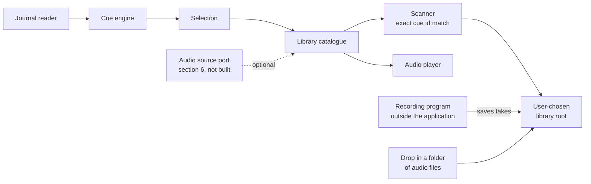

# Bridge Talk: Requirements Specification

Open questions in section 11 are blocking for the areas they name.

---

## 1. Introduction

### 1.1 Purpose

Bridge Talk is a desktop application that watches Elite Dangerous as it is
played and plays a short piece of recorded audio when something happens in the
game. The audio is supplied by the person using it: recordings they made
themselves; recordings made for them by people they know.

It listens to the game. It does not control the game.

### 1.2 Intended audience

Oliver Ernster as author and decision owner; contributors to the open source
project.

### 1.3 Scope

**In scope:**

- A cue engine that turns Elite Dangerous journal events and status flags into
  named cues.
- An audio library held in a directory the user chooses, organised by the person
  who recorded it.
- Discovery of that library by scanning, with no configuration step.
- A checklist of the moments a voice has no recording for, each opening the folder
  its recording belongs in.
- Auditioning, casting a voice, settings and a tray presence.
- A setup program that installs, updates, repairs and removes the application for one user.
- An extension point through which an additional audio source may be supplied
  (section 6; not built today).
- Windows and Linux, decided by Oliver on 2026-09-13. Linux work comes after
  everything else.

**Out of scope:**

| Item | Why |
|---|---|
| Controlling the game in any way | The application has no input path to the game and will not acquire one |
| Speech recognition or spoken commands | Not what this is for |
| Text to speech synthesis | Recorded audio only |
| Shipping any audio with the application | The application plays what the user provides |
| Distributing recordings between users | No transport, no store, no upload |
| Editing the cue vocabulary from the user interface | `cues.toml` is edited as a file |
| Fuzzy, partial or normalising name matching | Section 3.1 rule 4; matching is exact by design |
| macOS | Not asked for; Windows and Linux are the platforms in scope |
| Capturing audio | Recorded in a dedicated program; section 4 |

### 1.4 Definitions

| Term | Meaning, fixed for this document |
|---|---|
| **Cue** | One thing the application can play, plus the game condition that triggers it. Identified by a stable id spelled in the game's own words, such as `StartJump.JumpType.Hyperspace`. Defined in `cues.toml`. |
| **Cue vocabulary** | The complete set of cue ids in `cues.toml`. Currently 256. |
| **Voice** | One person's recordings, selectable as a whole. A directory under the library root that yields at least one take. |
| **Library root** | One directory the user chooses, holding one subdirectory per voice. |
| **Manifest** | `voice.toml` in a voice directory. Optional; it may carry the name a voice is shown by, a credit and takes the convention cannot find (FR-210). |
| **Take** | One audio file answering one cue. A cue may have several takes. |
| **Cast** | The act of selecting the voice that speaks. |
| **Audition** | Playing a take on demand from the user interface, outside game events. |

### 1.5 References

- `ARCHITECTURE.md`: the layering invariants and the tests that enforce them.
- `internal/infrastructure/config/cues.toml`: the cue vocabulary.
- ISO/IEC/IEEE 29148 for requirement quality; EARS for requirement syntax.

---

## 2. Overall description

### 2.1 Product perspective



The cue engine asks the catalogue for a take for a cue id and gets a path or
nothing back. Everything about how audio is stored sits below that line.

### 2.2 User classes

| Class | Description | May do | May not do |
|---|---|---|---|
| **Commander** | Plays Elite Dangerous, wants spoken feedback | Choose a library root, cast a voice, audition, adjust settings, record | Modify the cue vocabulary from the interface |
| **Contributor** | Someone recording a voice for a commander | Record takes in a program of their choice and save them into a voice directory | Anything else |

A single person is usually both.

### 2.3 Operating environment

Windows. Go with Wails hosting a React and TypeScript front end. No CGO: `build.ps1`
sets `CGO_ENABLED` to `0`. Elite Dangerous journal files in their standard location
unless another directory is chosen in Settings or passed with `-journal`. No network
dependency at runtime: the application makes no outbound request.

**Linux is in scope alongside Windows,** decided by Oliver on 2026-09-13. It is not
built yet and comes after all other work. The library
schema in section 3 is already portable, so nothing there changes either way.

### 2.4 Constraints

| ID | Constraint |
|---|---|
| CON-1 | The layering invariant `UI to Application to Domain from Infrastructure` holds and is enforced by `tests/structural`. |
| CON-2 | Every Go source file, every front end source file and every file of the setup program's page stays at or below 400 lines; one landing between 381 and 400 lines is reduced to 350 or fewer. Build and packaging scripts are not counted. |
| CON-3 | The coverage floor over `internal/domain` and `internal/application` stays at 100 percent. |
| CON-4 | `VERSION` is the single source of truth for the version. No version literal elsewhere. |
| CON-5 | No audio ships inside the application or its setup program. |
| CON-6 | Everything written at install time stays per user, under `%LOCALAPPDATA%`, `HKCU`, the user's Start Menu under `%APPDATA%` and the user's Desktop, so Windows never asks for administrator rights. |
| CON-7 | The application never writes to the library root except where section 3 permits it. |

### 2.5 Assumptions

| ID | Assumption | Owner | Confirm by |
|---|---|---|---|
| ASM-1 | The 256 cue ids in `cues.toml` are the right vocabulary. | Oliver | Before recordings are made in earnest |
| ASM-2 | Recordings are made with ordinary consumer microphones in untreated rooms, so their quality is not controllable by the application. | Oliver | Before recordings are made in earnest |
| ASM-3 | A voice is expected to be complete: every cue recorded, every file present used. See FR-215. | Oliver | Confirmed 2026-09-09 |

---

## 3. The audio library

### 3.1 The schema

```
<library root>/
├── Alice/
│   ├── StartJump/
│   │   ├── best-one.wav
│   │   └── second-try.wav
│   ├── DockingGranted/
│   │   └── docking.mp3
│   └── voice.toml              optional: display name, credit, overrides
└── Bob/
    ├── StartJump.wav
    └── DockingGranted.wav
```

**Rule 1, the voice.** Each immediate subdirectory of the library root is a
candidate voice. It becomes a voice when at least one take resolves inside it.

**Rule 2, the folder form.** A subdirectory whose name is exactly a cue id with every
dot written as an underscore holds takes, so `Cast_Confirmed` is the folder for
`Cast.Confirmed`. A subdirectory named with dots is no cue's folder. Every recognised
audio file directly inside it that plays is one take (FR-204). File names carry no meaning.

**Rule 3, the flat form.** An audio file whose name, with its extension removed,
is exactly a cue id is a take for that cue. A trailing dot plus digits before the
extension distinguishes takes, so `StartJump.2.wav` is a second take of
`StartJump`.

**Rule 4, exact literal matching.** A name matches a cue id only when the two
strings are equal, compared case insensitively and in no other way. For a folder the
string compared is the cue id with every dot written as an underscore (FR-229); that is
the one derivation, it runs from id to name only and it is never applied to a name.
No normalisation, no punctuation folding, no fuzzy or nearest match, ever.

**Rule 5, the optional manifest.** `voice.toml` is not required and most voices will not have
one. Where present it may set the name the voice is shown by, a credit line and explicit cue to
file mappings for takes that follow no convention. It adds to what the convention found and takes
nothing away. The directory name stays the voice's identity whatever the manifest says.

**Why rule 4 is a requirement and not a detail.** A name either is a cue id or it
is not. Exact matching means the scan report can state, of every file it found,
whether it was used and if not why not, with no third answer. It also means a
directory of audio organised for some other purpose contributes nothing by
accident, which is what makes it safe to point the application at a directory and
simply see what happens.

### 3.2 Naming on disk

A file in the flat form is named with the cue id unchanged. A cue folder is named with
the cue id with every dot written as an underscore; nothing else is changed (FR-229). No
cue id holds an underscore (FR-230), so each folder name belongs to exactly one id.

Checked against all 256 cue ids: every id uses only letters, digits, `.` and a
space inside a segment, which five ids carry; none begins with a dot, which would
hide it on Linux and macOS; none ends in a dot or space, which Windows silently
strips; no space sits beside a dot; none has a first segment that is a Windows
reserved device name (`con`, `prn`, `aux`, `nul`, `com1` to `com9`, `lpt1` to
`lpt9`); none collides with another when case folded; the longest is 49
characters.

Verified on the Windows filesystem directly: directories named
`CommitCrime_CrimeType_collidedAtSpeedInNoFireZone` (the folder for the longest id),
`Synthesis_Name_Repair Basic` and `DockingGranted`, plus files named
`DockingGranted.wav`, `DockingGranted.2.wav` and `Synthesis.Name.Repair Basic.wav`,
were created and read back byte for byte with nothing stripped and nothing renamed. On Linux and macOS every byte
except `/` and NUL is legal in a name; the only special case is a leading dot,
which no id has.

**Case is the only genuine cross platform difference.** Windows and macOS refuse
two names differing only in case; Linux allows both. FR-218 says what happens
then. Voice directory names are user chosen and are never matched against
anything, so they may hold any characters the platform allows, including non
ASCII; they are display strings only.

### 3.3 The manifest format

TOML, matching `cues.toml`. Every key is optional; a key not shown here makes the file malformed
(FR-211).

```toml
name = "Alice Hart"
credit = "Recorded by Alice, 2026"

# Optional. Only needed for files the convention cannot find.
[takes]
"IsInDanger.Set" = ["oddly-named-file.wav", "alternates/another.wav"]
```

A `[takes]` key is a cue id, matched as rule 4 matches a file name. Each path is relative to the
voice directory, with `/` between its segments on every platform.

The reasoning, since this is an open source project and the file is meant to be
edited by hand: TOML takes comments, which JSON does not; it is not whitespace
significant, so no user can break it by indenting, which a YAML user can; it is
already a direct dependency, so it costs nothing; and it is what `cues.toml`
already is. Two configuration formats in one application is worse than either
format alone.

### 3.4 Requirements

**FR-201 Choose a library root**
Priority: Must.
When the user selects a library root, the application shall persist that path in
settings and shall scan it. It shall persist nothing else with it.
Acceptance: Given no root is set, when the user chooses one and the application is
restarted, then the same root is in use.
Verified by: `TestChoosingOneDirectoryKeepsThatDirectoryAlone` in `remember_test.go` at the
repository root, for persisting nothing else.

**FR-202 If the library root is missing or unreadable, then say so**
Priority: Must.
If the configured library root does not exist or cannot be read, then the Missing
takes pane shall show a refusal naming the path it tried, on the same pane as the Browse
control that chooses another root, rather than presenting an empty voice list. At startup
the same refusal is printed to standard error.
Note: the Cast pane does not tell these cases apart; it says nothing under the path is
named for a cue.
Rationale: an empty list and a broken path look identical; the guess a user makes
is usually the parent of the right place.
Verified by: `TestARootThatCannotBeReadIsAnError` in
`internal/infrastructure/library/voice_test.go`; `frontend/src/missingTakes.test.tsx` for the
refusal on the pane.

**FR-203 Recognised audio formats**
Priority: Must.
The scanner shall recognise files with the extensions `.wav`, `.mp3`, `.flac` and
`.ogg`, matched case insensitively; it shall ignore every other file.
Rationale: these are exactly the formats the player can decode.
Verified by: `TestTheFormatsThePlayerDecodesAreRecognisedInAnyCase` in
`internal/infrastructure/audio/formats_test.go`.

**FR-204 If a file has a recognised extension but cannot be decoded, then report it**
Priority: Must.
If a take cannot be decoded, then the application shall exclude it from the
catalogue, shall record it in the scan report with the reason and shall not fail
the scan.
Note: only the start of each take is decoded, so a file whose start plays and whose middle is
damaged is still offered. The scan report reaches standard error alone (FR-208).
Verified by: `TestATakeThatWillNotPlayIsLeftOutAndReported` and
`TestAVoiceScannedAloneLeavesOutWhatWillNotPlay` in
`internal/infrastructure/library/playable_test.go`;
`TestARecordingThatWillNotPlaySaysWhyWithoutNamingItself` and `TestARecordingThatPlaysIsPlayable`
in `internal/infrastructure/audio/formats_test.go`; `TestEverythingAScanPassedOverIsNamed` in
`voices_test.go` at the repository root.

**FR-205 Drop-in discovery, folder form**
Priority: Must.
When scanning a voice directory, the application shall treat each subdirectory
whose name equals a cue id's folder form (FR-229) as that cue's takes; every recognised
audio file directly inside it is one take.
Acceptance: Given `Alice/StartJump/` holding two WAV files, when a scan runs,
then Alice has two takes for `StartJump` and no manifest was needed.
Verified by: `TestAFolderNamedForACueHoldsThatCuesTakes` in
`internal/infrastructure/library/voice_test.go`.

**FR-206 Drop-in discovery, flat form**
Priority: Should.
When scanning a voice directory, the application shall treat a recognised audio
file whose base name equals a cue id, optionally followed by a dot and digits, as
a take for that cue.
Acceptance: Given `Bob/DockingGranted.wav` and `Bob/DockingGranted.2.wav`, when
a scan runs, then Bob has two takes for `DockingGranted`.
Verified by: `TestAFileNamedForACueIsATakeWithDigitsTellingTakesApart`;
`TestOnlyASegmentOfDigitsMarksAnotherTake`.

**FR-207 Matching is exact and literal**
Priority: Must.
The application shall compare a directory or file name to a cue id by case
insensitive string equality alone, a directory name against the id's folder form
(FR-229). It shall not normalise punctuation, whitespace or word separators; nor shall
it perform any fuzzy, partial or nearest match.
Verified by: `TestMatchingIsExactApartFromCase`.

**FR-208 If a name does not match a cue id, then skip it and report it**
Priority: Must.
If a subdirectory or audio file inside a voice directory matches no cue id, then
the application shall ignore it and shall record it in the scan report as
unmatched, naming what it found.
Rationale: a typo is the most likely user error and it is otherwise silent.
Note: the scan report reaches only standard error, printed at startup. Choosing a library
root and a rescan both discard it.
Verified by: `TestNamesMatchingNoCueAreReportedWhereTheyWereFound`.

**FR-209 If a directory yields no takes, then it is not a voice**
Priority: Must.
If an immediate subdirectory of the library root yields no resolved take, then the
application shall omit it from the voice list and shall record it in the scan
report with the reason.
Verified by: `TestADirectoryResolvingNothingIsReportedRatherThanOffered`.

**FR-210 Optional manifest**
Priority: Should.
Where a voice directory holds a `voice.toml` that FR-211 does not refuse, the application shall
show its `name` in place of the directory name wherever the voice is shown: its row on the Cast
pane, the Moments spoken for dialog, the Cast card on the Status pane, the Auditioning chooser, the
tray's Voice menu and the tray icon's hover text. It shall show the `credit` beneath the figures on
the voice's Cast pane row; it shall add every take the `[takes]` table declares to the takes found
by convention.
The directory name stays the voice's identity: Settings stores it, `-voice` matches it and `-list`
and `-unbound` print it. The Missing takes pane lists folders rather than voices, so it names
directories too. A blank or missing `name` leaves the voice shown by its directory name. Voices are
listed in order of the name they are shown by, ignoring case.
If a `[takes]` key names no cue, then the application shall pass over that entry and shall record it
in the scan report. If a declared path is absolute, leaves the voice directory or has no recognised
extension, then the application shall pass over that path alone and shall record it in the scan
report. A declared take that will not play, one that is not there included, is left out as FR-204
says. A file declared for a cue the convention already found it for is one take. Neither a file the
manifest reaches nor a folder holding one is reported as matching no cue (FR-208).
Acceptance: Given `Alice/StartJump.wav`, `Alice/odd.wav` and `Alice/voice.toml` holding
`name = "Alice Hart"`, `credit = "Recorded by Alice, 2026"` and `"IsInDanger.Set" = ["odd.wav"]`,
when a scan runs, then Alice has takes for `StartJump` and `IsInDanger.Set`, her Cast pane row reads
"Cast Alice Hart" with the credit beneath its figures and casting her stores `Alice`.
Verified by: `TestAManifestNamesAndCreditsItsVoice`, `TestAManifestAddsTheTakesItDeclares`,
`TestAManifestEntryThatCannotBeUsedIsPassedOverAlone` and `TestVoicesAreListedByTheNameTheyAreShownBy`
in `internal/infrastructure/library/manifest_test.go`;
`TestAManifestNameIsShownWhileTheDirectoryStaysTheIdentity` in `cast_test.go`;
`TestTheMenuShowsEachVoiceByTheNameItIsShownBy` in
`internal/infrastructure/taskbar/tray_windows_test.go`; "shows the name and credit a manifest gives"
in `frontend/src/cast.test.tsx`; "offers each voice under the name it is shown by" in
`frontend/src/audition.test.tsx`; "names the cast voice on the Status pane as it is shown" in
`frontend/src/shell.test.tsx`. Not verified by a test: the tray menu as drawn.

**FR-211 If a manifest is malformed, then fall back to the convention**
Priority: Must.
If `voice.toml` cannot be read, is not valid TOML, holds a key section 3.3 does not show or holds a
value of the wrong type, then the application shall scan the directory by convention as though the
file were absent; it shall record the reason in the scan report.
Rationale: a broken optional file must never cost a voice their voice.
Acceptance: Given `Alice/StartJump.wav` beside a `voice.toml` holding `nmae = "Alice Hart"`, when a
scan runs, then Alice is shown as `Alice` with her `StartJump` take and the scan report names
`Alice/voice.toml` with the key it did not know.
Note: the scan report reaches standard error alone (FR-208).
Verified by: `TestAManifestThatCannotBeUsedFallsBackToTheConvention` in
`internal/infrastructure/library/manifest_test.go`; `TestAKeyTheShapeDoesNotHoldIsRefused` in
`internal/infrastructure/tomlfile/strict_test.go`; `TestEverythingAScanPassedOverIsNamed` in
`voices_test.go`.

**FR-212 Assign unmatched files to cues**
Priority: Should.
Not built today: no pane lists unmatched files and nothing writes a `voice.toml`.
When the user selects a voice with unmatched files, the application shall list
those files, shall let the user assign each to a cue and shall write the
assignments to that voice's `voice.toml`.
Rationale: the escape hatch for audio that arrived under someone else's naming; it
is also how a user fixes a typo without leaving the application.

**FR-213 A directory organised under another convention resolves nothing**
Priority: Must.
Given a directory tree whose names follow a space separated prose convention, when
a scan runs, then no take shall resolve and no voice shall be offered.
Verified by: `TestATreeNamedInProseResolvesNothing` in
`internal/infrastructure/library/voice_test.go`.

**FR-214 Rescan on demand**
Priority: Must.
When the user requests a rescan, the application shall re-read the library root
and update the voice list, the completeness figures and the cast voice's catalogue
without a restart.
Note: a rescan that finds no voice leaves the voices already known in place. The
tray's voice menu is built at startup and is not refreshed by a rescan.
Verified by: `TestLookingAgainFindsAVoiceFilledSinceTheStart`;
`TestLookingAgainWithNothingToFindChangesNothing`.

**FR-215 Report both completeness figures**
Priority: Must.
The application shall show, for each voice, the number of cues that voice has at
least one take for out of the size of the cue vocabulary, plus the number of audio
files it uses out of the number of recognised audio files present in that voice's
directory.
Rationale: a voice is expected to be complete and every file present is expected
to be used, so both figures should read `n of n`. Two figures rather than one
because they fail differently: a shortfall in the first means lines were never
recorded; a shortfall in the second means files are present that nothing can
reach, which is a naming mistake.
Acceptance: Given a voice with takes for every cue and no unmatched files, when
the voice list is shown, then both figures read `n of n`.
Note: a recording present is any file with a recognised extension anywhere under the voice's
directory, whether it plays or not; a recording used is a distinct file that answers a cue. The Cast
pane words the pair as moments recorded and recordings used.
Verified by: `TestPresentCountsEveryRecognisedRecordingUnderTheVoice` in
`internal/infrastructure/library/present_test.go`;
`TestFilesCountDistinctFilesUsedAgainstRecordingsPresent` in
`internal/infrastructure/library/catalogue_test.go`; `TestTheCastPaneListsEveryVoiceTheScanFound` in
`cast_test.go`; "reads both completeness figures for each voice" in `frontend/src/cast.test.tsx`.

**FR-216 Audition a take**
Priority: Must.
When the user chooses a voice on the Audition pane and presses a group's button, the
application shall play one take drawn at random from the distinct takes of that group,
where a group is every cue sharing the first segment of its id. Any voice found may be
auditioned whether cast or not; an audition plays while muted.
Verified by: `TestTheAuditionPaneListsWhatAVoiceCanBeHeardOn` and
`TestAnAuditionPlaysEvenWhileMuted` in `audition_test.go`; `TestAnAuditionDrawsFromTheNamedGroup`
in `internal/infrastructure/library/catalogue_test.go`.

**FR-217 The library is read only, with named exceptions**
Priority: Must.
The application shall never write to, move, rename or delete a file under the
library root, except FR-223 making a voice's directory with its empty folders plus
FR-314 making a missing moment's folder. Both are confined to the voice directory being
targeted. FR-212 would add a third, writing a `voice.toml`; it is not built today.

**FR-218 If two directories differ only in case, then merge their takes**
Priority: Must.
If a voice directory holds more than one subdirectory whose name equals the same cue
folder name under case insensitive comparison, then the application shall treat their takes as
one set and shall record the duplication in the scan report.
Rationale: Linux permits `DockingGranted/` beside `dockinggranted/`; Windows and
macOS do not. Merging is deterministic and loses nothing. Silently choosing one
would make a library behave differently on two machines holding identical files.
Verified by: `TestDirectoriesDifferingOnlyInCaseMergeTheirTakes`.

**FR-219 No cue id may end in a digit only segment**
Priority: Must.
The cue vocabulary shall contain no id whose final dot separated segment consists
only of digits.
Rationale: the flat form in rule 3 distinguishes takes by a trailing dot and
digits, so such an id would make `x.2.wav` ambiguous between a second take of `x`
and a first take of `x.2`. No id has this shape today, which is a property of the
vocabulary rather than a law, so it is made a test.
A cue table holding such an id shall fail to load with the reason. That holds for the
shipped table and for an override file handed to the loader; no flag or setting supplies
an override today.
Verified by: `TestNoCueIdEndsInDigits` in `tests/structural/vocabulary_test.go`, proved by
planting a violating id; `TestAnIdEndingInASegmentOfDigitsIsRefused` in
`internal/domain/cue/id_test.go` for `cue.New`, which every table is built through;
`TestAnOverrideHoldingAnIdEndingInDigitsFailsToLoad` in
`internal/infrastructure/config/loader_test.go`.

**FR-222 No cue id may end in a dot or a space**
Priority: Must.
The cue vocabulary shall contain no id whose final character is a dot or a space.
Rationale: a recording is found by a name equal to its cue id; Windows silently
strips a trailing dot or space from a name as it is created, so a folder made for
such an id would arrive under a different name and never be found.
A cue table holding such an id shall fail to load with the reason. That holds for the
shipped table and for an override file handed to the loader; no flag or setting supplies
an override today.
Verified by: `TestNoCueIdEndsInADotOrASpace` in `tests/structural/vocabulary_test.go`, proved
by planting a violating id; `TestAnIdEndingInADotOrASpaceIsRefused` in
`internal/domain/cue/id_test.go`; `TestAnOverrideHoldingAnIdEndingInASpaceFailsToLoad` in
`internal/infrastructure/config/loader_test.go`.

**FR-229 A cue folder writes each dot as an underscore**
Priority: Must.
The application shall name every cue folder it makes, lists or opens with the cue id
with every dot written as an underscore. The scanner shall take a subdirectory of a voice
as a cue's folder only when its name equals that form, compared case insensitively.
Rationale: there are no dotted folder names (Oliver, 2026-09-13). The flat form keeps
the dots, since a trailing dot and digits number its takes (rule 3).
Acceptance: Given the cue `Cast.Confirmed`, when the folders for `Oliver` are made, then
`Oliver/Cast_Confirmed/` exists and `Oliver/Cast.Confirmed/` does not; a take in
`Oliver/Cast_Confirmed/` resolves for `Cast.Confirmed`; a take in `Oliver/Cast.Confirmed/`
resolves for nothing.
Verified by: `TestMakingAVoicesFoldersMakesOneForEveryCue` in
`internal/infrastructure/library/folders_test.go`, which also resolves a take in the
underscore folder and none in a dotted one; `TestAMomentFolderWritesEachDotAsAnUnderscore` in
`internal/infrastructure/library/checklist_test.go`; `TestAFolderNameWritesEachDotAsAnUnderscore`
in `internal/domain/cue/id_test.go`.

**FR-230 No cue id may contain an underscore**
Priority: Must.
The cue vocabulary shall contain no id holding an underscore. A cue table holding such an
id shall fail to load with the reason, whether it is the shipped table or an override file
handed to the loader.
Rationale: FR-229 writes dots as underscores. An id already holding one could share a
folder name with another id, so a folder could no longer be read back as exactly one cue.
Verified by: `TestNoCueIdHoldsAnUnderscore` in `tests/structural/vocabulary_test.go`, proved
by planting a violating id; `TestAnIdHoldingAnUnderscoreIsRefused` in
`internal/domain/cue/id_test.go` for `cue.New`, which every table is built through.

**FR-231 Every cue carries a written purpose**
Priority: Must.
Every cue in the cue table shall carry a purpose: one sentence, written by hand, saying when
the cue is heard. If a table holds a cue whose purpose is missing, empty or only spaces,
then the application shall refuse the table, naming the cue.
Rationale: a title is read from the cue id, so it can only restate the id. Someone recording a
take needs to know when it will be heard, which the id cannot say (Oliver, 2026-09-13). Titles
stay generated; the purpose is the one piece of reader facing text the table writes.
Acceptance: Given a table whose `Docked` entry has no `purpose`, when it is loaded, then loading
fails with an error naming `Docked`. Given the shipped table, when it is loaded, then every one
of its 256 cues has a purpose.
Verified by: `TestACueWithNoPurposeIsRefusedByName` and `TestEveryShippedCueHasAPurpose` in
`internal/infrastructure/config/loader_test.go`; `TestAPurposeIsCarriedAsWritten` in
`internal/domain/cue/cue_test.go`.

**FR-223 Make a voice's folders**
Priority: Must.
When the user asks for the folders of a named voice, the application shall create
`<library root>/<name>/` holding one empty subdirectory for each cue id in the
vocabulary, named with that id's folder form (FR-229).
Rationale: a folder named for its cue is the folder form of rule 2, so a person
filling a voice by hand puts each recording in the folder for its moment and never
types a cue id. The Missing takes pane opens the same folders under FR-314.
Acceptance: Given an empty library root and a vocabulary of 256 cues, when the user
makes the folders for `Oliver`, then `Oliver/` holds 256 empty subdirectories, one
per cue id; a take then placed in `Oliver/DockingGranted/` under any file name
resolves for `DockingGranted` on the next scan.
Verified by: `TestMakingAVoicesFoldersMakesOneForEveryCue` in
`internal/infrastructure/library/folders_test.go`;
`TestFoldersAreMadeUnderTheChosenRecordingsDirectory` in `folders_test.go` at the
repository root.

**FR-224 Making a voice's folders never replaces anything**
Priority: Must.
When the user asks for a voice's folders, the application shall leave every entry
already under that voice directory unchanged.
Acceptance: Given `Oliver/Docked/a.wav` and a file named `Oliver/Undocked`, when the
folders are made, then both are unchanged and only the missing folders are created;
a second run creates none.
Verified by: `TestMakingFoldersAgainAddsOnlyWhatIsMissing`.

**FR-225 If a voice name cannot be a folder name, then refuse it**
Priority: Must.
If the name given for a voice breaks one of the rules below, then the application
shall refuse it with the rule it broke, creating nothing.

- It is empty or only spaces.
- It begins or ends with a space.
- It ends with a dot.
- It holds one of `< > : " / \ | ? *` or a control character.
- Before its first dot it is a device name Windows keeps: `con`, `prn`, `aux`,
  `nul`, `com1` to `com9`, `lpt1` to `lpt9`.

Rationale: a library is expected to move between Windows and Linux, so the rules of
the stricter platform hold on both. The name is checked before anything is made, so a
refused name creates nothing, not even the default recordings directory of FR-228.
Verified by: `TestANameThatCannotBeAFolderIsRefused` in
`internal/infrastructure/library/folders_test.go`; `TestABadNameIsRefusedBeforeAnythingIsMade`
in `folders_test.go` at the repository root.

**FR-226 withdrawn on 2026-09-13.** It had Make folders ask where the folders go while no
library root was chosen. Pressed, the button opened a folder picker instead of making folders;
the picker refused the voice's name typed into it because that folder did not exist yet.
FR-228 replaces it. FR-226 is retired and is not reused.

**FR-228 While no library root is chosen, make the folders in the default recordings directory**
Priority: Must.
While no library root is chosen, when the user asks for a voice's folders, the application
shall make them in the default recordings directory of FR-227 without asking anything and shall
take that directory as the library root. If the default recordings directory cannot be worked
out or made, then the application shall report the reason and make nothing.
Rationale: a button called Make folders makes folders (Oliver, 2026-09-13). FR-201's chooser
refuses a directory holding no voices, which is all a new user has, so without this a new user
has no way to name a library root.
Acceptance: Given no library root on Windows, when the user makes the folders for `Oliver`, then
`%LOCALAPPDATA%\BridgeTalk\Recordings\Oliver\` holds one folder per cue, no dialog opens and
`%LOCALAPPDATA%\BridgeTalk\Recordings` is the stored library root, with nothing else stored beside it.
Verified by: `TestWithNoRecordingsDirectoryTheFoldersGoInTheDefaultOne`;
`TestADefaultThatCannotBeMadeIsReported` in `folders_test.go` at the repository root.

**FR-227 The recordings question opens in the product's own folder**
Priority: Must.
While no library root is chosen, when the application asks where the recordings are, the
application shall open that question in the default recordings directory, creating the
directory where it is missing.
The default recordings directory is `%LOCALAPPDATA%\BridgeTalk\Recordings` on
Windows. Elsewhere it is `BridgeTalk/Recordings` under `$XDG_DATA_HOME`, which falls
back to `~/.local/share` where it is unset.
Rationale: given no folder, the system dialog chose for itself and opened in the
game's folder, where a user's recordings do not belong. Of the folders the product
owns this is the one setup never removes: uninstall deletes the install directory;
forgetting settings deletes the window state and the settings file. It is local
rather than roaming, because hours of audio do not belong in a roaming profile.
Acceptance: Given no library root on Windows, when the user presses Browse for the
recordings, then the folder question opens in `%LOCALAPPDATA%\BridgeTalk\Recordings`,
which exists. Given a library root, when the user presses Browse for the recordings, then
the question opens in that root.
Verified by: `TestTheDefaultRecordingsDirectoryBelongsToTheProduct` in
`internal/infrastructure/library/root_test.go`;
`TestTheRecordingsQuestionOpensInTheProductsOwnFolder` and
`TestTheRecordingsQuestionOpensWhereTheRecordingsAre` in `folders_test.go` at the repository
root.

**FR-220 If a voice has no take for a cue, then the cue is silent and the gap is reported**
Priority: Must.
If the cast voice has no take for a fired cue, then the application shall play
nothing, shall not substitute a take from another cue or another voice; it shall
list that cue among the voice's missing cues.
Note: a complete voice is the expectation, so silence here covers a state the
design does not intend rather than a normal operating mode. It stays a Must
because a half recorded voice must not crash or substitute.
Verified by: `TestACueTheActiveVoiceCannotServeIsRecordedAsUnbound` in
`internal/application/services/reaction_test.go`, for the silence; the list is held by the tests
FR-311 names.

**FR-221 One cue plays one file**
Priority: Must.
The application shall play exactly one audio file per fired cue and shall not
assemble a sequence of files into one utterance.
Rationale: a long line is one long file. The person recording decides where a line
ends.
Verified by: `TestEveryCuePlaysExactlyOneFile` in `internal/application/services/scheduler_test.go`;
`TestACueWithSeveralTakesSpeaksOnce` in `internal/application/services/reaction_test.go`.

**FR-232 Casting a voice plays its confirmation**
Priority: Must.
When the user casts a voice, the application shall play one take of `Cast.Confirmed` from that
voice, chosen at random among its takes. If the voice has no take for `Cast.Confirmed`, the
output is muted or no audio device is open, then the cast shall succeed with nothing played.
Acceptance: Given `Ivy/` with two takes for `Cast.Confirmed`, when Ivy is cast, then one of the
two plays. Given `Ivy/` with none, when Ivy is cast, then the cast succeeds and nothing plays.
Verified by: `TestCastingAVoiceIsConfirmedInThatVoice` and `TestCastingAVoiceWhileMutedSaysNothing`
in `cast_test.go`; `TestTheAcknowledgementIsFoundByItsSource` and
`TestAnAcknowledgementNobodyRecordedIsSilence` in `internal/infrastructure/library/catalogue_test.go`.

**FR-233 Each listed cue is named once**
Priority: Must.
Wherever the application lists cues, on the Missing takes pane and in the breakdown dialog behind
a cast row, it shall show each cue under its full title alone, with no group heading above it.
Rationale: a heading is read from the first segment of the id and a title from the whole id, so a
heading repeats the start of every title beneath it; for 112 of the 256 cues the two are the same
words (Oliver, 2026-09-13).
Acceptance: Given `CarrierDepositFuel` and `StartJump.JumpType.Hyperspace` listed, then "Carrier
deposit fuel" is shown once and "Start jump: jump type hyperspace" is shown with no "Start jump"
standing on its own above it.
Verified by: `frontend/src/missingTakes.test.tsx` and `frontend/src/cast.test.tsx`, each failing
when a heading is drawn above a title; `TestTheBreakdownAnswersForAVoiceThatIsNotCast` in
`cast_test.go` for the full title reaching the page.

**FR-234 Nothing is shown twice in a row**
Priority: Must.
The application shall never show the same text twice in succession: no line, label, message or
tooltip shall repeat, word for word, text standing directly before it or beside it.
Rationale: a repeat tells the reader nothing new and makes the window look broken (Oliver,
2026-09-13).
Acceptance: A decision in the reaction log that played nothing names its cue once, with no event
name repeating the start of the id. With every voice complete, the voice chooser says "Every voice
is complete" and the note beneath it does not say it again. After Browse, the new path is shown
once, in its row; the message beneath does not repeat it. A cast row carries no tooltip
repeating its own words. The setup program's header carries no title line beneath the window's
own title bar, which already names the program.
Verified by: `frontend/src/shell.test.tsx` for the reaction log; `frontend/src/missingTakes.test.tsx`
for the complete note and the recordings message; `frontend/src/panes.test.tsx` for the journal
message; `frontend/src/cast.test.tsx` for the cast rows; `TestTheSetupHeaderRepeatsNoTitle` in
`tests/structural/setupheader_test.go` for the setup header. Each failed with its repeat put back.

**FR-235 Setup applies the boxes it shows**
Priority: Must.
Whenever setup writes the application, it shall apply the Start Menu, Desktop and sign-in boxes as
they stand on screen; no action shall substitute choices of its own. If a box that saves at once
fails to save, then setup shall put the box back as it was and show the reason.
Rationale: Reinstall applied sign-in off beneath a ticked box, so the application opened with its
own box unticked (Oliver, 2026-09-13).
Acceptance: Given the Installed screen with "Start it when I sign in" ticked, when Reinstall is
pressed, then the sign-in entry exists and the application's Settings box reads ticked.
Verified by: `TestSetupAppliesTheBoxesItShows` in `tests/structural/setupchoices_test.go`. The
entry and the Settings box after a real Reinstall are checked by hand, since no test runs setup.

**FR-236 A press never cuts a clip short**
Priority: Must.
While a clip is playing, the application shall ignore every audition press whichever group it
names; it shall show each audition button as unavailable until the clip ends or Stop is pressed.
Rationale: hammering Play cut off the clip already sounding, since starting a clip stopped whatever
was playing first (Oliver, 2026-09-13). A clip the ship is saying in reaction to the game counts
as playing, so an audition press never cuts a reaction short either.
Note: three acts still end a clip on purpose. Stop ends it. Casting a voice ends it and plays the
new voice's confirmation (FR-232). An alert ends a reaction of lower priority.
Acceptance: Given a clip playing, when any audition button is pressed, then the clip plays on and
nothing else starts. Given a clip playing, then every audition button is disabled; when the clip
ends, they are enabled again.
Verified by: `TestAPressWhileAClipPlaysLeavesThatClipPlaying` in `audition_test.go`;
`TestPlayingIfIdleLeavesACurrentSequenceAlone` in `internal/infrastructure/audio/sequence_test.go`;
`frontend/src/audition.test.tsx` for the held buttons. Each failed with its guard taken out. That
the clip is heard to its end is checked by hand, since no test hears the device.

**FR-237 A refusal names each path once**
Priority: Must.
Wherever the application or its setup program refuses an action over a file or folder, the refusal
shall name that file or folder once, written as the reader would type it, followed by the reason in
plain words. It shall not name the system call that failed.
Rationale: a folder with no journal in it was named twice, the second time with every separator
doubled; a folder that did not exist was named three times, with GetFileAttributesEx between them
(Oliver, 2026-09-13).
Acceptance: Given Browse on the Journal directory row answered with a folder holding no journal,
then the refusal names that folder once with single separators. Given a recordings directory that
does not exist, when Refresh is pressed, then the refusal names it once and says it cannot be found.
Verified by: `TestAJournalDirectoryRefusalNamesItsFolderOnce`, `TestARecordingsRefusalNamesItsFolderOnce`
and `TestAFolderTheFileManagerWillNotOpenIsNamedOnce` in `refusals_test.go`;
`TestSetupRefusalsNameTheirPathOnce` in `internal/infrastructure/setup/refusals_test.go`;
`TestConfigRefusalsNameTheirPathOnce` in `internal/infrastructure/config/refusals_test.go`. Every one
holds its refusals to `refusal.Check` in `internal/refusal`, the one statement of the rule, which
`TestCheckFindsEachWayARefusalGoesWrong` holds in turn. Each failed with its site's fix taken out.

**FR-238 The window opens whatever the journal directory holds**
Priority: Must.
When the application starts with a journal directory that cannot be found, cannot be read, holds no
journal file or holds no status file, it shall open its window as it otherwise would. The Status
pane and the Journal directory row on the Settings pane shall each show why that directory cannot
be watched, naming it once (FR-237). When Browse on that row takes a directory that can be watched,
neither shall show it any longer. The same holds when no directory was chosen and the game's usual
one does not exist, which is a machine where the game has never run.
Rationale: an unreadable journal directory ended the application before any window appeared, so it
read as a program that does not start rather than one pointed at the wrong place, with the one
control that could put it right out of reach (Oliver, 2026-09-13).
Acceptance: Given a journal directory that does not exist, when the application starts, then the
window opens, the Status pane says that directory cannot be found and so does the Journal directory
row. Given that window, when Browse on the row takes a directory holding a journal and a status
file, then neither place shows the refusal.
Verified by: `journaldir_test.go` for what startup watches and what the facade reports, including
a Browse that clears it; `frontend/src/shell.test.tsx` for the Status pane and
`frontend/src/panes.test.tsx` for the Settings row. Each failed with its fix taken out. That the
window itself appears is checked by hand, since no test opens it.

### 3.5 Non-functional

**NFR-P-201 Scan time**
Priority: Should.
Not measured today: no benchmark exists in the scanner package and section 2.3 names no
reference machine.
When scanning a library root holding up to 10 voices and up to 5,000 audio files
in total, the application shall complete the scan within 3 seconds on the
reference machine in section 2.3, measured by a benchmark in the scanner package.

**NFR-P-202 Playback latency**
Priority: Must.
Not measured today: no player benchmark exists.
When a cue fires, the application shall begin audio output within 150 milliseconds
at the 95th percentile, measured over 100 firings in the player benchmark.

---

## 4. Recording

Recording happens outside the application, in whatever program the person recording
prefers. The application's part is to say what a voice is still missing and to open the
folder each take belongs in.

**Withdrawn on 2026-09-13.** A built-in recorder was specified here as FR-301 to FR-310
with NFR-C-301 to NFR-C-304. Oliver withdrew it in favour of recording in a dedicated
program, which already records WAV and can trim a take or even out its level, where a
bare recorder here would do neither. Those identifiers are retired and are not reused.

**FR-312 withdrawn on 2026-09-13.** It offered every voice folder, recorded or not. Oliver ruled
the same day that the chooser is for what still needs recording, so a complete voice has no place in
it; FR-316 and FR-317 replace it. FR-312 is retired and is not reused.

**FR-311 List what a voice is missing**
Priority: Must.
When the user chooses a voice folder on the Missing takes pane, the application shall list
every cue that voice has no take for, each under its full title alone (FR-233), with the full
path of the folder an audio file for it belongs in.
Rationale: what a voice is missing is audio files in particular folders, so the list says
where each one goes rather than leaving the reader to work out a path from a cue id.
Acceptance: Given `Oliver/` holding a take for `Docked` alone and a vocabulary of 256
cues, when Oliver is chosen, then 255 cues are listed and `Docked` is not; `Undocked` is
shown with `<library root>\Oliver\Undocked` as its folder.
Verified by: `TestMissingListsWhatAVoiceHasNoTakeFor` in
`internal/infrastructure/library/checklist_test.go`; `TestTheChecklistCountsWhatIsRecorded`
in `checklist_test.go` at the repository root; `frontend/src/missingTakes.test.tsx`.

**FR-318 Show when each missing take will be heard**
Priority: Must.
When the Missing takes pane lists a cue, it shall show the cue's purpose (FR-231) on the line
beneath its title and above its folder path, in the theme's secondary text colour, so the
purpose reads apart from both. That colour shall measure a contrast of at least 7 to 1 against
the page and panel backgrounds in both the light theme and the dark one.
Rationale: the list is useful to someone recording only if it says when each take will be heard
(Oliver, 2026-09-13).
Acceptance: Given `Oliver/` with no take for `Cast.Confirmed`, when Oliver is chosen, then the
row reads "Cast: confirmed", then the purpose of `Cast.Confirmed`, then
`<library root>\Oliver\Cast_Confirmed`, the purpose drawn in the secondary colour.
Verified by: `frontend/src/missingTakes.test.tsx` for the line and its place in the row;
`TestTheChecklistCountsWhatIsRecorded` for the purpose reaching the page;
`TestThePurposeLineContrastsInBothThemes` in `tests/structural/contrast_test.go` for the colour.

**FR-316 Offer only the voices still missing takes**
Priority: Must.
The Missing takes pane shall offer in its voice chooser every immediate subdirectory of the
library root that has no take for at least one cue, including one that holds no take at all,
each named with how many cues it is missing. A voice folder with a take for every cue shall not
be offered.
Rationale: the chooser is for what still needs recording (Oliver, 2026-09-13). A voice made
under FR-223 holds no take until the first is saved, so under FR-209 it is not yet a voice; it
is exactly the one that needs the list.
Acceptance: Given `Grace/` with a take for every cue, `Oliver/` with a take for `Docked` alone
and an empty `Hugo/`, when the pane opens, then the chooser offers Hugo and Oliver, each with
its count of missing cues; it does not offer Grace.
Verified by: `frontend/src/missingTakes.test.tsx`; `TestVoiceDirsListsEveryFolderRecordedOrNot`
and `TestEveryVoiceFolderIsOfferedRecordedOrNot` for the folders the pane chooses among.

**FR-317 The voice chooser is always shown**
Priority: Must.
The Missing takes pane shall always show its voice chooser. While the library root holds no
voice folder, the chooser shall hold one entry saying there are no voices yet and the pane shall
say how to make one. While every voice folder has a take for every cue, the chooser shall hold
one entry saying every voice is complete and the pane shall add that each one has a recording for
every moment, without saying again what the chooser says (FR-234).
Rationale: a control that is there in some states and gone in others makes the pane a different
window each time it is opened (Oliver, 2026-09-13).
Acceptance: Given no voice folder, the chooser shows "No voices yet" and cannot be changed.
Given only complete voices, the chooser shows "Every voice is complete" and the pane beneath it
says "Each one has a recording for every moment."
Verified by: `frontend/src/missingTakes.test.tsx`.

**FR-313 Show progress**
Priority: Should.
While a voice folder is chosen, the Missing takes pane shall show how many cues of the
vocabulary it has at least one take for.
Verified by: `TestTheChecklistCountsWhatIsRecorded`.

**FR-314 Open a moment's folder**
Priority: Must.
When the user presses Open folder beside a cue, the application shall open that cue's
folder inside the chosen voice folder in the system file manager, creating the folder
where it is missing.
Acceptance: Given `Oliver/` with no `Docked` folder, when Open folder is pressed beside
Docked, then `Oliver/Docked/` exists and File Explorer shows it.
Verified by: `TestAMomentFolderIsMadeWhereMissingAndKeptWhereNot`;
`TestOpeningAMomentsFolderMakesItAndShowsIt`. File Explorer appearing is not verified by
a test, since a test opens no window.

**FR-315 If a moment's folder cannot be opened, then say why**
Priority: Must.
If the cue is not in the vocabulary, the voice folder does not exist or the folder
cannot be made or shown, then the application shall report the reason on the Missing
takes pane without opening anything.
Verified by: `TestAMomentFolderThatCannotBeMadeIsReported`;
`TestAMomentFolderThatCannotBeOpenedIsReported`.

---

## 5. Cross cutting non-functional requirements

| ID | Requirement | Method |
|---|---|---|
| NFR-M-1 | Coverage over `internal/domain` and `internal/application` stays at 100 percent | `test.ps1` fails below the floor and names every function short of it |
| NFR-M-2 | No source file exceeds 400 lines; none sits between 381 and 400 | `TestNoFileExceedsLineLimit` and `TestNoFileInDangerBand` in `tests/structural/boundary_test.go`, over the Go source and both front ends; build scripts are not counted |
| NFR-M-3 | The layering invariant holds | `tests/structural/boundary_test.go` |
| NFR-M-4 | `gofmt`, `go vet` and `staticcheck` all exit zero | `test.ps1` runs `gofmt` and `go vet`; `build.ps1` runs `test.ps1` ahead of any build. Not enforced today for `staticcheck`: no script runs it; it is run by hand |
| NFR-S-1 | The application makes no network request; there is no update check | Inspection: no Go source outside the structural tests names a network package and the front end makes no request. No test asserts the outbound surface today; `TestDomainIsPure` forbids `net` and `net/http` in the domain alone |
| NFR-S-2 | The application never writes outside the library root and its own per user data directories, apart from the per user sign-in entry under `HKCU` | No test today. By inspection the application writes the settings file under the user configuration directory, the default recordings directory under `%LOCALAPPDATA%`, the folders of FR-223 and FR-314 plus the sign-in entry |
| NFR-O-1 | Every scan produces a report naming every candidate voice directory that resolved no take, every subdirectory or audio file matching no cue and every cue folder differing from another only in case, each with a reason. Not built today for undecodable files (FR-204) | `TestADirectoryResolvingNothingIsReportedRatherThanOffered`, `TestNamesMatchingNoCueAreReportedWhereTheyWereFound` and `TestDirectoriesDifferingOnlyInCaseMergeTheirTakes` in `internal/infrastructure/library/voice_test.go` |

**Non claims, stated deliberately:**

- The application does not encrypt recordings at rest.
- The application does not verify who a recording is of or who owns it.
- The application does not record, process, clean up or improve audio.
- The application cannot control the game.

---

## 6. The audio source port

**FR-501 The audio source is a port**
Priority: Should.
Not built today: no audio source interface is declared and `library.Catalogue` is built
directly over a scanned `library.Voice`. The reaction service does depend on the
`VoiceCatalogue` port.
The application layer shall declare an audio source interface that answers, for a
cue id, the takes available; the catalogue shall depend on that interface rather
than on any concrete scanner.
Rationale: an additional source of audio can then be supplied without the
catalogue knowing anything about where it came from. Declaring the seam now costs
nothing; retrofitting it later is a rewrite of the catalogue.

**FR-502 An extension supplies audio, never behaviour**
Priority: Must.
Not built today: there is no port for an implementation to supply.
An implementation of the port shall supply takes for cue ids and nothing else. It
shall not add cues, alter the cue table or change playback behaviour.

---

## 7. The cue engine

The requirements in sections 7 to 9 were written on 2026-09-13 for behaviour that had shipped
without any. Each states what the application does today; a "Not verified by a test" clause says
where nothing holds it. Where reading the source found behaviour that may not be what is wanted, the
question is in section 11 rather than written down here as a rule.

**FR-601 Read the journal forward only**
Priority: Must.
When the application starts watching a journal directory, it shall begin at the end of the newest
journal file, so nothing written before it started is played. When a newer journal file appears, it
shall read that file from its first byte. The newest file is the last in name order, since the
game's journal names carry a sortable time.
Rationale: launching the application part way through a session must not fire every cue the session
has already had.
Verified by: `TestASourceStartsAtTheEndAndNeverReplaysHistory` and
`TestANewJournalIsFollowedFromItsFirstByte` in `internal/infrastructure/journal/source_test.go`.

**FR-602 A journal line is read whole or not at all**
Priority: Must.
When a poll finds a journal line whose end is not yet written, the application shall hold what it
has until the rest arrives. If a line is not JSON or names no event, then the application shall drop
it without failing the poll. Blank lines are dropped. If the journal file has grown shorter than the
point already read, then the application shall read it again from its start.
Rationale: the game writes the journal while it is being read, so a line caught half written is
ordinary rather than an error.
Verified by: `TestALineCaughtMidWriteIsCarriedAndCompletedNextPass`,
`TestBlankAndWhitespaceLinesAreDropped` and `TestAFileThatShrankIsReadFromTheBeginningAgain` in
`internal/infrastructure/journal/tailreader_test.go`;
`TestAMalformedLineIsDroppedRatherThanFailingThePoll` in
`internal/infrastructure/journal/source_test.go`.

**FR-603 An event carries the game's own time**
Priority: Must.
The application shall date each journal and status event by the timestamp the game wrote beside it.
If that timestamp is missing or cannot be read, then the application shall date the event by the
moment it was read.
Verified by: `TestAppendedLinesArriveAsEvents` and `TestALineWithNoUsableTimestampIsDatedByTheClock`
in `internal/infrastructure/journal/source_test.go`; `TestAnEventIsDatedByTheFilesOwnTimestamp` in
`internal/infrastructure/status/watcher_test.go`.

**FR-604 The status file announces changes, never state**
Priority: Must.
When a status reading sets or clears a watched flag, the application shall raise one event for that
flag, rising when set and falling when cleared. When the focused panel, the fire group or the
capacitor holding the most pips changes, it shall raise one event naming the new value; pips with no
single leader read as `Balanced`. A reading equal to the one before raises nothing; neither does a
flag bit outside the watched set.
Verified by: `TestASetFlagRisesAndAClearedFlagFalls`, `TestTheOdysseyFlagWordIsWatchedToo`,
`TestARewriteThatChangesNothingIsNotNews` and `TestAnUnknownFlagBitIsIgnored` in
`internal/infrastructure/status/watcher_test.go`; `TestChangingTheFocusedPanelIsReportedByName`,
`TestChangingTheFireGroupIsReportedAsItsNumber`, `TestPipsAreReportedAsTheLeadingCapacitor`,
`TestTwoCapacitorsTiedAtTheTopReadAsBalanced` and `TestMovingPipsWithoutChangingTheLeaderIsNotNews`
in `internal/infrastructure/status/flags_test.go`.

**FR-605 The first reading of a session is the baseline**
Priority: Must.
When the first status reading of a session arrives, the application shall take it as the baseline
and raise nothing. While both flag words read zero, which is outside the game, it shall raise
nothing and discard the baseline, so the next session starts from its own first reading. If a status
reading cannot be read or parsed, then it shall raise nothing and report no error.
Rationale: the difference between two sessions is not something the ship did.
Verified by: `TestTheFirstPollPrimesTheBaselineAndSaysNothing`,
`TestLeavingTheGameIsNotTheShipDoingAnything`,
`TestReturningToTheGamePrimesAfreshRatherThanAnnouncingTheNewSession` and
`TestAFileCaughtMidWriteIsSilentRatherThanAnError` in
`internal/infrastructure/status/watcher_test.go`.

**FR-606 An event resolves to its most specific cue**
Priority: Must.
When an event arrives, the application shall choose, among the cues listening for its source and
name whose edge and every match field agree with it, the cue with the most match fields. If no cue
agrees, then the event shall play nothing and shall not be recorded.
Note: between cues with equally many match fields the one written first in the table wins; no test
holds that.
Verified by: `TestResolvePrefersTheMoreSpecificCue`, `TestResolveReportsNoMatch`,
`TestMatchesHonoursEdge` and `TestMatchesComparesPayloadAcrossTypes` in
`internal/domain/cue/cue_test.go`; `TestAnEventNoCueClaimsIsIgnoredEntirely` in
`internal/application/services/reaction_test.go`.

**FR-607 Every cue carries a priority and a cooldown**
Priority: Must.
Every cue shall carry one of four priorities, highest first: `alert`, `notice`, `ambient`,
`flavour`. A cue that names none is `ambient`. A cue's cooldown is a whole number of seconds, zero
where none is given. If a table names another priority or a negative cooldown, then it shall fail to
load with the reason.
Verified by: `TestParsePriorityReadsEverySpellingAndRejectsTheRest` and
`TestNewRejectsBadDefinitions` in `internal/domain/cue/cue_test.go`. Not verified by a test: the
default of `ambient`; that a cooldown is read as seconds.

**FR-608 A repeat inside 900 milliseconds is collapsed**
Priority: Must.
If a cue fires again less than 900 milliseconds after it was last handed over to be spoken, then
the application shall play nothing and shall record the decision as `duplicate`. A firing that
was muted, had no take or was let go (FR-612) opens no window.
Rationale: the journal sometimes states one situation twice in quick succession.
Verified by: `TestDedupeCollapsesRapidRepeats` in `internal/domain/selection/selection_test.go`;
`TestARepeatInsideTheDedupeWindowIsCollapsed` and `TestAFiringNeverHeardHoldsNothingBack` in
`internal/application/services/reaction_test.go`. Not verified by a test: that the application's window is 900 milliseconds, since both tests set a
width of their own.

**FR-609 A cue inside its cooldown is held**
Priority: Must.
If a cue with a cooldown fires again before that cooldown has run since it was last handed over to
be spoken, then the application shall play nothing and shall record the decision as `cooldown`. A
cue with no cooldown is never held; each cue's cooldown is its own. A firing that was muted, had no
take or was let go (FR-612) starts no cooldown.
Verified by: `TestCooldownBlocksASecondFiringInsideTheWindow`, `TestCooldownOfZeroAlwaysAllows` and
`TestCooldownIsPerCue` in `internal/domain/selection/selection_test.go`;
`TestACueInsideItsCooldownIsHeldAndRecorded` and `TestAFiringNeverHeardHoldsNothingBack` in
`internal/application/services/reaction_test.go`; `TestSubmitSaysWhetherItTookTheRequest` in
`internal/application/services/scheduler_test.go`.

**FR-610 A cue never plays the same take twice running**
Priority: Must.
When a cue with more than one take fires, the application shall play a take chosen at random from
those other than the one it played last for that cue. A cue with one take plays that take every
time.
Verified by: `TestPickerNeverRepeatsTheImmediatelyPreviousClip`, `TestPickerHandlesSmallFolders` and
`TestPickerRepeatsWhenEveryClipIsTheOneItJustPlayed` in
`internal/domain/selection/selection_test.go`.

**FR-611 A muted decision is still recorded**
Priority: Must.
While playback is muted, when a cue would be played, the application shall play nothing and shall
record the decision as `dropped`.
Rationale: the reaction log keeps showing what would have been said.
Verified by: `TestMutingRecordsWhatWouldHaveBeenSaidWithoutSayingIt` in
`internal/application/services/reaction_test.go`.

**FR-612 What is said, what waits and what is let go**
Priority: Must.
When a cue is to be played, the application shall apply its priority:

- an `alert` stops anything of lower priority that is playing and joins the queue ahead of every cue
  of lower priority;
- a `notice` joins the queue;
- an `ambient` cue joins the queue while the queue is empty; otherwise it is recorded as `dropped`;
- a `flavour` cue joins the queue while nothing is queued or playing; otherwise it is recorded as
  `dropped`.

The queue plays from the highest priority down; cues of one priority play in the order they
arrived. The application shall record a cue as `played` when
it starts; as `queued` when it waits behind one that is playing.
Verified by: `TestAlertInterruptsWhatIsSpeaking`, `TestAlertDoesNotInterruptAnotherAlert`,
`TestAmbientQueuesOnlyWhenNothingIsWaiting`, `TestFlavourIsDroppedWhileAnythingIsPending`,
`TestAFlavourLineIsDiscardedWhileSomethingIsSpeaking`,
`TestAFlavourLineIsTakenWhenNothingElseIsPending`, `TestQueueIsOrderedByPriorityThenArrival` and
`TestAlertsWaitingTogetherPlayInArrivalOrder` in
`internal/application/services/scheduler_test.go`. Not verified by a test: the `played` and `queued`
records.

**FR-613 A take that will not start is recorded**
Priority: Must.
If a take fails to start playing, then the application shall record the decision as `unbound` and
shall treat nothing as speaking.
Verified by: `TestAPlaybackFailureIsRecordedAndLeavesNothingSpeaking` in
`internal/application/services/scheduler_test.go`.

**FR-614 The reaction log keeps the newest 200 decisions**
Priority: Must.
The application shall record every decision this section names (`duplicate`, `cooldown`, `unbound`,
`dropped`, `queued` and `played`) with its time of day, its cue id and the file name of its take
alone. It shall keep the 200 newest, newest last, adding each to the reaction log on the Status pane
as it is made.
Verified by: `TestADecisionIsRecordedAndAnnounced`, `TestTheHistoryKeepsOnlyTheMostRecentDecisions`
and `TestAClipIsTrimmedToItsFileNameForTheLog` in `facade_test.go`; "adds each new decision as it is
announced" in `frontend/src/shell.test.tsx`. Not verified by a test: which 200 are kept, since the
test's decisions are all alike.

**FR-615 Both sources are asked every 250 milliseconds**
Priority: Must.
The application shall ask the journal, then the status file, for new events every 250 milliseconds.
If asking one fails, then it shall print the reason to standard error and ask the other as usual.
While no voice is cast, events are read and let go.
Verified by: `TestAFailingSourceDoesNotStopTheOthers` in `facade_test.go`;
`TestEventsReachTheReactionServiceOnlyOnceAVoiceIsCast` in `session_test.go`. Not verified by a
test: the 250 milliseconds.

**FR-616 Breaks in the speech are counted**
Priority: Should.
When the audio device waits more than 500 milliseconds for its next audio while a take is playing,
the application shall count it and keep the longest such wait; the gap between two takes is not
counted. While the count for the run is above zero, the Status pane shall show it with the longest
wait. At zero it shall say nothing.
Rationale: a break in the speech is otherwise known only to the listener.
Verified by: `TestARefillThatArrivesLateIsCountedAsTheDeviceRunningDry` and
`TestTheGapBetweenClipsIsNotAStall` in `internal/infrastructure/audio/player_test.go`; "says when
the audio device ran dry and for how long" and "says nothing at all when the device was never
starved" in `frontend/src/shell.test.tsx`.

---

## 8. The window and its controls

**FR-701 The command line outranks Settings for one run**
Priority: Must.
When the application is started with `-library`, `-journal` or `-voice`, it shall use that value for
the run in place of what Settings holds. Without a flag it shall use what Settings holds. Without
either, it shall use the game's usual journal directory for `-journal` and the first voice found for
`-voice`. A directory given by a flag or found without being chosen shall not be kept.
Verified by: `TestThisRunsInstructionBeatsWhatWasStored` and
`TestPickingWithNoPreferenceTakesTheFirstVoiceFound` in `cast_test.go`;
`TestStartupWatchesTheFlagThenSettingsThenTheUsualDirectory` in `journaldir_test.go`;
`TestChoosingOneDirectoryKeepsThatDirectoryAlone` in `remember_test.go`, for not keeping a
directory. Not verified by a test: a voice given by `-voice` is not kept.

**FR-702 A voice is named in full or by an unambiguous start**
Priority: Must.
When a voice is named, the application shall take the voice of that name, else the one voice whose
name begins with what was given. If no voice fits or more than one does, then the application shall
print a warning naming the voices there are and cast the first voice found.
Verified by: `TestPickingAcceptsAnUnambiguousPrefixAndRefusesAnAmbiguousOne` in `cast_test.go`. Not
verified by a test: the warning; casting the first voice in its place.

**FR-703 Two reports answer from the command line**
Priority: Should.
When started with `-list`, the application shall print each voice found with its takes and the cues
it has recorded, then end without opening a window. When started with `-unbound`, it shall print the
cues the chosen voice has no take for, then end. If no voice is found, then it shall print the
reason and end with a failing exit status; so shall `-unbound` naming a voice that is not there.
Given both flags, `-list` is answered.
Verified by: `TestTheCommandLineReportsRunOverEveryPack` in `session_test.go`, which runs both
reports. Not verified by a test: the printed text; the exit status.

**FR-704 A run can start with no icon or with no window**
Priority: Must.
When started with `-no-tray`, the application shall run without a notification area icon. When
started with `-hidden`, it shall start with its window put away in the notification area, as the
sign-in entry of FR-708 does. While there is no icon, `-hidden` shall be ignored and the window
shown, since nothing would bring it back. Once the page of a run started hidden has loaded, the
window shall stay put away.
Verified by: `TestAWindowStartedHiddenIsNotRaisedWhenThePageLoads` in `app_test.go`, for not raising
it. Not verified by a test: `-no-tray`; the window staying put away at a real sign-in.

**FR-705 Mute**
Priority: Must.
When the user mutes from the band, the Audio menu or the tray, the application shall stop anything
sounding, play no reaction until unmuted (FR-611) and mark Mute in the tray menu. Each run starts
unmuted.
Note: an audition plays while muted (FR-216); a cast confirmation does not (FR-232).
Verified by: `TestMutingSilencesTheDeviceAndUnmutingDoesNot` and
`TestEachTrayChoiceActsThroughTheControlItMirrors` in `facade_test.go`;
`TestTheFacadeAnswersWithNoVoiceCast` in `app_test.go`; `TestTheTrayIsKeptInStepWithTheSession` in
`session_test.go`; "offers the mute as the act rather than as the state" in
`frontend/src/App.menus.test.tsx`. Not verified by a test: starting unmuted; the mark in the tray
menu. The tray's hover text is OQ-12.

**FR-706 Volume**
Priority: Must.
The band shall hold a volume control running from silence to the take as recorded in twenty steps.
The application shall keep the level chosen for the next run. It shall start at full volume on a
first run; so it shall where what is kept is not a level between silence and full. With no audio
device the control shall still answer.
Verified by: `TestTheVolumeIsReadFromAndWrittenToTheDevice` and
`TestTheVolumeControlsAnswerWithNoDevice` in `facade_test.go`; `TestSetVolumeClampsOutOfRange` in
`internal/infrastructure/audio/player_test.go`; "starts at full volume on a first run rather than at
silence", "restores the level that was chosen last time and pushes it to the player", "ignores a
stored level outside the range the slider offers" and "remembers a level the slider was moved to" in
`frontend/src/App.storage.test.tsx`.

**FR-707 Light and dark**
Priority: Should.
The application shall offer a light theme and a dark one. It shall start dark on a first run and
keep the choice for the next run. The control on the band and the item in the Settings menu shall
each name the theme it would switch to.
Verified by: "restores the theme that was chosen last time" and "falls back to dark for a stored
theme that means nothing" in `frontend/src/App.storage.test.tsx`; "names the theme it would switch
to rather than the one in use" in `frontend/src/App.menus.test.tsx`. Not verified by a test: the
control on the band.

**FR-708 Start it when I sign in**
Priority: Must.
When the box on the Settings pane is ticked, the application shall write the per user sign-in entry
naming the program that is running, with `-hidden`. When the box is unticked, it shall remove the
entry. The box shall read ticked only while the entry names a file that exists. If the program is
running from the temporary directory when the box is ticked, then the application shall refuse with
the reason and leave the box unticked.
Rationale: an entry naming a copy that will be gone by the next sign-in reads as on while nothing
starts.
Verified by: `TestALoginEntryIsRefusedForACopyRunningFromTheTemporaryDirectory` and
`TestOnlyRealChildrenOfTheTemporaryTreeCountAsTemporary` in `facade_test.go`;
`TestTheLoginEntryNamesTheRealPath` and `TestALoginEntryReadsBackFromAnyQuoting` in
`internal/infrastructure/setup/setup_test.go`; "draws the sign-in box from the state, never from a
local copy" and "says why the entry could not be written; the box stays as it was" in
`frontend/src/panes.test.tsx`. Not verified by a test: writing or removing the entry itself, which
no test does to the real registry.

**FR-709 The cross asks**
Priority: Must.
While the tray icon is shown, when the window's cross is pressed, the application shall raise the
window and ask whether to minimise to the notification area or to quit, focused on minimising.
Escape or a press outside the question shall change nothing. While there is no tray icon, the cross
shall close the application. A quit already chosen from the File menu, the tray or the question
itself shall not be asked about again.
Verified by: `TestTheCrossAsksRatherThanClosing`, `TestAQuitAlreadyDecidedIsNotAskedAboutAgain`,
`TestTheCrossClosesWithNowhereToHide` and `TestMinimiseToTrayHidesWithoutEnding` in
`window_life_test.go`; "offers both answers rather than acting on the cross", "opens focused on
minimising, so Enter after the cross does not quit" and "costs nothing when it is dismissed, since
the press may have been an accident" in `frontend/src/dialogs.test.tsx`. Not verified by a test: a
press outside the question.

**FR-710 The notification area icon**
Priority: Must.
When the tray icon is clicked or Open is chosen from its menu, the application shall bring the
window back, centred, on the Cast pane. The menu shall hold, in order: Voice, listing the voices
found at startup by the name each is shown by (FR-210) with the cast one marked, present only while a voice was found; Open; Mute, marked
while muted; Quit. The icon's hover text shall name the product, the cast voice and whether playback
is muted. If the icon cannot be made, then the application shall print a warning and run without it.
Verified by: `TestAClickAsksForTheWindowBack`, `TestTheMenuOffersTheWindowToo`,
`TestDispatchMapsMenuIdentifiers`, `TestDispatchIgnoresNothingAndOutOfRange`,
`TestDispatchDoesNotBlockWhenNobodyIsReading`, `TestTooltipReflectsVoiceAndMuteState` and
`TestTheMenuShowsEachVoiceByTheNameItIsShownBy` in
`internal/infrastructure/taskbar/tray_windows_test.go`; `TestTheTrayIconBringsTheWindowBack` and
`TestASummonedWindowIsToldToOpenOnTheCast` in `window_life_test.go`;
`TestOnlyDirectoriesHoldingTakesAreOfferedToTheTray` in `cast_test.go`. Not verified by a test: the
menu as drawn; running on after the icon fails.

**FR-711 Choosing the journal directory**
Priority: Must.
When Browse on the Journal directory row takes a directory, the application shall build both the
journal source and the status source over it. Only once both exist shall it watch that directory, at
once and in place of the last one, keeping that directory alone for the next run. If either source cannot be
built, then it shall refuse with the reason (FR-237) and change nothing. A cancelled Browse shall
change nothing. If the choice cannot be kept, then the application shall say so.
Verified by: `TestChoosingAJournalDirectoryRebuildsBothSourcesTogether` and
`TestADirectoryYieldingOnlyOneSourceChangesNothing` in `settings_test.go`;
`TestChoosingOneDirectoryKeepsThatDirectoryAlone` and `TestAChoiceThatCannotBeRememberedIsReported`
in `remember_test.go`; `TestChoicesSurviveASave`,
`TestAFileThatDoesNotParseLoadsAsNothing` and `TestASaveLeavesNoWorkingFileBehind` in
`internal/infrastructure/config/settings_test.go`. Not verified by a test: a cancelled Browse on
this row.

**FR-712 Guide, Licence and About**
Priority: Should.
The Guide pane, reached from the band and from the Help menu, shall be titled with the name the
application gives itself. Help, then Licence, shall show the licence file the application was built
with, word for word. Help, then About, shall show the name, the tagline, the version from `VERSION`,
the author, the statements of authorship and attribution, the licence in one sentence, a credit for
every dependency shipped and the copyright.
Verified by: "titles itself with the name the application gives" and "draws every section of the
guide" in `frontend/src/guide.test.tsx`; "reaches the guide, the licence and the About dialog from
Help" in `frontend/src/App.menus.test.tsx`; `TestTheLicenceDialogShowsTheLicenceFileItself` and
`TestAboutNamesTheLicence` in `licence_test.go`; `TestAboutCarriesAuthorshipAndAttribution` in
`app_test.go`; `TestTheProductIsNamedOnce` in `tests/structural/identity_test.go`. Not verified by a
test: the About dialog as drawn.

**FR-713 Keyboard**
Priority: Must.
The main window shall open with nothing focused. Tab and the Right arrow shall move focus forward;
Shift+Tab and the Left arrow shall move it back. Both directions shall wrap at the ends, passing
over any control that is disabled or hidden. A list of rows shall be one stop whose rows are walked
with Up and Down, each row walked to brought into view. A voice chooser shall open on Down. While a
menu is open, stepping to the next title in the bar shall open that title's menu with its first
item under the keyboard; past either end of the bar the menu shall close and focus move on. A
dialog shall open focused on its first control, hold a ring of its own that wraps within it and
never reaches the window behind, close on Escape and give focus back to what opened it. Opened from
a menu, that is the menu's title. A region that scrolls shall show the ring when the keyboard lands
on it; a disabled control shall wear the danger ring. Where the window comes up without the
keyboard, it shall take it.
Not fully built today: the setup program answers native Tab alone, read from its scripts on
2026-09-13.
Verified by: "steps forward on Tab and on Right, from a neutral start", "wraps at both ends", "skips
a stop that cannot be used" and "takes focus when the dialog opens, skipping a control that cannot
be used" in `frontend/src/hooks.test.tsx`; "walks its rows with the vertical arrows, wrapping at
both ends" and "brings the row it walks to into view" in `frontend/src/shell.test.tsx`; "asks the
window for the keyboard when the page finds it has none" and "keeps the ring inside a dialog,
wrapping at its ends" in `frontend/src/App.test.tsx`; "hands focus back to the menu title a dialog
was opened from" and "carries an open menu along the bar and lets it go at the end" in
`frontend/src/App.menus.test.tsx`; `TestEveryDisabledControlWearsTheDangerRing` and
`TestEveryScrollingRegionRingsForTheKeyboard` in `tests/structural/rings_test.go`;
`TestTheWindowIsRaisedOnceThePageExists` and `TestThePageCanAskForTheKeyboard` in `app_test.go`.
Not verified by a test: real focus and paint in the window, since no test opens it.

**FR-714 A surface to read through reads itself**
Priority: Must.
While the Guide pane or the body of a dialog holds more than fits, the application shall scroll it:
still for 5 seconds; down one pixel every 80 milliseconds; still for 5 seconds at the end; back up
15 pixels every 40 milliseconds; still for 2 seconds at the top; then again. When the reader
scrolls, presses, types or moves focus into it, the application shall stop for 2.5 seconds, then
carry on from where the reader left it. Focus arriving while the first 5 seconds run shall not count
as the reader. While a dialog is open over it, a surface shall stay exactly where it is and ignore
input.
Verified by: "holds still before the first descent", "advances a pixel every second tick rather than
every tick", "rewinds after the bottom hold, then holds at the top", "resumes from where the reader
left it rather than from the top" and "ignores focus arriving while the start hold runs" in
`frontend/src/autoscroll.test.ts`; "keeps the whole start hold when focus arrives as it opens" and
"ignores input while frozen and resumes in place when the dialog closes" in
`frontend/src/reading.test.tsx`; "freezes while a dialog is open over it" in
`frontend/src/hooks.test.tsx`.

---

## 9. The setup program

**FR-801 Setup opens on the screen the machine calls for**
Priority: Must.
When setup starts with `-uninstall`, it shall open on the Uninstall screen. Otherwise it shall open
on Install where nothing is installed; on Installed, offering Repair, Reinstall and Uninstall, where
the same version is installed; on the screen that updates or goes back a version where another
version is installed. On the screen that updates or goes back a version, the button that makes the
change shall lead. Setup shall compare versions by major, minor then patch as numbers, ignoring
anything after a hyphen; a field that is missing or not a number counts as zero.
Verified by: `TestCompareOrdersVersions` and `TestCompareIsAntisymmetric` in
`internal/infrastructure/setup/semver_test.go`. Not verified by a test: which screen opens; which
button leads.

**FR-802 Every install writes the same way**
Priority: Must.
When Install, Update, Go back or Reinstall is confirmed, setup shall write the application's files
under `%LOCALAPPDATA%\Programs\BridgeTalk`, place a copy of itself there as `uninstall.exe` and
record the application in the Apps list. It shall then apply the boxes as they stand (FR-235). Where
the box to start the application is ticked, setup shall start it and close. A file an earlier
version had that this one does not is left in place.
Verified by: `TestExtractZipWritesEveryEntry` and `TestTheUninstallEntryNamesTheRealPath` in
`internal/infrastructure/setup/setup_test.go`; `TestTheSetupProgramIsCopiedBesideTheInstall` and
`TestTheInstallAndStateDirectoriesComeFromTheEnvironment` in
`internal/infrastructure/setup/install_test.go`. Not verified by a test: the order of the steps; the
Apps list beyond its uninstall and modify commands; starting the application. No test drives setup's
own facade.

**FR-803 A payload entry that leaves the install directory is refused**
Priority: Must.
If an entry in the payload names a path outside the install directory, then setup shall stop, report
"unsafe path in payload" with the entry's name and write nothing further.
Note: only an entry climbing out through `..` is tested. Nothing written before the refusal is taken
back.
Verified by: `TestExtractZipRejectsAPathThatEscapes` in
`internal/infrastructure/setup/setup_test.go`; `TestAnEntryThatClimbsOutOfTheDestinationIsRefused`
in `internal/infrastructure/setup/install_test.go`.

**FR-804 Repair leaves the options as they stand**
Priority: Must.
When Repair is pressed, setup shall write the files again as FR-802 does, keeping the Start Menu
entry, the Desktop shortcut and the sign-in entry exactly as they are on the machine. A sign-in
entry naming a program that is missing shall be kept, since a missing program is what a damaged
install is.
Verified by: `TestTheShortcutBoxesReflectWhatIsOnTheMachine` in
`internal/infrastructure/setup/windows_test.go`, for reading the shortcuts. Not verified by a test:
Repair itself; keeping a sign-in entry, since no test writes to the real registry.

**FR-805 Uninstall removes the application and nothing of the user's**
Priority: Must.
When Uninstall is confirmed, setup shall remove the shortcuts, the sign-in entry and the Apps list
entry, then delete the install directory once setup has closed. Where "Also forget my settings" is
ticked, which it is not by default, setup shall also delete the settings file and the window's
stored state. Setup shall never touch the recordings. When Cancel is pressed, setup shall return to
the screen it opened on; opened with `-uninstall`, as the Apps list opens it, it shall close.
Note: each step after the check for a running copy is attempted whatever became of the one before
it; a step that fails is not reported.
Verified by: `TestUntickingAShortcutRemovesIt` in `internal/infrastructure/setup/windows_test.go`;
`TestTheSavedStateIsRemovedWhenTheUninstallIsAskedTo` in
`internal/infrastructure/setup/install_test.go`; `TestForgettingRemovesTheChoicesAndTheirDirectory`
and `TestForgettingLeavesWhatIsNotTheStoresOwn` in `internal/infrastructure/config/forget_test.go`.
Not verified by a test: removing the registry entries; deleting the install directory; Cancel.

**FR-806 A running copy is closed before setup writes**
Priority: Must.
If the application is running when setup is asked to write or to uninstall, then setup shall say so
and offer to close it. If it is still running 5 seconds after being closed, then setup shall say it
could not be closed and ask for it to be closed by hand.
Verified by: `TestProcessIDsFindsTheRunningTestByItsOwnName` in
`internal/infrastructure/setup/process_windows_test.go`, for finding a program by its name. Not
verified by a test: the offer; closing the program; the 5 seconds.

**FR-807 A failure says why**
Priority: Must.
If a step setup checks fails, then setup shall show "Something went wrong" with the reason and a
Close button.
Not verified by a test.

---

## 10. Build order

Requirements are elicited outside in. The system is built inside out: domain,
then application, then infrastructure, then user interface.

The diagnostic that says the foundation is sound: every user visible action in
this document is executable from a Go test with no window open. Choosing a root,
scanning, casting, auditioning, making a voice's folders and opening a moment's folder
are each one named entry point. If a user interface over them turns out to be hard,
the actions were not given callable homes; that is a hypothesis; the
headless test is how it gets tested.

---

## 11. Open questions

| ID | Question | Blocks | Owner |
|---|---|---|---|
| **OQ-6** | How does an additional audio source reach the application? Go has no practical dynamic plugin story on Windows. The realistic options are a separate process behind a local protocol, a build tag producing a second binary; or having the extension write a `voice.toml` into a directory the application already scans. The third needs no new mechanism at all. | Section 6 | Oliver, with a recommendation from Claude |
| **OQ-10** | A take cut short still reports that it finished, so the scheduler stops counting the alert that replaced it as speaking. A `flavour` cue arriving then is queued behind the alert rather than let go. Read in the source, not reproduced. | FR-612 | Claude, to reproduce |
| **OQ-12** | The tray's hover text is refreshed only after a choice from the tray menu, so muting or casting from the window leaves it describing the state before. Read in the source, not reproduced. | FR-710 | Claude, to reproduce |
| **OQ-16** | Shortcut paths reach PowerShell quoted by Go's `%q`, which doubles every backslash; a `$` in a path would also be read by PowerShell. What either does to the shortcut is not measured. | FR-802, FR-804 | Claude, to measure |
| **OQ-17** | NFR-P-202 asks for sound within 150 milliseconds at the 95th percentile. The journal is asked every 250 milliseconds (FR-615) and the audio device holds half a second of buffer, so the figure cannot be met as built. Read in the source. Build towards it, demote it or retire it? | NFR-P-202 | Oliver |

---

## 12. Prioritisation

| Priority | Content |
|---|---|
| **Must** | FR-201 to FR-205, FR-207 to FR-209, FR-211, FR-213 to FR-225, FR-227 to FR-238, FR-311, FR-314 to FR-318, FR-502, FR-601 to FR-615, FR-701, FR-702, FR-704 to FR-706, FR-708 to FR-711, FR-713, FR-714, FR-801 to FR-807, NFR-M-1 to NFR-M-4, NFR-S-1, NFR-S-2, NFR-O-1, NFR-P-202 |
| **Should** | FR-206, FR-210, FR-212, FR-313, FR-501, FR-616, FR-703, FR-707, FR-712, NFR-P-201 |
| **Could** | Nothing at present |
| **Won't this time** | Distributing recordings between users; text to speech; audio post processing; any fuzzy or normalising name matching; editing the cue vocabulary from the user interface; a built-in recorder, FR-301 to FR-310 with NFR-C-301 to NFR-C-304, withdrawn on 2026-09-13 |

---

## 13. Traceability

Every requirement above names its acceptance criterion. On implementation, each
gains a `Verified by:` line naming the test; no requirement is considered met
until that test exists and has been seen to fail without the implementation.
