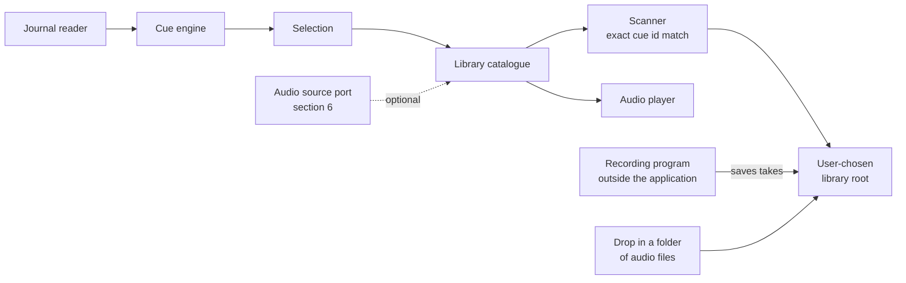

# Bridge Talk: Requirements Specification

Open questions in section 8 are blocking for the areas they name.

---

## 1. Introduction

### 1.1 Purpose

Bridge Talk is a desktop application that watches Elite Dangerous as it is
played and plays a short piece of recorded audio when something happens in the
game. The audio is supplied by the person using it: recordings they made
themselves; recordings made for them by people they know.

It listens to the game. It does not control the game.

### 1.2 Intended audience

Oliver Ernster as author and decision owner; contributors to the open source
project.

### 1.3 Scope

**In scope:**

- A cue engine that turns Elite Dangerous journal events and status flags into
  named cues.
- An audio library held in a directory the user chooses, organised by the person
  who recorded it.
- Discovery of that library by scanning, with no configuration step.
- A checklist of the moments a voice has no recording for, each opening the folder
  its recording belongs in.
- Auditioning, casting a voice, settings and a tray presence.
- An extension point through which an additional audio source may be supplied.
- Windows and Linux, decided by Oliver on 2026-09-13. Linux work comes after
  everything else.

**Out of scope:**

| Item | Why |
|---|---|
| Controlling the game in any way | The application has no input path to the game and will not acquire one |
| Speech recognition or spoken commands | Not what this is for |
| Text to speech synthesis | Recorded audio only |
| Shipping any audio with the application | The application plays what the user provides |
| Distributing recordings between users | No transport, no store, no upload |
| Editing the cue vocabulary from the user interface | `cues.toml` is edited as a file |
| Fuzzy, partial or normalising name matching | Section 3.1 rule 4; matching is exact by design |
| macOS | Not asked for; Windows and Linux are the platforms in scope |
| Capturing audio | Recorded in a dedicated program; section 4 |

### 1.4 Definitions

| Term | Meaning, fixed for this document |
|---|---|
| **Cue** | One thing the application can play, plus the game condition that triggers it. Identified by a stable id spelled in the game's own words, such as `StartJump.JumpType.Hyperspace`. Defined in `cues.toml`. |
| **Cue vocabulary** | The complete set of cue ids in `cues.toml`. Currently 256. |
| **Voice** | One person's recordings, selectable as a whole. A directory under the library root that yields at least one take. |
| **Library root** | One directory the user chooses, holding one subdirectory per voice. |
| **Manifest** | `voice.toml` in a voice directory. Optional. Carries a display name, a credit and any take the convention cannot find. |
| **Take** | One audio file answering one cue. A cue may have several takes. |
| **Cast** | The act of selecting the voice that speaks. |
| **Audition** | Playing a take on demand from the user interface, outside game events. |

### 1.5 References

- `ARCHITECTURE.md`: the layering invariants and the tests that enforce them.
- `internal/infrastructure/config/cues.toml`: the cue vocabulary.
- ISO/IEC/IEEE 29148:2018 for requirement quality; EARS for requirement syntax.

---

## 2. Overall description

### 2.1 Product perspective



The cue engine asks the catalogue for a take for a cue id and gets a path or
nothing back. Everything about how audio is stored sits below that line.

### 2.2 User classes

| Class | Description | May do | May not do |
|---|---|---|---|
| **Commander** | Plays Elite Dangerous, wants spoken feedback | Choose a library root, cast a voice, audition, adjust settings, record | Modify the cue vocabulary from the interface |
| **Contributor** | Someone recording a voice for a commander | Record takes in a program of their choice and save them into a voice directory | Anything else |

A single person is usually both.

### 2.3 Operating environment

Windows 10 and Windows 11, x64. Go 1.26 with Wails v2 hosting a React and
TypeScript front end. No CGO, per the house rule. Elite Dangerous journal files in their
standard location. No network dependency at runtime: the application makes no
outbound request.

**Linux is in scope alongside Windows,** decided by Oliver on 2026-09-13. It is not
built yet and comes after all other work. The library
schema in section 3 is already portable, so nothing there changes either way.

### 2.4 Constraints

| ID | Constraint |
|---|---|
| CON-1 | The layering invariant `UI to Application to Domain from Infrastructure` holds and is enforced by `tests/structural`. |
| CON-2 | Modules stay at or below 400 lines; a module landing between 381 and 400 lines is reduced to 350 or fewer. Build and packaging scripts are exempt. |
| CON-3 | The coverage floor over `internal/domain` and `internal/application` stays at 100 percent. |
| CON-4 | `VERSION` is the single source of truth for the version. No version literal elsewhere. |
| CON-5 | No audio ships inside the application or its setup program. |
| CON-6 | Everything written at install time stays per user, under `%LOCALAPPDATA%`, `HKCU`, the user's Start Menu under `%APPDATA%` and the user's Desktop, so Windows never asks for administrator rights. |
| CON-7 | The application never writes to the library root except where section 3 permits it. |

### 2.5 Assumptions

| ID | Assumption | Owner | Confirm by |
|---|---|---|---|
| ASM-1 | The 256 cue ids in `cues.toml` are the right vocabulary. | Oliver | Before recordings are made in earnest |
| ASM-2 | Recordings are made with ordinary consumer microphones in untreated rooms, so their quality is not controllable by the application. | Oliver | Before recordings are made in earnest |
| ASM-3 | A voice is expected to be complete: every cue recorded, every file present used. See FR-215. | Oliver | Confirmed 2026-09-09 |

---

## 3. The audio library

### 3.1 The schema

```
<library root>/
├── Alice/
│   ├── StartJump/
│   │   ├── best-one.wav
│   │   └── second-try.wav
│   ├── DockingGranted/
│   │   └── docking.mp3
│   └── voice.toml              optional: display name, credit, overrides
└── Bob/
    ├── StartJump.wav
    └── DockingGranted.wav
```

**Rule 1, the voice.** Each immediate subdirectory of the library root is a
candidate voice. It becomes a voice when at least one take resolves inside it.

**Rule 2, the folder form.** A subdirectory whose name is exactly a cue id holds
takes. Every recognised audio file directly inside it is one take. File names
carry no meaning.

**Rule 3, the flat form.** An audio file whose name, with its extension removed,
is exactly a cue id is a take for that cue. A trailing dot plus digits before the
extension distinguishes takes, so `StartJump.2.wav` is a second take of
`StartJump`.

**Rule 4, exact literal matching.** A name matches a cue id only when the two
strings are equal, compared case insensitively and in no other way. No
normalisation, no punctuation folding, no fuzzy or nearest match, ever.

**Rule 5, the optional manifest.** `voice.toml` is not required and most voices
will not have one. Where present it may set a display name, a credit line and
explicit cue to file mappings for takes that follow no convention. It adds to what
the convention found.

**Why rule 4 is a requirement and not a detail.** A name either is a cue id or it
is not. Exact matching means the scan report can state, of every file it found,
whether it was used and if not why not, with no third answer. It also means a
directory of audio organised for some other purpose contributes nothing by
accident, which is what makes it safe to point the application at a directory and
simply see what happens.

### 3.2 Naming on disk

The cue id is the on-disk name unchanged, with no derivation step between them.

Checked against all 256 cue ids: every id uses only letters, digits, `.` and a
space inside a segment, which five ids carry; none begins with a dot, which would
hide it on Linux and macOS; none ends in a dot or space, which Windows silently
strips; no space sits beside a dot; none has a first segment that is a Windows
reserved device name (`con`, `prn`, `aux`, `nul`, `com1` to `com9`, `lpt1` to
`lpt9`); none collides with another when case folded; the longest is 49
characters.

Verified on the Windows filesystem directly: directories named
`CommitCrime.CrimeType.collidedAtSpeedInNoFireZone` (the longest id),
`Synthesis.Name.Repair Basic` and `DockingGranted`, plus files named
`DockingGranted.wav` and `DockingGranted.2.wav`, were created and read back byte
for byte with nothing stripped and nothing renamed. On Linux and macOS every byte
except `/` and NUL is legal in a name; the only special case is a leading dot,
which no id has.

**Case is the only genuine cross platform difference.** Windows and macOS refuse
two names differing only in case; Linux allows both. FR-218 says what happens
then. Voice directory names are user chosen and are never matched against
anything, so they may hold any characters the platform allows, including non
ASCII; they are display strings only.

### 3.3 The manifest format

TOML, matching `cues.toml`.

```toml
name = "Alice"
credit = "Recorded by Alice, 2026"

# Optional. Only needed for files the convention cannot find.
[takes]
"IsInDanger.Set" = ["oddly-named-file.wav", "alternates/another.wav"]
```

The reasoning, since this is an open source project and the file is meant to be
edited by hand: TOML takes comments, which JSON does not; it is not whitespace
significant, so no user can break it by indenting, which a YAML user can; it is
already a direct dependency, so it costs nothing; and it is what `cues.toml`
already is. Two configuration formats in one application is worse than either
format alone.

### 3.4 Requirements

**FR-201 Choose a library root**
Priority: Must.
When the user selects a library root, the application shall persist that path in
settings and shall scan it.
Acceptance: Given no root is set, when the user chooses one and the application is
restarted, then the same root is in use.

**FR-202 If the library root is missing or unreadable, then say so**
Priority: Must.
If the configured library root does not exist or cannot be read, then the
application shall report the path it tried and shall offer to choose another,
rather than presenting an empty voice list.
Rationale: an empty list and a broken path look identical; the guess a user makes
is usually the parent of the right place.

**FR-203 Recognised audio formats**
Priority: Must.
The scanner shall recognise files with the extensions `.wav`, `.mp3`, `.flac` and
`.ogg`, matched case insensitively; it shall ignore every other file.
Rationale: these are exactly the formats the player can decode.

**FR-204 If a file has a recognised extension but cannot be decoded, then report it**
Priority: Must.
If a take cannot be decoded, then the application shall exclude it from the
catalogue, shall record it in the scan report with the reason and shall not fail
the scan.

**FR-205 Drop-in discovery, folder form**
Priority: Must.
When scanning a voice directory, the application shall treat each subdirectory
whose name equals a cue id as that cue's takes; every recognised audio file
directly inside it is one take.
Acceptance: Given `Alice/StartJump/` holding two WAV files, when a scan runs,
then Alice has two takes for `StartJump` and no manifest was needed.

**FR-206 Drop-in discovery, flat form**
Priority: Should.
When scanning a voice directory, the application shall treat a recognised audio
file whose base name equals a cue id, optionally followed by a dot and digits, as
a take for that cue.
Acceptance: Given `Bob/DockingGranted.wav` and `Bob/DockingGranted.2.wav`, when
a scan runs, then Bob has two takes for `DockingGranted`.

**FR-207 Matching is exact and literal**
Priority: Must.
The application shall compare a directory or file name to a cue id by case
insensitive string equality alone. It shall not normalise punctuation, whitespace
or word separators; nor shall it perform any fuzzy, partial or nearest match.

**FR-208 If a name does not match a cue id, then skip it and report it**
Priority: Must.
If a subdirectory or audio file inside a voice directory matches no cue id, then
the application shall ignore it and shall record it in the scan report as
unmatched, naming what it found.
Rationale: a typo is the most likely user error and it is otherwise silent.

**FR-209 If a directory yields no takes, then it is not a voice**
Priority: Must.
If an immediate subdirectory of the library root yields no resolved take, then the
application shall omit it from the voice list and shall record it in the scan
report with the reason.

**FR-210 Optional manifest**
Priority: Should.
Where a voice directory holds a readable `voice.toml`, the application shall take
the display name and credit from it; it shall add any takes it declares to those
found by convention.
Acceptance: Given a voice directory with files found by convention and a manifest
naming one further file, when a scan runs, then both sets of takes are present.

**FR-211 If a manifest is malformed, then fall back to the convention**
Priority: Must.
If `voice.toml` cannot be parsed, then the application shall scan the directory by
convention as though the file were absent; it shall record the parse error in the
scan report.
Rationale: a broken optional file must never cost a voice their voice.

**FR-212 Assign unmatched files to cues**
Priority: Should.
When the user selects a voice with unmatched files, the application shall list
those files, shall let the user assign each to a cue and shall write the
assignments to that voice's `voice.toml`.
Rationale: the escape hatch for audio that arrived under someone else's naming; it
is also how a user fixes a typo without leaving the application.

**FR-213 A directory organised under another convention resolves nothing**
Priority: Must.
Given a directory tree whose names follow a space separated prose convention, when
a scan runs, then no take shall resolve and no voice shall be offered.
Verified by: a test using invented prose folder names.

**FR-214 Rescan on demand**
Priority: Must.
When the user requests a rescan, the application shall re-read the library root
and update the voice list, the completeness figures and the cast voice's catalogue
without a restart.
Note: a rescan that finds no voice leaves the voices already known in place. The
tray's voice menu is built at startup and is not refreshed by a rescan.
Verified by: `TestLookingAgainFindsAVoiceFilledSinceTheStart`;
`TestLookingAgainWithNothingToFindChangesNothing`.

**FR-215 Report both completeness figures**
Priority: Must.
The application shall show, for each voice, the number of cues that voice has at
least one take for out of the size of the cue vocabulary, plus the number of audio
files it uses out of the number of recognised audio files present in that voice's
directory.
Rationale: a voice is expected to be complete and every file present is expected
to be used, so both figures should read `n of n`. Two figures rather than one
because they fail differently: a shortfall in the first means lines were never
recorded; a shortfall in the second means files are present that nothing can
reach, which is a naming mistake.
Acceptance: Given a voice with takes for every cue and no unmatched files, when
the voice list is shown, then both figures read `n of n`.

**FR-216 Audition a take**
Priority: Must.
When the user selects a cue for the cast voice and requests an audition, the
application shall play one take for that cue.

**FR-217 The library is read only, with three named exceptions**
Priority: Must.
The application shall never write to, move, rename or delete a file under the
library root, except FR-212 writing a `voice.toml`, FR-223 making a voice's empty
folders plus FR-314 making a missing moment's folder. All three are confined to the
voice directory being targeted.

**FR-218 If two directories differ only in case, then merge their takes**
Priority: Must.
If a voice directory holds more than one entry whose name equals the same cue id
under case insensitive comparison, then the application shall treat their takes as
one set and shall record the duplication in the scan report.
Rationale: Linux permits `Docking.Granted/` beside `docking.granted/`; Windows and
macOS do not. Merging is deterministic and loses nothing. Silently choosing one
would make a library behave differently on two machines holding identical files.

**FR-219 No cue id may end in a digit only segment**
Priority: Must.
The cue vocabulary shall contain no id whose final dot separated segment consists
only of digits.
Rationale: the flat form in rule 3 distinguishes takes by a trailing dot and
digits, so such an id would make `x.2.wav` ambiguous between a second take of `x`
and a first take of `x.2`. No id has this shape today, which is a property of the
vocabulary rather than a law, so it is made a test.
A cue table holding such an id, whether shipped or supplied by the user, shall fail
to load with the reason.
Verified by: a structural test over `cues.toml`, proved by planting a violating id
and reading a non-zero exit code; plus tests that `cue.New`, which every table is
built through, refuses such an id and that an override holding one fails to load.

**FR-222 No cue id may end in a dot or a space**
Priority: Must.
The cue vocabulary shall contain no id whose final character is a dot or a space.
Rationale: a recording is found by a name equal to its cue id; Windows silently
strips a trailing dot or space from a name as it is created, so a folder made for
such an id would arrive under a different name and never be found.
A cue table holding such an id, whether shipped or supplied by the user, shall fail
to load with the reason.
Verified by: a structural test over `cues.toml`, proved by planting a violating id
and reading a non-zero exit code; plus tests that `cue.New` refuses such an id and
that an override holding one fails to load.

**FR-223 Make a voice's folders**
Priority: Must.
When the user asks for the folders of a named voice, the application shall create
`<library root>/<name>/` holding one empty subdirectory named for each cue id in
the vocabulary.
Rationale: a folder named for its cue is the folder form of rule 2, so a person
filling a voice by hand puts each recording in the folder for its moment and never
types a cue id. The Missing takes pane opens the same folders under FR-314.
Acceptance: Given an empty library root and a vocabulary of 256 cues, when the user
makes the folders for `Oliver`, then `Oliver/` holds 256 empty subdirectories, one
per cue id; a take then placed in `Oliver/DockingGranted/` under any file name
resolves for `DockingGranted` on the next scan.
Verified by: `TestMakingAVoicesFoldersMakesOneForEveryCue` in
`internal/infrastructure/library/folders_test.go`;
`TestFoldersAreMadeUnderTheChosenRecordingsDirectory` in `folders_test.go`.

**FR-224 Making a voice's folders never replaces anything**
Priority: Must.
When the user asks for a voice's folders, the application shall leave every entry
already under that voice directory unchanged.
Acceptance: Given `Oliver/Docked/a.wav` and a file named `Oliver/Undocked`, when the
folders are made, then both are unchanged and only the missing folders are created;
a second run creates none.
Verified by: `TestMakingFoldersAgainAddsOnlyWhatIsMissing`.

**FR-225 If a voice name cannot be a folder name, then refuse it**
Priority: Must.
If the name given for a voice breaks one of the rules below, then the application
shall refuse it with the rule it broke, creating nothing.

- It is empty or only spaces.
- It begins or ends with a space.
- It ends with a dot.
- It holds one of `< > : " / \ | ? *` or a control character.
- Before its first dot it is a device name Windows keeps: `con`, `prn`, `aux`,
  `nul`, `com1` to `com9`, `lpt1` to `lpt9`.

Rationale: a library is expected to move between Windows and Linux, so the rules of
the stricter platform hold on both. The name is checked before anything is asked, so
a refused name never opens a dialog.
Verified by: `TestANameThatCannotBeAFolderIsRefused`;
`TestABadNameIsRefusedBeforeAnythingIsAsked`.

**FR-226 withdrawn on 2026-09-13.** It had Make folders ask where the folders go while no
library root was chosen. Pressed, the button opened a folder picker instead of making folders;
the picker refused the voice's name typed into it because that folder did not exist yet.
FR-228 replaces it. FR-226 is retired and is not reused.

**FR-228 While no library root is chosen, make the folders in the default recordings directory**
Priority: Must.
While no library root is chosen, when the user asks for a voice's folders, the application
shall make them in the default recordings directory of FR-227 without asking anything and shall
take that directory as the library root. If the default recordings directory cannot be worked
out or made, then the application shall report the reason and make nothing.
Rationale: a button called Make folders makes folders (Oliver, 2026-09-13). FR-201's chooser
refuses a directory holding no voices, which is all a new user has, so without this a new user
has no way to name a library root.
Acceptance: Given no library root on Windows, when the user makes the folders for `Oliver`, then
`%LOCALAPPDATA%\BridgeTalk\Recordings\Oliver\` holds one folder per cue, no dialog opens and
`%LOCALAPPDATA%\BridgeTalk\Recordings` is the stored library root.
Verified by: `TestWithNoRecordingsDirectoryTheFoldersGoInTheDefaultOne`;
`TestADefaultThatCannotBeMadeIsReported` in `folders_test.go`.

**FR-227 The recordings question opens in the product's own folder**
Priority: Must.
While no library root is chosen, when the application asks where the recordings are, the
application shall open that question in the default recordings directory, creating the
directory where it is missing.
The default recordings directory is `%LOCALAPPDATA%\BridgeTalk\Recordings` on
Windows. Elsewhere it is `BridgeTalk/Recordings` under `$XDG_DATA_HOME`, which falls
back to `~/.local/share` where it is unset.
Rationale: given no folder, the system dialog chose for itself and opened in the
game's folder, where a user's recordings do not belong. Of the folders the product
owns this is the one setup never removes: uninstall deletes the install directory;
forgetting settings deletes the window state and the settings file. It is local
rather than roaming, because hours of audio do not belong in a roaming profile.
Acceptance: Given no library root on Windows, when the user presses Browse for the
recordings, then the folder question opens in `%LOCALAPPDATA%\BridgeTalk\Recordings`,
which exists. Given a library root, when the user presses Browse for the recordings, then
the question opens in that root.
Verified by: `TestTheDefaultRecordingsDirectoryBelongsToTheProduct` in
`internal/infrastructure/library/root_test.go`;
`TestTheRecordingsQuestionOpensInTheProductsOwnFolder` and
`TestTheRecordingsQuestionOpensWhereTheRecordingsAre` in `folders_test.go`.

**FR-220 If a voice has no take for a cue, then the cue is silent and the gap is reported**
Priority: Must.
If the cast voice has no take for a fired cue, then the application shall play
nothing, shall not substitute a take from another cue or another voice; it shall
list that cue among the voice's missing cues.
Note: a complete voice is the expectation, so silence here covers a state the
design does not intend rather than a normal operating mode. It stays a Must
because a half recorded voice must not crash or substitute.

**FR-221 One cue plays one file**
Priority: Must.
The application shall play exactly one audio file per fired cue and shall not
assemble a sequence of files into one utterance.
Rationale: a long line is one long file. The person recording decides where a line
ends.

### 3.5 Non-functional

**NFR-P-201 Scan time**
Priority: Should.
When scanning a library root holding up to 10 voices and up to 5,000 audio files
in total, the application shall complete the scan within 3 seconds on the
reference machine in section 2.3, measured by a benchmark in the scanner package.

**NFR-P-202 Playback latency**
Priority: Must.
When a cue fires, the application shall begin audio output within 150 milliseconds
at the 95th percentile, measured over 100 firings in the player benchmark.

---

## 4. Recording

Recording happens outside the application, in whatever program the person recording
prefers. The application's part is to say what a voice is still missing and to open the
folder each take belongs in.

**Withdrawn on 2026-09-13.** A built-in recorder was specified here as FR-301 to FR-310
with NFR-C-301 to NFR-C-304. Oliver withdrew it in favour of recording in a dedicated
program, which already records WAV and can trim a take or even out its level, where a
bare recorder here would do neither. Those identifiers are retired and are not reused.

**FR-312 withdrawn on 2026-09-13.** It offered every voice folder, recorded or not. Oliver ruled
the same day that the chooser is for what still needs recording, so a complete voice has no place in
it; FR-316 and FR-317 replace it. FR-312 is retired and is not reused.

**FR-311 List what a voice is missing**
Priority: Must.
When the user chooses a voice folder on the Missing takes pane, the application shall list
every cue that voice has no take for, grouped under each cue's heading and showing each
cue's title with the full path of the folder an audio file for it belongs in.
Rationale: what a voice is missing is audio files in particular folders, so the list says
where each one goes rather than leaving the reader to work out a path from a cue id.
Acceptance: Given `Oliver/` holding a take for `Docked` alone and a vocabulary of 256
cues, when Oliver is chosen, then 255 cues are listed and `Docked` is not; `Undocked` is
shown with `<library root>\Oliver\Undocked` as its folder.
Verified by: `TestMissingListsWhatAVoiceHasNoTakeFor` in
`internal/infrastructure/library/checklist_test.go`; `TestTheChecklistCountsWhatIsRecorded`
in `checklist_test.go`; `frontend/src/missingTakes.test.tsx`.

**FR-316 Offer only the voices still missing takes**
Priority: Must.
The Missing takes pane shall offer in its voice chooser every immediate subdirectory of the
library root that has no take for at least one cue, including one that holds no take at all,
each named with how many cues it is missing. A voice folder with a take for every cue shall not
be offered.
Rationale: the chooser is for what still needs recording (Oliver, 2026-09-13). A voice made
under FR-223 holds no take until the first is saved, so under FR-209 it is not yet a voice; it
is exactly the one that needs the list.
Acceptance: Given `Grace/` with a take for every cue, `Oliver/` with a take for `Docked` alone
and an empty `Hugo/`, when the pane opens, then the chooser offers Hugo and Oliver, each with
its count of missing cues; it does not offer Grace.
Verified by: `frontend/src/missingTakes.test.tsx`; `TestVoiceDirsListsEveryFolderRecordedOrNot`
and `TestEveryVoiceFolderIsOfferedRecordedOrNot` for the folders the pane chooses among.

**FR-317 The voice chooser is always shown**
Priority: Must.
The Missing takes pane shall always show its voice chooser. While the library root holds no
voice folder, the chooser shall hold one entry saying there are no voices yet and the pane shall
say how to make one. While every voice folder has a take for every cue, the chooser shall hold
one entry saying every voice is complete and the pane shall say so.
Rationale: a control that is there in some states and gone in others makes the pane a different
window each time it is opened (Oliver, 2026-09-13).
Acceptance: Given no voice folder, the chooser shows "No voices yet" and cannot be changed.
Given only complete voices, the chooser shows "Every voice is complete" and so does the pane.
Verified by: `frontend/src/missingTakes.test.tsx`.

**FR-313 Show progress**
Priority: Should.
While a voice folder is chosen, the Missing takes pane shall show how many cues of the
vocabulary it has at least one take for.
Verified by: `TestTheChecklistCountsWhatIsRecorded`.

**FR-314 Open a moment's folder**
Priority: Must.
When the user presses Open folder beside a cue, the application shall open that cue's
folder inside the chosen voice folder in the system file manager, creating the folder
where it is missing.
Acceptance: Given `Oliver/` with no `Docked` folder, when Open folder is pressed beside
Docked, then `Oliver/Docked/` exists and File Explorer shows it.
Verified by: `TestAMomentFolderIsMadeWhereMissingAndKeptWhereNot`;
`TestOpeningAMomentsFolderMakesItAndShowsIt`. File Explorer appearing is not verified by
a test, since a test opens no window.

**FR-315 If a moment's folder cannot be opened, then say why**
Priority: Must.
If the cue is not in the vocabulary, the voice folder does not exist or the folder
cannot be made or shown, then the application shall report the reason on the Missing
takes pane without opening anything.
Verified by: `TestAMomentFolderThatCannotBeMadeIsReported`;
`TestAMomentFolderThatCannotBeOpenedIsReported`.

---

## 5. Cross cutting non-functional requirements

| ID | Requirement | Method |
|---|---|---|
| NFR-M-1 | Coverage over `internal/domain` and `internal/application` stays at 100 percent | `test.ps1` fails below the floor and names every function short of it |
| NFR-M-2 | No module exceeds 400 lines; none sits between 381 and 400 | `tests/structural` LOC test, build scripts exempt |
| NFR-M-3 | The layering invariant holds | `tests/structural/boundary_test.go` |
| NFR-M-4 | `gofmt`, `go vet` and `staticcheck` all exit zero | `test.ps1`, ahead of any build |
| NFR-S-1 | The application makes no network request other than the update check | Inspection plus a test asserting the outbound surface |
| NFR-S-2 | The application never writes outside the library root and its own per user data directories | Test over the write paths |
| NFR-O-1 | Every scan produces a report naming every skipped directory, every unmatched file and every undecodable file, with a reason | Test asserting a report entry per skip class |

**Non claims, stated deliberately:**

- The application does not encrypt recordings at rest.
- The application does not verify who a recording is of or who owns it.
- The application does not record, process, clean up or improve audio.
- The application cannot control the game.

---

## 6. The audio source port

**FR-501 The audio source is a port**
Priority: Should.
The application layer shall declare an audio source interface that answers, for a
cue id, the takes available; the catalogue shall depend on that interface rather
than on any concrete scanner.
Rationale: an additional source of audio can then be supplied without the
catalogue knowing anything about where it came from. Declaring the seam now costs
nothing; retrofitting it later is a rewrite of the catalogue.

**FR-502 An extension supplies audio, never behaviour**
Priority: Must.
An implementation of the port shall supply takes for cue ids and nothing else. It
shall not add cues, alter the cue table or change playback behaviour.

---

## 7. Build order

Requirements are elicited outside in. The system is built inside out: domain,
then application, then infrastructure, then user interface.

The diagnostic that says the foundation is sound: every user visible action in
this document is executable from a Go test with no window open. Choosing a root,
scanning, casting, auditioning, making a voice's folders and opening a moment's folder
are each one named entry point. If a user interface over them turns out to be hard,
the actions were not given callable homes; that is a hypothesis; the
headless test is how it gets tested.

---

## 8. Open questions

| ID | Question | Blocks | Owner |
|---|---|---|---|
| **OQ-6** | How does an additional audio source reach the application? Go has no practical dynamic plugin story on Windows. The realistic options are a separate process behind a local protocol, a build tag producing a second binary; or having the extension write a `voice.toml` into a directory the application already scans. The third needs no new mechanism at all. | Section 6 | Oliver, with a recommendation from Claude |

---

## 9. Prioritisation

| Priority | Content |
|---|---|
| **Must** | FR-201 to FR-205, FR-207 to FR-209, FR-211, FR-213 to FR-225, FR-227, FR-228, FR-311, FR-314 to FR-317, FR-502, NFR-M-1 to NFR-M-4, NFR-S-1, NFR-S-2, NFR-O-1, NFR-P-202 |
| **Should** | FR-206, FR-210, FR-212, FR-313, FR-501, NFR-P-201 |
| **Could** | Nothing at present |
| **Won't this time** | Distributing recordings between users; text to speech; audio post processing; any fuzzy or normalising name matching; editing the cue vocabulary from the user interface; a built-in recorder, FR-301 to FR-310 with NFR-C-301 to NFR-C-304, withdrawn on 2026-09-13 |

---

## 10. Traceability

Every requirement above names its acceptance criterion. On implementation, each
gains a `Verified by:` line naming the test; no requirement is considered met
until that test exists and has been seen to fail without the implementation.
